# AgTeamOS

> Plugin de Claude Code que simula un equipo completo de ingeniería de élite — un
> **sistema operativo de equipo**, portable entre proyectos y compartible con tu equipo.
>
> **9 agentes** · **38 comandos** (`/agteamos:<nombre>`) · **3 flujos inteligentes** · **SDD + Context Engineering**

---

## Quick Start

```bash
/plugin marketplace add EJBereguete/claude-plugins
/plugin install agteamos
```

Después de instalarlo, en cualquier proyecto:

```bash
@architect "Quiero crear una app de gestión de inventarios en FastAPI + React"
```

O invoca cualquier comando directo, sin pasar por un agente:

```bash
/agteamos-setup
```

(Ver la sección [Comandos disponibles](#comandos-disponibles) para el listado completo y
[Compartir con tu equipo](#compartir-con-tu-equipo) si necesitas que quede instalado
automáticamente para todo el equipo en un repo específico.)

---

## Esto es lo que aparece en TU proyecto (`agteamos/`)

Al usar AgTeamOS en un proyecto, todo lo que el sistema gestiona vive en **una sola carpeta
visible `agteamos/`** en la raíz de ese repo — no se mezcla con tu `/docs` genérico. Se va
poblando de forma **incremental**, con lo que se puede confirmar contra el código real en cada
paso (no de una sola pasada) — ver [Adoptar un proyecto existente](docs/primeros-pasos/04-adoptar-proyecto-existente.md).
Este es el árbol completo, replicado tal cual desde la referencia canónica en
[`docs/referencia/estructura-de-carpetas.md`](docs/referencia/estructura-de-carpetas.md) — si alguna
vez estas dos versiones divergen, esa página es la que gana:

```
agteamos/
├── platform.yml                      ← /agteamos-setup
├── dashboard.html                    ← /agteamos-dashboard — reporte general (generado, NO se commitea)
├── product/
│   ├── mission.md
│   ├── roadmap.md
│   ├── kpis.md
│   └── backlog.md                    ← /agteamos-new-project (mirror de los tickets del MVP)
├── architecture/
│   ├── PROJECT_CONTEXT.md
│   ├── ARCHITECTURE.md
│   └── adr/ADR-NNN-slug.md
├── api/
│   ├── openapi.yml
│   └── endpoints.md
├── design/
│   ├── DESIGN_SYSTEM.md
│   └── mockup-v<n>.png
├── devops/
│   ├── INFRASTRUCTURE.md
│   ├── DORA_METRICS.md
│   ├── SLO.md
│   └── prr/PRR-v<semver>.md
├── security/
│   ├── AUDIT-YYYY-MM-DD.md
│   └── threat-models/
├── incidents/
│   ├── post-mortems/
│   ├── runbooks/
│   └── playbooks/
├── decisions/
│   ├── decision-log.md
│   └── rfcs/RFC-NNN-slug.md
├── standards/                        ← /agteamos-standards (convenciones reales del proyecto)
│   ├── standards.yml                 ← manifest: qué estándar aplica, cuál se adaptó, cuál se desvía
│   ├── index.yml                     ← keyword → carpeta, para encontrar el estándar relevante rápido
│   ├── api/
│   │   ├── README.md                 ← reglas adaptadas a ESTE proyecto
│   │   ├── examples.md               ← ejemplos reales tomados del código del proyecto
│   │   └── deviations.md             ← solo si hay desviaciones (opcional)
│   ├── git/README.md
│   ├── security/README.md
│   ├── testing/README.md
│   ├── database/README.md
│   ├── frontend/README.md
│   ├── clean-architecture/README.md
│   ├── solid-principles/README.md
│   ├── dry-kiss-yagni/README.md
│   ├── domain-driven-design/README.md
│   └── devops/README.md
├── specs/                            ← specs maestras persistentes (estilo OpenSpec)
│   ├── index.yml                     ← keyword → dominio.md
│   └── <dominio>.md                  ← Coverage: seeded | partial | complete
└── changes/                          ← reemplaza tasks/active + tasks/completed
    ├── <id>-<slug>/                  ← tarea activa
    │   ├── task.yml                  ← metadata (owner real, agentes IA, status, schema, doc_impact...)
    │   ├── brief.md                  ← input original del usuario (solo schema full, inmutable)
    │   ├── progress.md               ← tracking de sesión/handoff (checkpoint protocol)
    │   ├── report.html               ← reporte visual de la tarea (generado, NO se commitea)
    │   ├── verify-report.md          ← gate RFC 2119, aparece recién al cierre
    │   ├── knowledge-base.md         ← aprendizajes/decisiones reutilizables, escrito al cerrar
    │   ├── evidence/                 ← screenshots QA, evidencia
    │   └── specs/                    ← solo si schema: full
    │       ├── requirements.md
    │       ├── design.md
    │       ├── tasks.md
    │       └── deltas/<dominio>.md   ← qué cambia en la spec maestra (uno por dominio afectado)
    └── archive/<YYYY-MM-DD>-<id>-<slug>/   ← close-task mueve aquí al cerrar
```

`docs/` deja de ser una carpeta que este sistema gestiona — es la misma decisión de fondo que
`.agent-os/` en Agent OS y `openspec/` en OpenSpec: todo lo que el sistema toca vive en su propia
carpeta con nombre de marca.

> Esta es la estructura que se instala **en el repo de tu proyecto**. Es distinta del árbol de
> archivos del propio plugin AgTeamOS (`agents/`, `skills/`, `hooks/`, `standards/`, `docs/`), que
> vive en el repo del marketplace — ver [Estructura del propio plugin](#estructura-del-propio-plugin-este-repo)
> más abajo.

### ¿Se commitea `agteamos/`?

**Sí — commiteá `agteamos/` como cualquier código fuente**, misma lógica que OpenSpec aplica a
`openspec/`: la spec y el estado de las tareas son parte del proyecto, no un artefacto aparte.

**Excepción, 2 archivos que NUNCA se commitean** porque son 100% derivables de `task.yml` +
`progress.md` + `verify-report.md`, y versionarlos garantiza un conflicto de merge en cada PR en
cuanto hay más de un desarrollador activo:

```
agteamos/dashboard.html
agteamos/changes/**/report.html
```

Agregá esas dos líneas a tu `.gitignore`. Se regeneran on-demand con `/agteamos-dashboard` (o
automáticamente al cerrar una tarea) — no hace falta que existan en el repo para que el sistema
funcione. Ver el detalle en
[Compartir con tu equipo](docs/primeros-pasos/03-compartir-con-tu-equipo.md).

---

## Comandos disponibles

Cada una de las 38 skills del plugin **ya es un comando** — no hay una carpeta `commands/`
separada (se evaluó y se descartó: colisiona de nombre con las skills). Todas se invocan tanto en
forma completa (`/agteamos:<nombre>`) como en forma corta sin el namespace del plugin
(`/agteamos-<nombre>`), siempre que no haya colisión — y no la hay:

| Comando corto | Comando completo | Qué hace |
|---|---|---|
| `/agteamos-setup` | `/agteamos:agteamos-setup` | Configura `platform.yml` inicial (stack, integraciones, `handoff_mode`) |
| `/agteamos-new-project` | `/agteamos:agteamos-new-project` | Flujo 1: proyecto desde cero (visión, arquitectura, scaffold, backlog) |
| `/agteamos-new-task` | `/agteamos:agteamos-new-task` | Flujo 2: feature nueva sin ticket (clarification → requirements → design → ticket) |
| `/agteamos-implement` | `/agteamos:agteamos-implement` | Flujo 3: implementación desde ticket existente (DoR, código, tests, PR) |
| `/agteamos-close-task` | `/agteamos:agteamos-close-task` | Cierre de tarea: verify, PR, merge, archivado, sync de specs |
| `/agteamos-onboard` | `/agteamos:agteamos-onboard` | Ingeniería inversa de un proyecto existente, genera `agteamos/` |
| `/agteamos-audit` | `/agteamos:agteamos-audit` | Auditoría integral del proyecto (arquitectura, seguridad, deuda técnica) |
| `/agteamos-standards` | `/agteamos:agteamos-standards` | Detecta y documenta convenciones reales en `agteamos/standards/` |
| `/agteamos-docs` | `/agteamos:agteamos-docs` | Mantiene `agteamos/` sincronizado tras cambios relevantes |
| `/agteamos-dashboard` | `/agteamos:agteamos-dashboard` | Genera/actualiza `report.html` por tarea y `dashboard.html` general |
| `/agteamos-deploy` | `/agteamos:agteamos-deploy` | Despliegue monitoreado con PRR, smoke tests y verificación de rollback |
| `/agteamos-review` | `/agteamos:agteamos-review` | Code review en 6 dimensiones (seguridad, correctitud, performance...) |
| `/agteamos-fix` | `/agteamos:agteamos-fix` | Hotfix táctico: fix mínimo + test de regresión + PR directo |
| `/agteamos-debug` | `/agteamos:agteamos-debug` | Debugging sistemático con causa raíz (5 Whys) |
| `/agteamos-adr` | `/agteamos:agteamos-adr` | Architecture Decision Records (formato Nygard) |
| `/agteamos-rfc` | `/agteamos:agteamos-rfc` | Request for Comments para cambios de alto impacto o cross-team |
| `/agteamos-incident` | `/agteamos:agteamos-incident` | Gestión de incidentes: severidad, roles, ciclo de vida, post-mortem |
| `/agteamos-improve-skill` | `/agteamos:agteamos-improve-skill` | Meta-mejora: ajusta una skill existente con feedback del usuario |
| `/agteamos-flow-router` | `/agteamos:agteamos-flow-router` | Step 1: detecta automáticamente qué flujo (1/2/3) activar |
| `/agteamos-repo-context-check` | `/agteamos:agteamos-repo-context-check` | Step 0 obligatorio: detecta estado del repo y de `agteamos/` |
| `/agteamos-sdd-protocol` | `/agteamos:agteamos-sdd-protocol` | Spec-Driven Development: requirements/design/tasks + deltas |
| `/agteamos-task-tracking` | `/agteamos:agteamos-task-tracking` | Tracking de sesión/handoff por tarea (`progress.md`, `task.yml`) |
| `/agteamos-story-breakdown` | `/agteamos:agteamos-story-breakdown` | Evalúa INVEST y divide historias grandes en subtareas |
| `/agteamos-context-engineering` | `/agteamos:agteamos-context-engineering` | Protocolo de handoff y presupuesto de tokens entre agentes |
| `/agteamos-clarification-protocol` | `/agteamos:agteamos-clarification-protocol` | Preguntas de contexto antes de empezar cualquier tarea |
| `/agteamos-definition-of-ready` | `/agteamos:agteamos-definition-of-ready` | Valida si un ticket tiene lo mínimo para empezar |
| `/agteamos-pr-standards` | `/agteamos:agteamos-pr-standards` | Estándares de creación, revisión y merge de PRs |
| `/agteamos-asvs-checklist` | `/agteamos:agteamos-asvs-checklist` | Checklist OWASP ASVS L1/L2 antes de producción |
| `/agteamos-production-readiness` | `/agteamos:agteamos-production-readiness` | Checklist de preparación para producción (PRR) |
| `/agteamos-dora-metrics` | `/agteamos:agteamos-dora-metrics` | Mide y trackea las 4 métricas DORA |
| `/agteamos-slo-management` | `/agteamos:agteamos-slo-management` | Define y gestiona SLOs/SLIs y error budgets |
| `/agteamos-runbook-management` | `/agteamos:agteamos-runbook-management` | Runbooks (tácticos) y playbooks (estratégicos) operacionales |
| `/agteamos-threat-modeling` | `/agteamos:agteamos-threat-modeling` | Threat modeling con PASTA + STRIDE + LINDDUN |
| `/agteamos-code-analysis` | `/agteamos:agteamos-code-analysis` | Análisis estático de calidad (Python/TS/.NET) |
| `/agteamos-build-api-workflow` | `/agteamos:agteamos-build-api-workflow` | Construcción quirúrgica de endpoints, modelos y migraciones |
| `/agteamos-build-ui-workflow` | `/agteamos:agteamos-build-ui-workflow` | Construcción de componentes de frontend respetando el design system |
| `/agteamos-backlog` | `/agteamos:agteamos-backlog` | Captura ideas de mejora del propio AgTeamOS, sin interrumpir el flujo |
| `/agteamos-self-audit` | `/agteamos:agteamos-self-audit` | Detecta fricción propia del framework (distinta de `agteamos-audit`, que audita tu proyecto) |

---

## Compartir con tu equipo

Hay dos formas oficiales de distribuir AgTeamOS a tus compañeros — elegí la que te sirva:

### Opción 1 — Instalación personal (recomendada)

Cada persona corre estos dos comandos **una sola vez** en su máquina. Queda instalado a nivel de
usuario (scope `user`), disponible en **cualquier proyecto** que abra después, para siempre. No se
commitea nada a ningún repo.

```bash
/plugin marketplace add EJBereguete/claude-plugins
/plugin install agteamos
```

Para pasárselo a un compañero: que corra esos mismos 2 comandos en su máquina. Listo.

### Opción 2 — Instalación forzada por proyecto

Si querés que **cualquiera que clone un repo específico** reciba el prompt de instalación
automáticamente (sin depender de que se acuerde), commiteá esto en `.claude/settings.json` de ese
proyecto:

```json
{
  "extraKnownMarketplaces": {
    "team-plugins": {
      "source": {
        "source": "github",
        "repo": "EJBereguete/claude-plugins"
      }
    }
  },
  "enabledPlugins": {
    "agteamos@team-plugins": true
  }
}
```

Esto cubre **solo ese proyecto** — no le da acceso a AgTeamOS al resto de los proyectos de esa
persona a menos que también use la Opción 1.

---

## El flujo completo de un vistazo

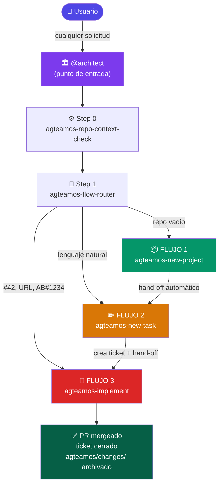

---

## Step 0 — agteamos-repo-context-check

**Se ejecuta SIEMPRE, antes de cualquier otra cosa.**

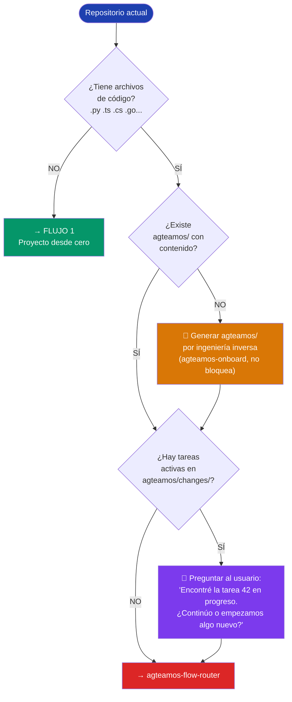

### Qué genera si no existe `agteamos/`

Ver el árbol completo en [Esto es lo que aparece en TU proyecto](#esto-es-lo-que-aparece-en-tu-proyecto-agteamos) —
`agteamos-onboard` lo puebla por ingeniería inversa leyendo el código real: stack detectado en
`architecture/PROJECT_CONTEXT.md`, endpoints encontrados en `api/openapi.yml`, tokens de diseño en
`design/DESIGN_SYSTEM.md`, métricas iniciales en `devops/DORA_METRICS.md`, etc.

---

## Step 1 — agteamos-flow-router

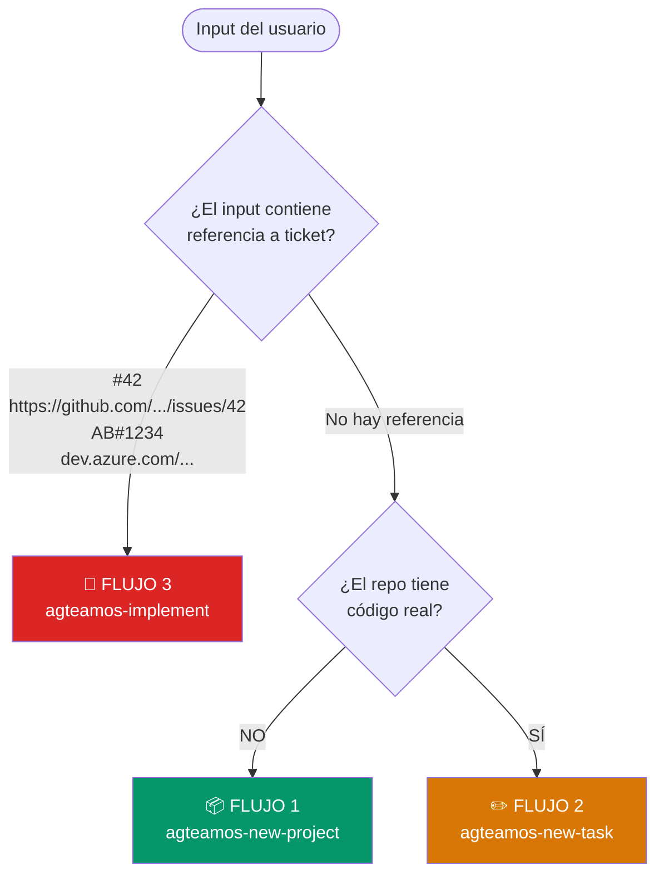

**Ejemplos de detección:**

| Input del usuario | Flujo activado |
|-------------------|---------------|
| `"Quiero crear una app de inventarios"` + repo vacío | Flujo 1 |
| `"Agrega notificaciones por email"` + proyecto existente | Flujo 2 |
| `"#42"` o `"issue 42"` | Flujo 3 (GitHub) |
| `https://github.com/user/repo/issues/42` | Flujo 3 (GitHub) |
| `"AB#1234"` | Flujo 3 (Azure DevOps) |

---

## FLUJO 1 — Proyecto desde cero

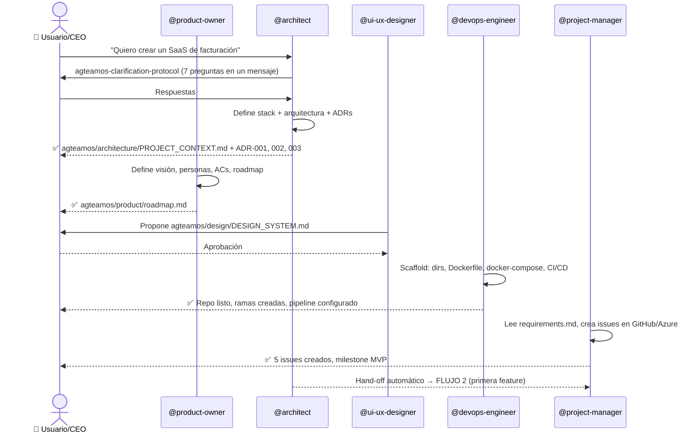

**Resultado al finalizar Flujo 1:**
- `agteamos/` poblado (`product/`, `architecture/`, `design/`, `devops/`...)
- Repo con código skeleton que compila
- `docker-compose up` funciona
- CI/CD configurado y pasando
- Backlog inicial en GitHub/Azure

---

## FLUJO 2 — Tarea nueva sin ticket

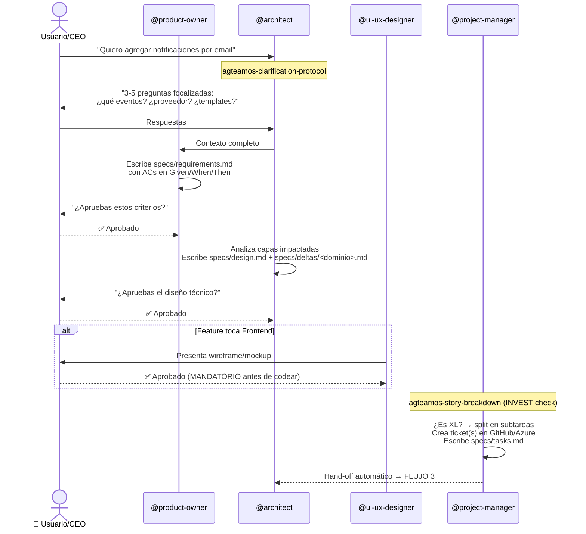

**SDD Checkpoints en Flujo 2:**

```
requirements.md  →  [CEO aprueba ACs]  →  design.md  →  [CEO aprueba diseño]  →  tasks.md  →  FLUJO 3
```

---

## FLUJO 3 — Tarea desde ticket existente

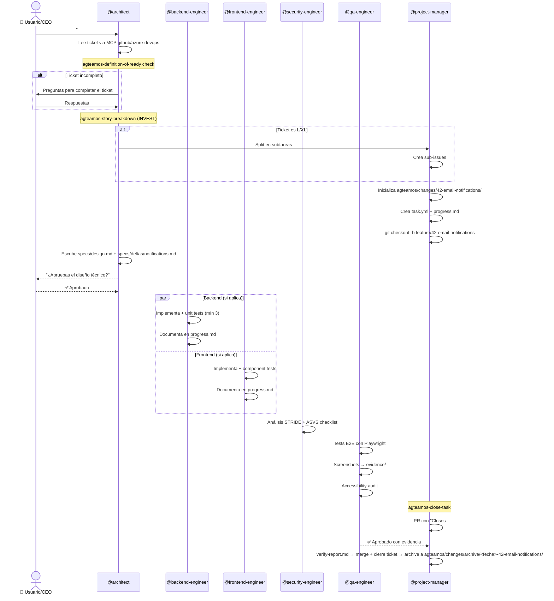

---

## SDD — Spec-Driven Development

**El principio:** la especificación es la fuente de verdad. El código es su expresión.

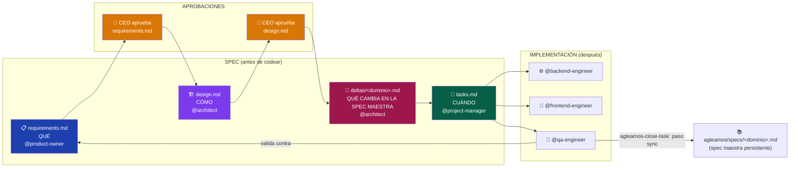

Cada tarea se marca con un `schema: full` o `schema: lite` en su `task.yml`: `full` genera los 4
artefactos completos (features, cross-team); `lite` se salta la ceremonia para bug fixes o cambios
de un solo archivo (`agteamos-fix`/`agteamos-debug`), documentando solo un resumen corto y el test
de regresión.

### Los 4 artefactos en detalle

**1. requirements.md** — escrito por `@product-owner`
```markdown
# Feature: Email Notifications

## Objetivo de negocio
Reducir el churn un 15% enviando recordatorios antes de vencimiento.

## User Stories
- Como usuario registrado, quiero recibir un email al completar mi registro,
  para confirmar que mi cuenta fue creada exitosamente.

## Acceptance Criteria
- [ ] Given: usuario completa el registro
  When: hace click en "Crear cuenta"
  Then: recibe email de bienvenida en menos de 60 segundos

## Out of Scope
- Notificaciones push (ticket separado)
- Emails de marketing

## Definition of Done
- [ ] Todos los ACs pasan
- [ ] Unit tests: happy path + error + edge
- [ ] E2E con screenshots como evidencia
- [ ] PR aprobado por QA
```

**2. design.md** — escrito por `@architect`
````markdown
# Design: Email Notifications

## Arquitectura
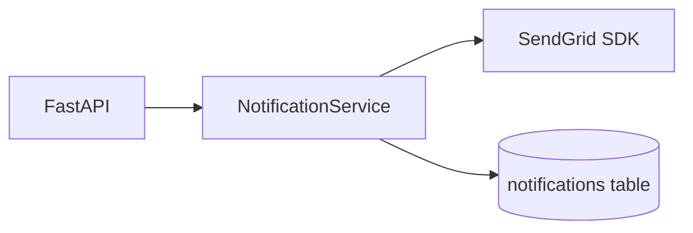

## Modelo de datos
CREATE TABLE notifications (
  id UUID PRIMARY KEY DEFAULT gen_random_uuid(),
  user_id UUID NOT NULL REFERENCES users(id),
  type VARCHAR(50) NOT NULL,
  sent_at TIMESTAMPTZ,
  created_at TIMESTAMPTZ NOT NULL DEFAULT NOW()
);

## Decisiones técnicas
| Decisión | Alternativas | Razón |
|----------|-------------|-------|
| SendGrid | SMTP, SES | SDK oficial Python, deliverability superior |
| Cola async | Síncrono | No bloquear la respuesta al usuario |
````

**3. specs/deltas/notifications.md** — escrito por `@architect`, junto con design.md
```markdown
# Spec Delta: Email Notifications → dominio: notifications

## Spec maestra afectada
agteamos/specs/notifications.md

## ADDED
- Email de bienvenida al completar el registro
- Email de reset de password con token válido por 1h

## MODIFIED
(sin cambios sobre comportamiento previo — dominio nuevo)

## REMOVED
(ninguno)
```
`agteamos-close-task` aplica este delta sobre `agteamos/specs/notifications.md` al cerrar la
tarea (paso "sync") — **después** de confirmar el merge, no antes (disciplina tomada de OpenSpec:
nunca se archiva algo que después no pasa review). Como es la primera tarea de este dominio, el
archivo se crea en ese momento con el contenido de `ADDED`. Un delta por dominio permite que una
misma tarea toque 2+ dominios sin pisarse.

**4. tasks.md** — escrito por `@project-manager`
```markdown
# Tasks: Email Notifications
## Branch: feature/42-email-notifications

### Backend (@backend-engineer)
1. [ ] Migration: CREATE TABLE notifications
2. [ ] NotificationService.send_welcome()
3. [ ] NotificationService.send_reset_password()
4. [ ] POST /api/notifications/send (admin)
5. [ ] Unit tests (4 tests mínimo)

### QA (@qa-engineer)
6. [ ] E2E: usuario recibe email en < 60s
7. [ ] Screenshots en evidence/
8. [ ] Accessibility audit
```

---

## Context Engineering — Cómo los agentes no pierden contexto

**El problema:** los modelos de IA tienen ventanas de tokens finitas. Un sprint largo puede requerir múltiples sesiones.

**La solución:** todo el estado vive en archivos, nunca en la conversación.

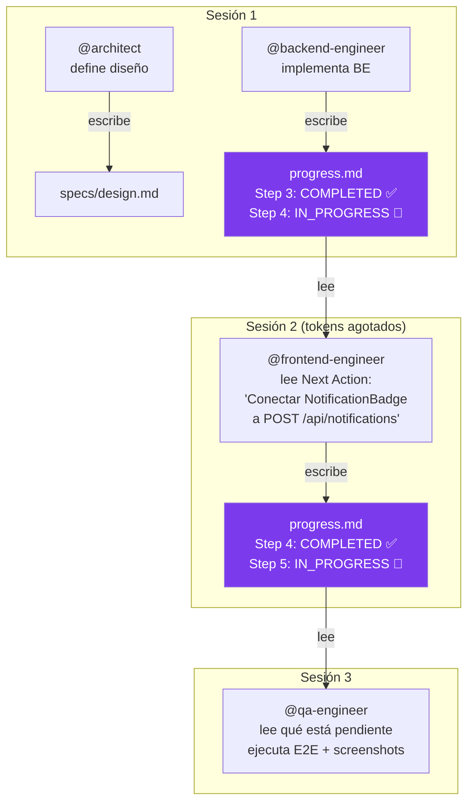

`agteamos-implement` carga el contexto en 3 niveles (context tiers), no todo de una vez: **Tier 1**
(~1KB, solo identidad de la tarea, para retomar rápido), **Tier 2** (default: + standards
relevantes + spec del dominio), **Tier 3** (completo: + spec maestra + ADRs + decision-log, solo
en tareas complejas o cross-dominio).

### La carpeta de cada tarea

```
agteamos/changes/42-email-notifications/
│
├── task.yml                    ← metadata estructurada
│   id: "42"
│   status: in_progress
│   branch: feature/42-email-notifications
│   layer: fullstack
│   owner: { name: "Eddy Bereguete", email: "..." }   ← persona real, vía git config
│   assigned_to: [backend-engineer, frontend-engineer] ← agentes IA (distinto de owner)
│
├── progress.md                 ← ESTADO PERSISTENTE
│   ├── Progress Log (step a step)
│   ├── Files Modified (tabla)
│   ├── Unit Tests Written (tabla)
│   ├── Evidence / Screenshots (tabla)
│   ├── Decisions Made (tabla)
│   └── ⭐ Next Action ← lo primero que lee el agente que retoma
│
├── report.html                 ← reporte visual de la tarea (link al dashboard general)
│
├── evidence/
│   ├── e2e-registration-flow.png   ← screenshot obligatorio QA
│   ├── e2e-email-received.png
│   └── e2e-error-state.png
│
└── specs/
    ├── requirements.md
    ├── design.md
    ├── tasks.md
    └── deltas/notifications.md
```

### El checkpoint protocol

Cada agente actualiza `progress.md` **en cada step**, no al final:

```markdown
## Next Action (si el contexto se resetea)

> Resume point: Step 4 — Frontend integration
> Branch: feature/42-email-notifications (último commit: abc123)
> Ejecutar: git checkout feature/42-email-notifications && git log --oneline -3
> Tarea: Conectar NotificationBadge.tsx a POST /api/notifications/send
> Luego: escribir tests con Testing Library
> Archivo: frontend/src/components/NotificationBadge.tsx (creado, falta integración)
```

### SQUAD_HANDOVER.md — entre agentes

Cuando un agente termina y otro debe continuar:

```markdown
# SQUAD_HANDOVER.md

## Tarea activa
- ID: 42 | Branch: feature/42-email-notifications

## Completado
- [x] DoR check (PASSED)
- [x] design.md aprobado por CEO
- [x] Backend: NotificationService + 4 unit tests (PASSING)
- [x] Endpoint POST /api/notifications/send

## Pendiente
- [ ] Frontend: NotificationBadge component (@frontend-engineer)
- [ ] E2E + screenshots (@qa-engineer)
- [ ] agteamos-close-task

## Contexto crítico
- Usamos SendGrid (no SMTP) — ver ADR en design.md
- Rate limit: 10 emails/min/usuario (implementado en service.py:47)
- SENDGRID_API_KEY debe estar en .env
```

---

## Mapa de interacción entre agentes

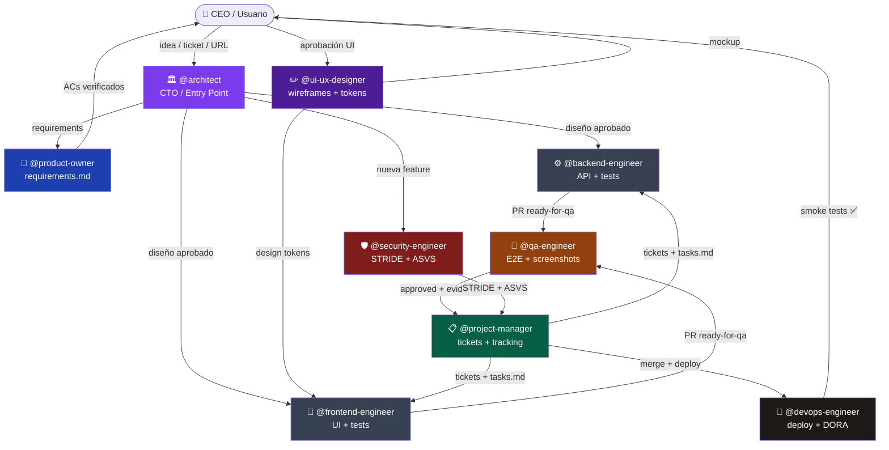

---

## Ciclo de vida completo de una tarea

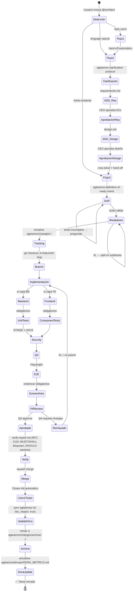

---

## Mapa de skills por categoría

Todos los nombres reales llevan el prefijo `agteamos-` (omitido en el diagrama por espacio: p. ej.
`new-project` es `agteamos-new-project`).

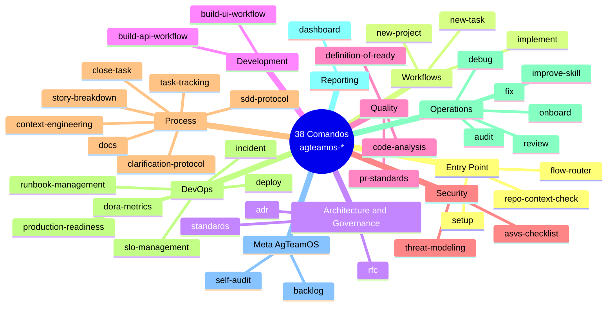

Ver el catálogo completo con descripciones en
[`docs/referencia/catalogo-de-skills.md`](docs/referencia/catalogo-de-skills.md) y la matriz
skill-por-agente en [`docs/referencia/matriz-agentes-y-skills.md`](docs/referencia/matriz-agentes-y-skills.md).

---

## Cómo interactúan las skills entre sí

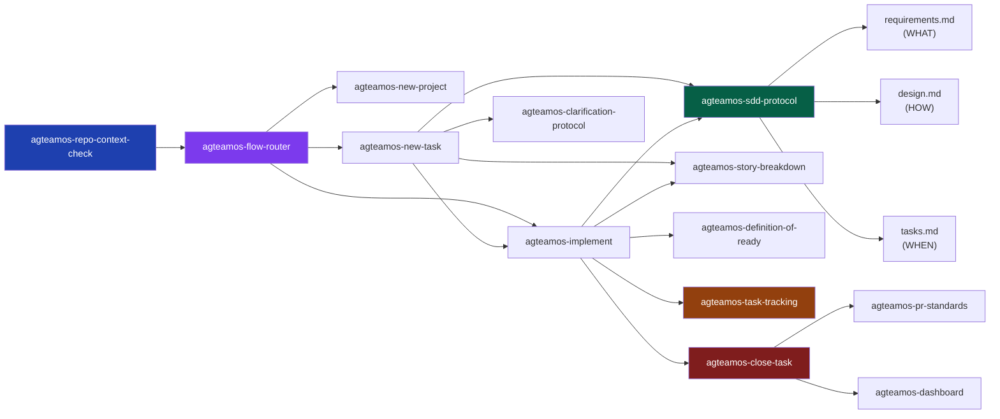

---

## Los 9 agentes y sus skills

Los agentes usan `model: sonnet` (alias genérico — se actualiza solo con el tiempo, sin quedar
pisoteados con una versión vieja hardcodeada), salvo `@architect` que se mantiene en `opus` a
propósito por su rol de mayor razonamiento (CTO / Principal Architect).

Tabla resumida — el detalle completo de las 38 skills por agente (fuente: frontmatter real de
`agents/*.md`) vive en
[`docs/referencia/matriz-agentes-y-skills.md`](docs/referencia/matriz-agentes-y-skills.md), que se
regenera desde esos 9 archivos y no de memoria:

| Agente | Modelo | # Skills | Algunas skills | Produce |
|--------|--------|:--------:|-----------------|---------|
| **@architect** | opus | 27 | repo-context-check, flow-router, new-project, adr, sdd-protocol, standards... | design.md, ADRs, dirección técnica |
| **@product-owner** | sonnet | 11 | sdd-protocol, story-breakdown, clarification-protocol, definition-of-ready... | requirements.md, roadmap.md |
| **@project-manager** | sonnet | 20 | task-tracking, close-task, dora-metrics, new-task, dashboard... | tasks.md, tickets, DORA_METRICS.md, dashboard.html |
| **@backend-engineer** | sonnet | 13 | task-tracking, build-api-workflow, debug, fix, close-task... | endpoints, unit tests, migraciones |
| **@frontend-engineer** | sonnet | 12 | task-tracking, build-ui-workflow, debug, fix, close-task... | componentes, component tests |
| **@qa-engineer** | sonnet | 15 | production-readiness, review, incident, definition-of-ready, close-task... | E2E tests, screenshots, aprobaciones |
| **@security-engineer** | sonnet | 10 | code-analysis, threat-modeling, asvs-checklist, adr, review... | STRIDE analysis, ASVS checklist |
| **@devops-engineer** | sonnet | 14 | production-readiness, dora-metrics, runbook-management, deploy, close-task... | CI/CD, deploy, PRR, DORA updates |
| **@ui-ux-designer** | sonnet | 8 | clarification-protocol, sdd-protocol, build-ui-workflow, new-project... | wireframes, DESIGN_SYSTEM.md |

---

## Standards — Código de referencia

Los 11 temas en `/standards/` (una carpeta por tema, con su propio `README.md` y ejemplos por
lenguaje adentro) son guías prescriptivas con código real:

| Tema | Qué cubre |
|---------|-----------|
| `clean-architecture/` | Capas, regla de dependencias, Use Cases — Python/TS |
| `solid-principles/` | Los 5 principios con before/after — Python/TS |
| `dry-kiss-yagni/` | DRY, KISS, YAGNI + el AHA Principle |
| `domain-driven-design/` | Entities, Aggregates, Repos, Domain Events |
| `api-design/` | REST naming, RFC 9457 errors, paginación, rate limiting |
| `database/` | Naming, Expand-Contract migrations, índices, SQLAlchemy async |
| `testing/` | Pirámide, Given/When/Then, factories, Playwright E2E |
| `frontend/` | React/TS, WCAG 2.2, Core Web Vitals, Testing Library |
| `git/` | Conventional Commits, PR template, merge strategy |
| `security/` | OWASP Top 10, headers, secrets, ASVS L1 |
| `devops/` | Dockerfile multi-stage, GH Actions, PRR, SLOs |

`agteamos-standards` lee estos 11 temas del plugin y los adapta al proyecto real en
`agteamos/standards/<tema>/README.md`, con un header de `Estado` (STUB/EXTRACTED/DESIGN-DERIVED/
CREATED/UPDATED) y `Confidence` (1-5) según qué tan bien respaldado está por código real leído.

> **Standards vs Skills — distinción validada (Agent OS):** si es una convención de código
> ("así se nombran los endpoints"), es un **Standard** (declarativo). Si es un procedimiento
> repetible ("así se cierra una tarea"), es una **Skill** (procedimental). Es el mismo criterio
> que ya se usó para decidir qué vive en `standards/` y qué vive en `skills/` — no cambia, solo se
> deja explícito.

---

## DORA Metrics — Midiendo el rendimiento

El plugin trackea automáticamente las 4 métricas DORA:

```
Deployment Frequency  → ¿Cuántas veces deployamos? (Meta: múltiples/semana)
Lead Time for Changes → ¿Cuánto tarda un commit en llegar a prod? (Meta: < 1 día)
Change Failure Rate   → ¿Qué % de deploys causa incidentes? (Meta: < 15%)
MTTR                  → ¿Cuánto tardamos en recuperarnos? (Meta: < 1 hora)
```

Se actualizan en `agteamos/devops/DORA_METRICS.md` después de cada deploy.

---

## MCPs disponibles

| MCP | Usado por | Para qué |
|-----|-----------|----------|
| `github` | Todos | Issues, PRs, reviews, labels, milestones |
| `azure-devops` | PM, Architect | Work items, repos, pipelines en Azure |
| `playwright` | QA, Security | E2E tests, screenshots de evidencia, DAST |
| `filesystem` | Todos | Leer/escribir archivos del proyecto con seguridad |
| `postgres` | Backend, DevOps | Inspeccionar esquemas, validar migraciones |
| `docker` | DevOps | Builds, gestión de contenedores |
| `sentry` | DevOps, QA | Errores en producción, alertas |
| `sonarqube` | QA, Security | Análisis estático de calidad |
| `context7` | Todos | Documentación actualizada de cualquier librería |

---

## Hooks de seguridad automáticos

Se ejecutan sin que el usuario los invoque, como scripts Node.js portables (`hooks/scripts/*.js`,
exec form sin shell — mismo comportamiento en Windows/Mac/Linux):

```
🔴 Anti-SQL destructivo  → bloquea DROP TABLE, TRUNCATE, DELETE sin WHERE
🔴 Secret scanning       → detecta API keys, tokens, passwords en el código
🟡 Quality feedback      → sugiere linters (Ruff, ESLint) al crear archivos
```

---

## Variables de entorno requeridas

```bash
GITHUB_TOKEN=ghp_...          # Issues, PRs, reviews, merges
AZURE_DEVOPS_PAT=...          # (opcional) Si usas Azure DevOps
DATABASE_URL=postgresql://... # Inspección de esquemas con MCP postgres
SENTRY_AUTH_TOKEN=...         # Monitoreo de errores en producción
SONAR_TOKEN=...               # Análisis estático de calidad
```

## Cómo invocarlo

```bash
# Proyecto nuevo
@architect "Quiero crear una app de gestión de inventarios en FastAPI + React"

# Feature nueva (proyecto existente)
@architect "Agrega un módulo de reportes en PDF exportables"

# Ticket existente — GitHub
@architect "#42"
@architect "https://github.com/miorg/mirepo/issues/42"

# Ticket existente — Azure DevOps
@architect "AB#1234"

# Tareas específicas directas
@backend-engineer "Implementa el endpoint POST /invoices"
@qa-engineer "Haz code review del PR #15"
@devops-engineer "Despliega el servicio api a Cloud Run"
@security-engineer "Audita el módulo de autenticación"

# Comandos directos, sin pasar por un agente
/agteamos-audit
/agteamos-standards
/agteamos:agteamos-close-task
```

---

## Estructura del propio plugin (este repo)

> Esto es el repo del **marketplace/plugin** — distinto de la carpeta `agteamos/` que se instala
> en cada proyecto consumidor (ver [más arriba](#esto-es-lo-que-aparece-en-tu-proyecto-agteamos)).

```
agteamos/
├── .claude-plugin/
│   └── plugin.json              ← manifiesto v1.0.0 (name: agteamos, displayName: AgTeamOS)
├── .mcp.json                    ← 9 MCP servers configurados
├── agents/                      ← 9 agentes especializados
│   ├── architect.md             ← punto de entrada, model: opus
│   ├── backend-engineer.md      ← model: sonnet
│   ├── frontend-engineer.md
│   ├── product-owner.md
│   ├── project-manager.md
│   ├── qa-engineer.md
│   ├── security-engineer.md
│   ├── devops-engineer.md
│   └── ui-ux-designer.md
├── skills/                      ← 38 skills/comandos, cada una `name: agteamos-<nombre>`
│   ├── new-project/             ← Flujo 1 (name: agteamos-new-project)
│   ├── new-task/                ← Flujo 2 (name: agteamos-new-task)
│   ├── implement/                ← Flujo 3 (name: agteamos-implement)
│   ├── task-closure/            ← (name: agteamos-close-task)
│   ├── audit-workflow/          ← (name: agteamos-audit)
│   ├── build-api-workflow/
│   ├── build-ui-workflow/
│   ├── debug-workflow/          ← (name: agteamos-debug)
│   ├── deploy-workflow/         ← (name: agteamos-deploy)
│   ├── fix-workflow/            ← (name: agteamos-fix)
│   ├── onboard-workflow/        ← (name: agteamos-onboard)
│   ├── review-workflow/         ← (name: agteamos-review)
│   ├── improve-skill-workflow/  ← (name: agteamos-improve-skill)
│   ├── repo-context-check/      ← protocolo (Step 0, name: agteamos-repo-context-check)
│   ├── flow-router/             ← protocolo (Step 1, name: agteamos-flow-router)
│   ├── dashboard/                ← NUEVA (name: agteamos-dashboard) — report.html + dashboard.html
│   ├── backlog/                  ← NUEVA (name: agteamos-backlog) — BACKLOG.md del propio plugin
│   ├── self-audit/               ← NUEVA (name: agteamos-self-audit) — fricción propia del framework
│   └── [20 skills más...]
├── standards/                   ← 11 temas, uno por carpeta, con sus ejemplos adentro
│   ├── api-design/{README.md, examples/{csharp,python,typescript}.md}
│   ├── clean-architecture/
│   ├── solid-principles/
│   ├── dry-kiss-yagni/
│   ├── domain-driven-design/
│   ├── database/
│   ├── testing/
│   ├── frontend/
│   ├── git/
│   ├── security/
│   └── devops/
├── hooks/
│   ├── hooks.json               ← exec form: "command": "node", "args": [...]
│   └── scripts/                 ← un .js por hook (SQL destructivo, secrets, push protegido...)
├── BACKLOG.md                   ← ideas de mejora del propio AgTeamOS (agteamos-backlog)
├── docs/                        ← documentación del plugin (Diátaxis: tutorial/guía/referencia/explicación)
│   ├── README.md
│   ├── primeros-pasos/          ← 01-instalacion.md, 02-primer-proyecto.md, 03-compartir-con-tu-equipo.md, 04-adoptar-proyecto-existente.md
│   ├── guias/                   ← configurar-la-plataforma.md, crear-y-cerrar-una-tarea.md, mantener-standards-al-dia.md, ejecutar-una-auditoria.md
│   ├── conceptos/                ← filosofia-y-arquitectura.md, sdd-y-specs-maestras.md, capa-de-standards.md, context-engineering.md
│   └── referencia/               ← catalogo-de-skills.md, matriz-agentes-y-skills.md, estructura-de-carpetas.md
└── README.md                    ← este archivo
```

---

**Autor**: EJBereguete — [github.com/EJBereguete](https://github.com/EJBereguete)
**Versión**: `1.0.0` | Sin `commands/` · 38 comandos vía skills · SDD + Context Engineering
