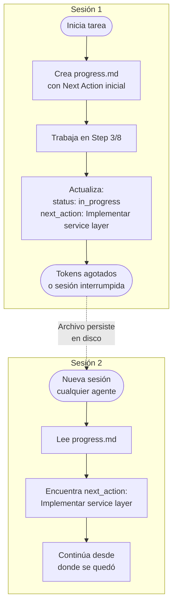

# Context Engineering — Persistencia entre sesiones

## El problema

Claude tiene un límite de tokens por sesión. En tareas largas o complejas el contexto de conversación se agota. Sin una solución, el agente pierde el hilo de lo que estaba haciendo y el usuario tiene que re-explicar el estado completo del trabajo.

## La solución: estado en archivos

En lugar de depender de la memoria de conversación (que se pierde), AgTeamOS **persiste el estado en archivos** dentro de `agteamos/changes/<id>-<slug>/`. El sistema funciona aunque la sesión se interrumpa, el contexto se agote, o un agente distinto retome el trabajo.



## Principios fundamentales

AgTeamOS sigue las mejores prácticas de Anthropic para sistemas multi-agente:

1. **Right context at the right time** — no se carga todo el repo al inicio; cada agente carga solo lo que necesita, cuando lo necesita (ver context tiers más abajo)
2. **Subagentes retornan resúmenes** — máximo 1-2k tokens de vuelta al orquestador, no outputs completos
3. **Shared state vía archivos** — el estado compartido vive en `agteamos/changes/`, no en la conversación
4. **Stopping conditions explícitas** — cada agente sabe cuándo parar
5. **Context budget awareness** — mide bytes/tokens estimados y no afirma uso
   real de la ventana si el host no lo expone.

## Context tiers en `agteamos-implement`

Cargar todo el contexto de una vez (`PROJECT_CONTEXT.md`, `design.md`, specs maestras, ADRs) en cada tarea es caro incluso cuando la tarea es simple. `agteamos-implement` carga contexto en 3 niveles, de forma perezosa:

| Tier | Contiene | Cuándo se usa |
|---|---|---|
| **1** | `task.yml` + `progress.md` | Retomar o cambio lite acotado |
| **2** | Tier 1 + artefactos del cambio + standards/specs relacionados | La mayoría de tareas full |
| **3** | Tier 2 + ADRs/decisiones explícitamente relacionadas | Multi-dominio, seguridad, arquitectura o contrato cross-repo |

Este diseño reduce el consumo de tokens en tareas simples sin perder profundidad cuando realmente se necesita — nadie carga la spec maestra completa de `notifications` para arreglar un typo en un mensaje de error.

## Presupuesto determinista

```bash
node <plugin>/scripts/agteamos-status.mjs \
  --root <proyecto> --context-budget --json
```

`contracts/context-budget.json` define presupuestos y la fórmula
`estimated_tokens = ceil(utf8_bytes / 4)`. El reporte agrega por tier, módulo
lógico y artefacto activo. Excluye código, binaries, evidence, cache, HTML y
payloads externos.

Es una estimación determinista, no telemetría del host, facturación ni tokens
reales consumidos. Portal y pulse muestran el mismo resumen. Llegar al 80% del
budget estimado recomienda checkpoint/menos contexto; no prueba que la ventana
real esté al límite.

## Registry, discovery e inyección

El plugin declara siete topics metadata-only en `standards/registry.yml`:
`design-de-codigo`, `api-design`, `database`, `testing`, `frontend`,
`security` y `entrega-y-operaciones`. El knowledge real vive en
`agteamos/standards/<id>/` y nace por discovery de evidencia del proyecto.

Durante onboarding L0 no existe `agteamos/standards/`.
`agteamos/onboarding.yml` conserva status y trigger; `--inject` resuelve con
el registry del plugin y devuelve vacío hasta que `ensure-artifact` genera el
topic más relevante. El primer discovery crea carpeta e índices. Cada
generación cambia `lifecycle: initialized` a `active`.

Los consumidores no recorren esos topics. Invocan
`agteamos-knowledge --inject <intent|paths>` y leen únicamente los paths
devueltos. Si el topic más relevante está `pending` o `stale`,
`ensure-artifact` permite generar como máximo uno en ese step.

README, CHANGELOG, `docs/architecture.md` y `docs/operations.md` son human
docs lazy derivadas de `agteamos/`; no forman parte de los tiers ni pueden
completar contexto canónico faltante.

Greenfield crea solo el README inicial. CHANGELOG aparece al primer cierre y
`docs/` únicamente cuando arquitectura u operaciones tienen fuentes estables.

## Estructura del archivo de tracking: `progress.md`

Cada tarea tiene un `progress.md` (dentro de `agteamos/changes/<id>-<slug>/`) que persiste todo el estado:

```markdown
# TASK-42: Add Email Notifications

| Campo | Valor |
|-------|-------|
| **Status** | IN_PROGRESS (40%) |
| **Owner** | Eddy Bereguete |
| **Branch** | feature/42-email-notifications |
| **Type** | Feature |
| **Platform** | GitHub #42 |
| **Last checkpoint** | 2026-08-09 14:30 |

## Acceptance Criteria
- [ ] AC 1: Given a user registers, When confirmed, Then receives welcome email
- [x] AC 2: Given invalid email, When sending, Then returns 422 (verified)

## Progress Log

### Step 1: Analysis & Setup [COMPLETED]
- Read PROJECT_CONTEXT.md — stack: FastAPI + React + PostgreSQL
- Branch created: feature/42-email-notifications
- Decision: Use SendGrid SDK — better deliverability vs raw SMTP

### Step 2: Backend implementation [COMPLETED]
- Created: src/notifications/service.py (NotificationService)

### Step 3: Unit Tests [IN_PROGRESS]
- test_send_welcome_email_success (PASS)
- test_send_email_rate_limited (PENDING)

### Step 4: Frontend integration [PENDING]
### Step 5: E2E Tests + Evidence [PENDING]
### Step 6: PR + Closure [PENDING]

## Unit Tests Written
| Test | File | Status | Cubre |
|------|------|--------|-------|
| test_send_welcome_email_success | test_notifications.py | PASS | Happy path |

## Evidence (QA Screenshots)
| Screenshot | Descripción | Status |
|-----------|-------------|--------|
| evidence/e2e-email-sent.png | Email recibido en inbox | Pending |

## Files Modified
| Archivo | Acción | Descripción |
|---------|--------|-------------|
| src/notifications/service.py | Created | NotificationService |

## Next Action (if context resets)
> **Resume desde**: Step 3 — completar test_send_email_rate_limited
> **Branch**: feature/42-email-notifications (último commit: abc123)
> **Ejecutar**: git checkout feature/42-email-notifications
> **Luego**: Implementar rate limit de 10 emails/min/usuario en NotificationService
```

## El campo "Next Action"

Es el campo más importante del archivo de tracking. Es lo primero que lee un agente al retomar una tarea. Debe ser lo suficientemente detallado para que un agente **sin contexto previo** sepa exactamente qué hacer:

**Mal Next Action:**
```
> Continuar con los tests
```

**Buen Next Action:**
```
> Resume desde: Step 3 — unit tests del NotificationService
> Branch: feature/42-email-notifications (último commit: abc123f)
> Ejecutar: git checkout feature/42-email-notifications && git log --oneline -3
> Pendiente: test_send_email_rate_limited en src/tests/test_notification_service.py
> El servicio tiene un rate limit de 10/min/usuario configurado en NotificationService.send()
```

## Capturar la persona, no solo el agente de IA

`task.yml` tiene un campo `owner` (nombre + email), capturado automáticamente vía `git config user.name` / `git config user.email` en el momento en que `agteamos-implement` crea la carpeta de la tarea — sin preguntarle nada al usuario. Si otra persona retoma la tarea en otra sesión (`git config user.name` distinto), se agrega una entrada a `handoffs:`. Es independiente de `assigned_to:` (los agentes de IA que intervinieron) — quién (persona real) trabajó la tarea y qué rol de IA se usó son dos cosas distintas, y ambas se muestran en `report.html` y en `agteamos/dashboard.html`.

## Handoff Protocol entre agentes

Cuando un agente termina su parte y pasa el trabajo a otro, escribe un handoff estructurado:

```markdown
## Handoff: @backend-engineer → @qa-engineer

### Completado
- NotificationService con send_welcome(), send_reset(), send_alert()
- Unit tests: 4 passing, 0 failing (coverage: 92%)
- Branch: feature/42-email-notifications (commit: abc123f)

### Contexto crítico para QA
- Rate limit: 10 emails/min/usuario — el test E2E no debe disparar esto
- Usar SENDGRID_API_KEY=test-key en .env.test para no hacer llamadas reales

### Tu tarea
Ejecutar E2E tests con Playwright cubriendo el flujo de registro completo.

### Criterio de éxito
Todos los ACs de requirements.md verificados, screenshots en evidence/.
```

Si `platform.yml` tiene `handoff_mode: explicit` (el default), cada una de estas transiciones pide confirmación del usuario antes de continuar. Con `handoff_mode: auto`, los agentes se pasan la posta solos. Ver [Configurar la plataforma](../guias/configurar-la-plataforma.md).

## Checkpoint Protocol

| Momento | Acción |
|---------|--------|
| Al empezar un step | Marca el step como "IN_PROGRESS" |
| Al completar un step | Marca como "COMPLETED", lista archivos creados |
| Al tomar una decisión técnica | Documenta en "Decisions Made" |
| Antes de un paso riesgoso | Checkpoint durable; commit solo si el flujo lo autorizó |
| Al 80% del budget estimado o telemetría explícita del host | Checkpoint completo con "Next Action" detallado |

## Reglas para el "Next Action"

1. **Siempre actualizado** — nunca en blanco, aunque sea al final de una sesión completa
2. **Accionable sin contexto** — el agente que lo lea no debe necesitar leer la conversación
3. **Incluir branch y último commit**
4. **Incluir el "por qué"** de cualquier decisión que afecte el siguiente paso
5. **Incluir paths exactos** — nunca "el archivo de tests", siempre la ruta completa

## Anti-patterns a evitar

| Anti-pattern | Por qué es un problema | Solución |
|-------------|----------------------|----------|
| Depender de la conversación para el estado | Se pierde cuando los tokens se agotan | Escribir en `progress.md` |
| Pasar outputs completos entre agentes | Consume tokens innecesariamente | Resumir en 1-2k tokens |
| Activar más agentes de los necesarios | Overhead de coordinación | Solo los agentes de las capas impactadas |
| Dejar "Next Action" vacío | El siguiente agente está ciego | Siempre actualizar antes de parar |
| Loop sin stopping condition | El agente sigue indefinidamente | Máximo 3 iteraciones por paso |
