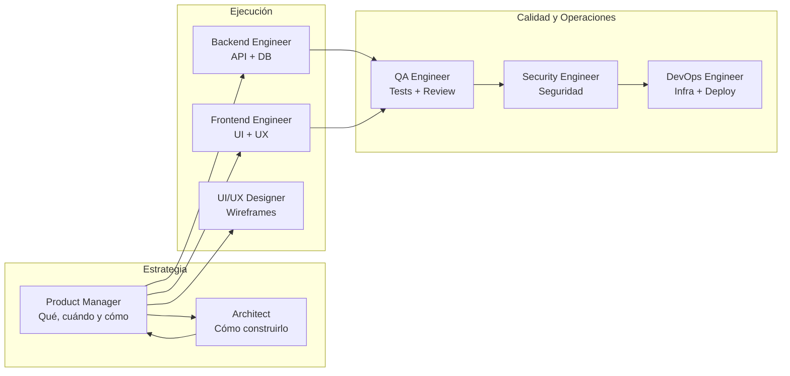
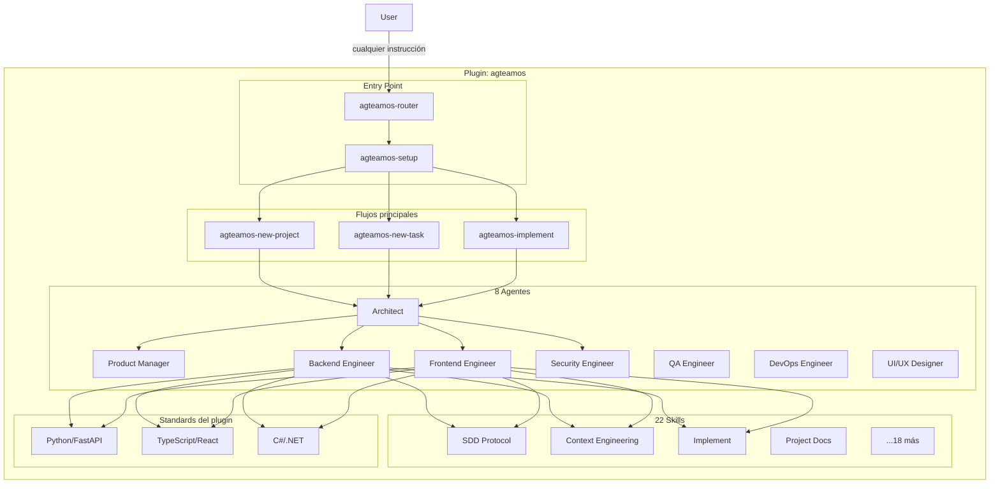

# Filosofía y arquitectura de AgTeamOS

## ¿Qué es?

**AgTeamOS** es un plugin para Claude Code que convierte al asistente en un equipo completo de ingeniería de software. En lugar de un solo asistente genérico, orquesta **8 agentes especializados** que colaboran para entregar software de calidad profesional, y persiste todo lo que gestiona en una única carpeta visible y portable: `agteamos/` en la raíz de tu proyecto.

Cada agente tiene un rol definido, skills específicas (invocables como `/agteamos-<nombre>`), y estándares de código que aplica automáticamente. El sistema implementa **Spec-Driven Development (SDD)** y **Context Engineering** para mantener coherencia entre sesiones largas y garantizar que el contexto no se pierda cuando se agota la ventana de tokens.

## ¿Qué problema resuelve?

### 1. Un solo asistente no puede ser experto en todo al mismo tiempo

Un asistente genérico cambia de mentalidad constantemente: arquitecto, backend, tester, DevOps. Esto reduce la profundidad de cada rol. AgTeamOS asigna un agente especializado a cada tarea: el Architect diseña, el Backend Engineer implementa, el QA Engineer valida. Cada agente activa solo las skills relevantes para su función.

### 2. El contexto se pierde cuando los tokens se agotan

En proyectos reales las sesiones se interrumpen. Si Claude pierde el hilo, el usuario tiene que re-explicar todo. AgTeamOS resuelve esto con **Context Engineering**: persiste el estado de cada tarea en `agteamos/changes/<id>-<slug>/progress.md`. Al iniciar una nueva sesión, cualquier agente lee el archivo, encuentra el campo `Next Action`, y retoma exactamente donde se quedó. Ver [Context Engineering](./context-engineering.md).

### 3. No hay estándares consistentes entre sesiones

Sin un marco de trabajo, el código generado varía en estructura, naming y calidad. AgTeamOS incluye estándares por stack (Python/FastAPI, TypeScript/React, C#/.NET) empaquetados en el plugin, y una skill (`agteamos-project-docs`) que los adapta al código real de tu proyecto. Ver [Capa de standards](#capa-de-standards) más abajo.

### 4. No hay un único lugar donde ver "qué se instala en mi proyecto"

Todo lo que AgTeamOS gestiona vive en **una sola carpeta visible `agteamos/`** — no repartido en varias carpetas genéricas de documentación. El árbol completo está en [Estructura de carpetas](../referencia/estructura-de-carpetas.md).

## ¿Para quién es?

- Desarrolladores full-stack trabajando solos que quieren simular un equipo con roles claros
- Equipos pequeños que necesitan estructura y estándares reproducibles
- Proyectos desde cero que requieren arquitectura y planificación antes de escribir código
- Features complejas que requieren múltiples perspectivas (backend, frontend, seguridad, QA)

## Beneficios clave

| Beneficio | Cómo se logra |
|---|---|
| Arquitectura bien pensada | El Architect revisa toda decisión técnica; las relevantes quedan como ADR |
| Especificaciones antes de código | SDD: `requirements.md` → `design.md` → deltas → `tasks.md`, con aprobación explícita en cada paso |
| Contexto persistente | `progress.md` con `Next Action` — cualquier agente retoma sin contexto previo |
| Tests obligatorios | Mínimo happy path + error + edge case por cada pieza funcional; QA valida con E2E y evidencia |
| Multi-stack | Python/FastAPI, TypeScript/React, C#/.NET — estándares y ejemplos para los tres |
| Visibilidad real | `agteamos/dashboard.html` — estado de todas las tareas, quién las trabajó, sin servidor |

## Mapa de agentes por función



`@architect` es el punto de entrada de cualquier flujo — ejecuta `agteamos-router` en cada sesión nueva. El detalle completo de cada agente (rol, responsabilidades, skills asignadas) y la matriz skill-por-agente están en [Agentes y skills](../referencia/agentes-y-skills.md).

## Arquitectura del plugin



## ¿Cómo se instala?

Ver [Quickstart](../primeros-pasos/01-quickstart.md). En resumen: se instala como plugin de Claude Code vía marketplace, y cada skill se invoca directamente con `/agteamos-<nombre>` (forma corta) o `/agteamos:agteamos-<nombre>` (forma completa con namespace) — sin necesidad de una carpeta `commands/` separada.

## Una decisión de diseño explícita: Standards vs. Skills

AgTeamOS distingue con precisión entre dos tipos de conocimiento:

- **Standards (declarativo)** — si es una convención de código ("los DTOs son inmutables", "los endpoints devuelven RFC 9457"), vive en `standards/` (el árbol base del plugin) y se proyecta a `agteamos/standards/` una vez adaptado al proyecto real.
- **Skills (procedimental)** — si es un procedimiento repetible ("cómo cerrar una tarea", "cómo auditar seguridad"), vive como skill invocable.

Esta distinción no es accidental: mezclar reglas de código con workflows en el mismo archivo hace que ambos sean más difíciles de mantener y de encontrar. Es el mismo criterio que otros frameworks de desarrollo asistido por agentes (Agent OS, entre otros) formalizan explícitamente — AgTeamOS llegó al mismo diseño de forma independiente y lo mantiene como principio consciente, no como convención implícita.

## Capa de standards

AgTeamOS distingue dos cosas relacionadas pero distintas, y ambas se llaman "standards" en contextos distintos — vale la pena separarlas con claridad:

1. **`standards/` del propio plugin** — los 7 temas base con código de referencia, empaquetados dentro de AgTeamOS. Genéricos, no atados a ningún proyecto concreto.
2. **`agteamos/standards/` de tu proyecto** — el resultado de la skill `agteamos-project-docs` leyendo tu código real y adaptando (o desviándose de) esos 7 temas base. Específico de tu proyecto.

### 1. Standards base del plugin

Ubicados en `standards/` dentro del repositorio de AgTeamOS, uno por tema, cada carpeta con sus propios ejemplos de código adentro (no un árbol `examples/` separado por lenguaje):

```
standards/
├── api-design/
│   ├── README.md
│   └── examples/
├── database/
├── design-de-codigo/
│   ├── README.md
│   └── examples/
├── entrega-y-operaciones/
├── frontend/
├── security/
└── testing/
```

### Stacks soportados

| Stack | Lenguaje | Framework | ORM/DB | Tests |
|---|---|---|---|---|
| Python | 3.11+ | FastAPI | SQLAlchemy 2.x + Alembic | pytest + pytest-asyncio + factory_boy |
| C#/.NET | .NET 8+ | ASP.NET Core / Blazor / MAUI | EF Core 8 | xUnit + FluentAssertions + Moq/NSubstitute |
| TypeScript | 5+ | React 19 / NestJS / Express | Prisma / Drizzle | Vitest + Testing Library + Playwright |

### Reglas transversales que aplican todos los agentes

- Funciones pequeñas con responsabilidad única — si supera ~40 líneas, evaluar dividir
- Manejo explícito de errores — nunca silenciosos ni genéricos
- Sin lógica de negocio en controllers/handlers — delegar a servicios
- Sin secrets ni valores hardcodeados — siempre variables de entorno
- Tests obligatorios: mínimo happy path + error + edge case

**Ejemplo — Result Pattern en C#:**
```csharp
public async Task<Result<InvoiceDto>> CreateInvoiceAsync(
    CreateInvoiceCommand command,
    CancellationToken cancellationToken = default)
{
    var customer = await _repository.FindAsync(command.CustomerId, cancellationToken);
    if (customer is null)
        return Result.Failure<InvoiceDto>(CustomerErrors.NotFound(command.CustomerId));

    var invoice = Invoice.Create(customer, command.Items);
    await _repository.AddAsync(invoice, cancellationToken);
    await _unitOfWork.SaveChangesAsync(cancellationToken);
    return Result.Success(_mapper.Map<InvoiceDto>(invoice));
}
```

**Ejemplo — capas en FastAPI:**
```python
class CreateInvoiceUseCase:
    def __init__(self, repo: InvoiceRepository, notifier: NotificationService) -> None:
        self._repo = repo
        self._notifier = notifier

    async def execute(self, command: CreateInvoiceCommand) -> InvoiceDTO:
        invoice = Invoice.create(command.customer_id, command.items)
        await self._repo.save(invoice)
        await self._notifier.send_confirmation(invoice)
        return InvoiceDTO.from_domain(invoice)
```

**Ejemplo — React con TypeScript:**
```typescript
interface Invoice {
  id: string
  customerId: string
  total: number
  status: 'draft' | 'sent' | 'paid'
}

function useInvoices() {
  return useQuery<Invoice[], ApiError>({
    queryKey: ['invoices'],
    queryFn: () => apiClient.get<Invoice[]>('/invoices'),
  })
}
```

### 2. `agteamos/standards/` — la proyección sobre tu proyecto

La skill `agteamos-project-docs` (ver [guía operativa](../guias/mantener-standards-al-dia.md)) lee estos 7 temas base y los compara contra tu código real, produciendo una carpeta por tema **dentro de tu proyecto**:

```
agteamos/standards/
├── standards.yml          ← manifest: qué aplica, qué se adapta, qué se desvía
├── index.yml               ← keyword → carpeta, para no escanear los 7 temas
├── api-design/
│   ├── README.md            ← reglas adaptadas a ESTE proyecto
│   ├── examples.md           ← ejemplos reales tomados del código del proyecto
│   └── deviations.md         ← solo si hay desviaciones
├── database/README.md
├── design-de-codigo/README.md
├── entrega-y-operaciones/README.md
├── frontend/README.md
├── security/README.md
└── testing/README.md
```

Cada `README.md` lleva un header de proveniencia con `Estado` (STUB / EXTRACTED / DESIGN-DERIVED / CREATED / UPDATED) y `Confidence` (1-5) — un estándar no se marca como vigente (`status: applies`) con confidence menor a 4/5. El detalle completo de esta regla y el ciclo de vida está en [Mantener los standards al día](../guias/mantener-standards-al-dia.md).

### Por qué la separación importa

Si `agteamos/standards/` simplemente copiara el `standards/` del plugin sin adaptar, no aportaría nada sobre leer el árbol del plugin directamente. El valor real está en que cada regla se confirma (o se desvía, con razón documentada) contra el código que existe de verdad en tu proyecto — el `Confidence` score es la forma en que el sistema es honesto sobre qué tan seguro está de esa determinación.

### Cómo lo usan los agentes

El acceso a `agteamos/standards/` combina dos mecanismos distintos — uno pasivo (siempre activo, no requiere que ningún agente lo pida) y uno activo (lo dispara la skill que está a punto de escribir o revisar código):

#### Inyección pasiva — hook `SessionStart`

Un hook corre automáticamente al iniciar cualquier sesión. Si `agteamos/standards/index.yml` ya existe en el proyecto (es decir, `agteamos-project-docs` corrió al menos una vez), inyecta al contexto un resumen compacto del índice — carpeta por tema con sus keywords, tope de 15 temas para no volcar el índice completo:

```
[agteamos] Standards del proyecto disponibles en agteamos/standards/.
Indice keyword -> carpeta (agteamos/standards/index.yml):
- api-design: api, rest, endpoints
- security: auth, jwt, mfa
- database: migrations, postgres, sql
...
Antes de escribir o revisar codigo, resuelve el tema relevante contra este
indice y lee agteamos/standards/<carpeta>/README.md (y deviations.md si existe).
```

Si `index.yml` todavía no existe (el proyecto nunca corrió `agteamos-project-docs`), el hook no hace nada — no bloquea ni advierte, simplemente no hay nada que inyectar todavía.

#### Resolución activa — las skills que escriben o revisan código

La inyección pasiva pone el índice en el contexto, pero quien realmente **lee la regla completa y la aplica** son las skills que escriben o revisan código (`agteamos-build`, `agteamos-quality`), cada una con un Step explícito para esto:

| Skill | Qué hace |
|---|---|
| `agteamos-build` | Resuelve keywords (`api`, `rest`, `endpoints`, `react`, `component`, `frontend` + las que apliquen a la tarea) contra `index.yml`, lee el `README.md`/`deviations.md` de cada carpeta resuelta, y aplica esas reglas por encima del patrón genérico del Step de implementación, tanto para Backend como para Frontend |
| `agteamos-quality` | En su modo de review, resuelve el tema del código bajo revisión, compara contra el `README.md` del proyecto y contra `deviations.md` (una desviación ya documentada ahí no es un hallazgo nuevo) |

Si `agteamos/standards/index.yml` no existe todavía, ninguna de las dos bloquea la tarea — cada una lo deja constancia explícita en su output ("no se encontró `agteamos/standards/` — no se pudo verificar contra los estándares del proyecto") en vez de saltear el paso en silencio.

Esto garantiza que el código generado en la sesión 1 sea consistente con el generado en la sesión 50, por cualquier agente que pase por una de estas skills — y que un estándar exista en `agteamos/standards/` no depende de que alguien se acuerde de ir a leerlo.
