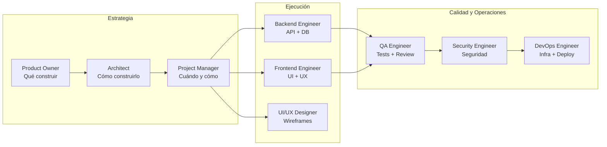
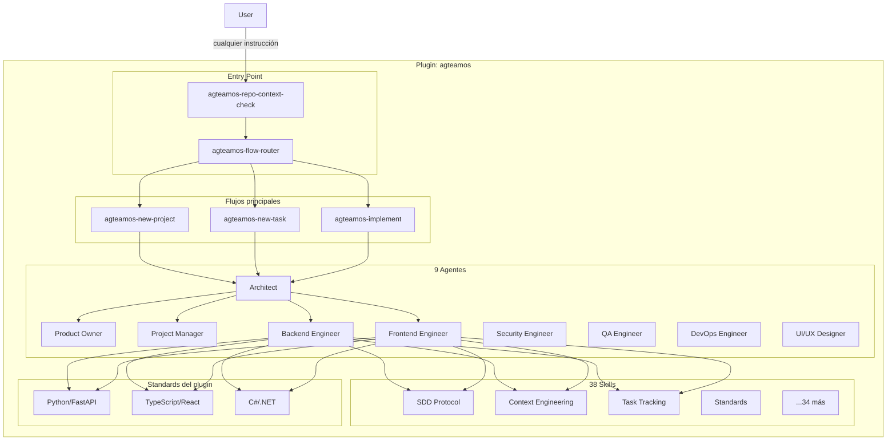

# Filosofía y arquitectura de AgTeamOS

## ¿Qué es?

**AgTeamOS** es un plugin para Claude Code que convierte al asistente en un equipo completo de ingeniería de software. En lugar de un solo asistente genérico, orquesta **9 agentes especializados** que colaboran para entregar software de calidad profesional, y persiste todo lo que gestiona en una única carpeta visible y portable: `agteamos/` en la raíz de tu proyecto.

Cada agente tiene un rol definido, skills específicas (invocables como `/agteamos-<nombre>`), y estándares de código que aplica automáticamente. El sistema implementa **Spec-Driven Development (SDD)** y **Context Engineering** para mantener coherencia entre sesiones largas y garantizar que el contexto no se pierda cuando se agota la ventana de tokens.

## ¿Qué problema resuelve?

### 1. Un solo asistente no puede ser experto en todo al mismo tiempo

Un asistente genérico cambia de mentalidad constantemente: arquitecto, backend, tester, DevOps. Esto reduce la profundidad de cada rol. AgTeamOS asigna un agente especializado a cada tarea: el Architect diseña, el Backend Engineer implementa, el QA Engineer valida. Cada agente activa solo las skills relevantes para su función.

### 2. El contexto se pierde cuando los tokens se agotan

En proyectos reales las sesiones se interrumpen. Si Claude pierde el hilo, el usuario tiene que re-explicar todo. AgTeamOS resuelve esto con **Context Engineering**: persiste el estado de cada tarea en `agteamos/changes/<id>-<slug>/progress.md`. Al iniciar una nueva sesión, cualquier agente lee el archivo, encuentra el campo `Next Action`, y retoma exactamente donde se quedó. Ver [Context Engineering](./context-engineering.md).

### 3. No hay estándares consistentes entre sesiones

Sin un marco de trabajo, el código generado varía en estructura, naming y calidad. AgTeamOS incluye estándares por stack (Python/FastAPI, TypeScript/React, C#/.NET) empaquetados en el plugin, y una skill (`agteamos-standards`) que los adapta al código real de tu proyecto. Ver [Capa de standards](./capa-de-standards.md).

### 4. No hay un único lugar donde ver "qué se instala en mi proyecto"

Todo lo que AgTeamOS gestiona vive en **una sola carpeta visible `agteamos/`** — no repartido en varias carpetas genéricas de documentación. El árbol completo está en [Estructura de carpetas](../referencia/estructura-de-carpetas.md).

## ¿Para quién es?

- Desarrolladores full-stack trabajando solos que quieren simular un equipo con roles claros
- Equipos pequeños que necesitan estructura y estándares reproducibles
- Proyectos desde cero que requieren arquitectura y planificación antes de escribir código
- Features complejas que requieren múltiples perspectivas (backend, frontend, seguridad, QA)

## Beneficios clave

| Beneficio | Cómo se logra |
|---|---|
| Arquitectura bien pensada | El Architect revisa toda decisión técnica; las relevantes quedan como ADR |
| Especificaciones antes de código | SDD: `requirements.md` → `design.md` → deltas → `tasks.md`, con aprobación explícita en cada paso |
| Contexto persistente | `progress.md` con `Next Action` — cualquier agente retoma sin contexto previo |
| Tests obligatorios | Mínimo happy path + error + edge case por cada pieza funcional; QA valida con E2E y evidencia |
| Multi-stack | Python/FastAPI, TypeScript/React, C#/.NET — estándares y ejemplos para los tres |
| Visibilidad real | `agteamos/dashboard.html` — estado de todas las tareas, quién las trabajó, sin servidor |

## Mapa de agentes por función

`@architect` es el punto de entrada de cualquier flujo — ejecuta `agteamos-repo-context-check` y `agteamos-flow-router` en cada sesión nueva. El detalle completo de cada agente (rol, responsabilidades, skills asignadas) y la matriz skill-por-agente están en [Matriz de agentes y skills](../referencia/matriz-agentes-y-skills.md).

## Arquitectura del plugin

## ¿Cómo se instala?

Ver [Instalación](../primeros-pasos/01-instalacion.md). En resumen: se instala como plugin de Claude Code vía marketplace, y cada skill se invoca directamente con `/agteamos-<nombre>` (forma corta) o `/agteamos:agteamos-<nombre>` (forma completa con namespace) — sin necesidad de una carpeta `commands/` separada.

## Una decisión de diseño explícita: Standards vs. Skills

AgTeamOS distingue con precisión entre dos tipos de conocimiento:

- **Standards (declarativo)** — si es una convención de código ("los DTOs son inmutables", "los endpoints devuelven RFC 9457"), vive en `standards/` (el árbol base del plugin) y se proyecta a `agteamos/standards/` una vez adaptado al proyecto real.
- **Skills (procedimental)** — si es un procedimiento repetible ("cómo cerrar una tarea", "cómo auditar seguridad"), vive como skill invocable.

Esta distinción no es accidental: mezclar reglas de código con workflows en el mismo archivo hace que ambos sean más difíciles de mantener y de encontrar. Es el mismo criterio que otros frameworks de desarrollo asistido por agentes (Agent OS, entre otros) formalizan explícitamente — AgTeamOS llegó al mismo diseño de forma independiente y lo mantiene como principio consciente, no como convención implícita.
