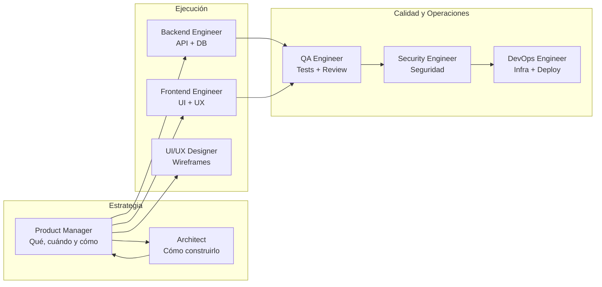
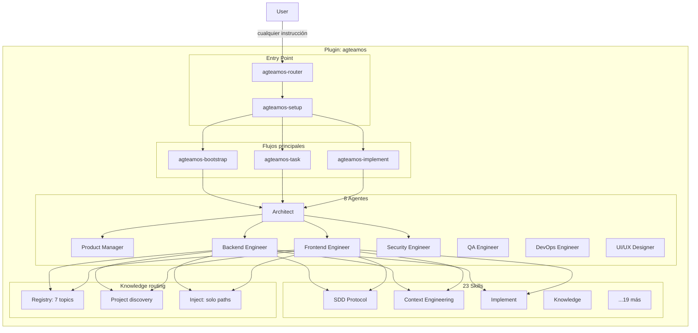

# Filosofía y arquitectura de AgTeamOS

## ¿Qué es?

**AgTeamOS** es un plugin para Claude Code que convierte al asistente en un
equipo completo de ingeniería de software. Orquesta **8 agentes
especializados** y persiste su estado canónico en `agteamos/`. README,
CHANGELOG y docs humanas son vistas derivadas opcionales.

Cada agente tiene un rol definido y skills específicas. Las convenciones se
descubren desde el repositorio; no se aplican standards genéricos
automáticamente. El sistema implementa **Spec-Driven Development (SDD)** y
**Context Engineering**.

## ¿Qué problema resuelve?

### 1. Un solo asistente no puede ser experto en todo al mismo tiempo

Un asistente genérico cambia de mentalidad constantemente: arquitecto, backend, tester, DevOps. Esto reduce la profundidad de cada rol. AgTeamOS asigna un agente especializado a cada tarea: el Architect diseña, el Backend Engineer implementa, el QA Engineer valida. Cada agente activa solo las skills relevantes para su función.

### 2. El contexto se pierde cuando los tokens se agotan

En proyectos reales las sesiones se interrumpen. Si Claude pierde el hilo, el usuario tiene que re-explicar todo. AgTeamOS resuelve esto con **Context Engineering**: persiste el estado de cada tarea en `agteamos/changes/<id>-<slug>/progress.md`. Al iniciar una nueva sesión, cualquier agente lee el archivo, encuentra el campo `Next Action`, y retoma exactamente donde se quedó. Ver [Context Engineering](./context-engineering.md).

### 3. No hay estándares consistentes entre sesiones

Sin un marco de trabajo, el código generado varía entre sesiones.
`agteamos-knowledge` descubre convenciones en código, tests, configuración y
ADRs del proyecto. El plugin aporta un registry metadata-only para encontrar
evidencia, no estándares prescriptivos. Ver [Capa de standards](#capa-de-standards).

### 4. No hay un único lugar donde ver "qué se instala en mi proyecto"

El estado canónico vive en **`agteamos/`** y se materializa por trigger, no
como árbol completo durante onboarding. El contrato está en
[Estructura de carpetas](../referencia/estructura-de-carpetas.md).

## ¿Para quién es?

- Desarrolladores full-stack trabajando solos que quieren simular un equipo con roles claros
- Equipos pequeños que necesitan estructura y estándares reproducibles
- Proyectos desde cero que requieren arquitectura y planificación antes de escribir código
- Features complejas que requieren múltiples perspectivas (backend, frontend, seguridad, QA)

## Beneficios clave

| Beneficio | Cómo se logra |
|---|---|
| Arquitectura bien pensada | El Architect revisa toda decisión técnica; las relevantes quedan como ADR |
| Especificaciones antes de código | SDD: `requirements.md` → `design.md` → deltas → `tasks.md`, con aprobación explícita en cada paso |
| Contexto persistente | `progress.md` con `Next Action` — cualquier agente retoma sin contexto previo |
| Tests obligatorios | Mínimo happy path + error + edge case por cada pieza funcional; QA valida con E2E y evidencia |
| Multi-stack | Python/FastAPI, TypeScript/React, C#/.NET — estándares y ejemplos para los tres |
| Visibilidad real | `agteamos/dashboard.html` — estado de todas las tareas, quién las trabajó, sin servidor |

## Mapa de agentes por función



`@architect` es el punto de entrada de cualquier flujo — ejecuta `agteamos-router` en cada sesión nueva. El detalle completo de cada agente (rol, responsabilidades, skills asignadas) y la matriz skill-por-agente están en [Agentes y skills](../referencia/agentes-y-skills.md).

## Arquitectura del plugin



## ¿Cómo se instala?

Ver [Quickstart](../primeros-pasos/01-quickstart.md). En resumen: se instala como plugin de Claude Code vía marketplace, y cada skill se invoca directamente con `/agteamos-<nombre>` (forma corta) o `/agteamos:agteamos-<nombre>` (forma completa con namespace) — sin necesidad de una carpeta `commands/` separada.

## Una decisión de diseño explícita: Knowledge vs. Skills

AgTeamOS distingue con precisión entre dos tipos de conocimiento:

- **Knowledge project-owned (declarativo)** — una convención vive en
  `agteamos/standards/` solo después de discovery con evidencia del proyecto.
  `standards/registry.yml` aporta ids, aliases, keywords y globs para routing.
- **Skills (procedimental)** — si es un procedimiento repetible ("cómo cerrar una tarea", "cómo auditar seguridad"), vive como skill invocable.

Esta distinción no es accidental: mezclar reglas de código con workflows en el mismo archivo hace que ambos sean más difíciles de mantener y de encontrar. Es el mismo criterio que otros frameworks de desarrollo asistido por agentes (Agent OS, entre otros) formalizan explícitamente — AgTeamOS llegó al mismo diseño de forma independiente y lo mantiene como principio consciente, no como convención implícita.

## Capa de standards

AgTeamOS separa routing de conocimiento y conocimiento real:

1. **`standards/registry.yml` del plugin** — siete lentes metadata-only.
2. **`agteamos/standards/` del proyecto** — convenciones descubiertas en
   evidencia real y decisiones del equipo.

### 1. Registry metadata-only del plugin

La única entrada de knowledge empaquetada es:

```
standards/
├── registry.yml
└── README.md
```

Sus ids/folders son `design-de-codigo`, `api-design`, `database`, `testing`,
`frontend`, `security` y `entrega-y-operaciones`. Keywords, globs y aliases
sirven para seleccionar evidencia; no afirman cómo debe escribirse el código.

### Ejemplos procedimentales soportados

| Stack | Lenguaje | Framework | ORM/DB | Tests |
|---|---|---|---|---|
| Python | 3.11+ | FastAPI | SQLAlchemy 2.x + Alembic | pytest + pytest-asyncio + factory_boy |
| C#/.NET | .NET 8+ | ASP.NET Core / Blazor / MAUI | EF Core 8 | xUnit + FluentAssertions + Moq/NSubstitute |
| TypeScript | 5+ | React 19 / NestJS / Express | Prisma / Drizzle | Vitest + Testing Library + Playwright |

Estos stacks aparecen como ejemplos en skills de build, quality y security,
no como baseline de `agteamos-knowledge`.

### Guardrails transversales de calidad

- Funciones pequeñas con responsabilidad única — si supera ~40 líneas, evaluar dividir
- Manejo explícito de errores — nunca silenciosos ni genéricos
- Sin lógica de negocio en controllers/handlers — delegar a servicios
- Sin secrets ni valores hardcodeados — siempre variables de entorno
- Tests obligatorios: mínimo happy path + error + edge case

**Ejemplo — Result Pattern en C#:**
```csharp
public async Task<Result<InvoiceDto>> CreateInvoiceAsync(
    CreateInvoiceCommand command,
    CancellationToken cancellationToken = default)
{
    var customer = await _repository.FindAsync(command.CustomerId, cancellationToken);
    if (customer is null)
        return Result.Failure<InvoiceDto>(CustomerErrors.NotFound(command.CustomerId));

    var invoice = Invoice.Create(customer, command.Items);
    await _repository.AddAsync(invoice, cancellationToken);
    await _unitOfWork.SaveChangesAsync(cancellationToken);
    return Result.Success(_mapper.Map<InvoiceDto>(invoice));
}
```

**Ejemplo — capas en FastAPI:**
```python
class CreateInvoiceUseCase:
    def __init__(self, repo: InvoiceRepository, notifier: NotificationService) -> None:
        self._repo = repo
        self._notifier = notifier

    async def execute(self, command: CreateInvoiceCommand) -> InvoiceDTO:
        invoice = Invoice.create(command.customer_id, command.items)
        await self._repo.save(invoice)
        await self._notifier.send_confirmation(invoice)
        return InvoiceDTO.from_domain(invoice)
```

**Ejemplo — React con TypeScript:**
```typescript
interface Invoice {
  id: string
  customerId: string
  total: number
  status: 'draft' | 'sent' | 'paid'
}

function useInvoices() {
  return useQuery<Invoice[], ApiError>({
    queryKey: ['invoices'],
    queryFn: () => apiClient.get<Invoice[]>('/invoices'),
  })
}
```

### 2. `agteamos/standards/` — conocimiento project-owned eventual

La skill `agteamos-knowledge` (ver
[guía operativa](../guias/mantener-standards-al-dia.md)) usa el registry para
encontrar 5-10 fuentes representativas y documenta únicamente lo observado,
decidido o externo:

Esta carpeta no existe en L0. El primer discovery crea la carpeta, los índices
mínimos y únicamente el topic requerido:

```
agteamos/standards/
├── registry.yml           ← custom topics locales, opcional
├── standards.yml          ← observed | mixed | intentional-deviation | pending
├── index.yml              ← keyword/alias → folder canónico
├── index.meta.yml         ← done | pending | stale
├── api-design/
│   ├── README.md           ← convenciones y evidencia del proyecto
│   ├── examples.md         ← opcional, código real del proyecto
│   └── deviations.md       ← solo desviación intencional confirmada
├── database/README.md
├── design-de-codigo/README.md
├── entrega-y-operaciones/README.md
├── frontend/README.md
├── security/README.md
└── testing/README.md
```

Cada README separa `Provenance`, `Current conventions`, `Evidence`,
`Team decisions`, `Migration path` y `Learned in use`. Runtime y
clasificación son ejes distintos; ver
[Mantener los standards al día](../guias/mantener-standards-al-dia.md).

### Por qué la separación importa

Copiar reglas del plugin convertiría metadata en prescripción. El valor está
en la evidencia citada del proyecto y en distinguir observación, decisión y
referencia externa.

### Cómo lo usan los agentes

El acceso a `agteamos/standards/` combina dos mecanismos distintos — uno pasivo (siempre activo, no requiere que ningún agente lo pida) y uno activo (lo dispara la skill que está a punto de escribir o revisar código):

#### Inyección pasiva — hook `SessionStart`

`session-start.js` presenta un resumen compacto del índice project-owned si
existe. No inyecta contenido de standards ni lee subdirectorios prescriptivos:

```
[agteamos] Standards del proyecto disponibles en agteamos/standards/.
Indice keyword -> carpeta (agteamos/standards/index.yml):
- api-design: api, rest, endpoints
- security: auth, jwt, mfa
- database: migrations, postgres, sql
...
Antes de escribir o revisar codigo, usa agteamos-knowledge --inject con el
intent y los paths. Lee unicamente los paths devueltos.
```

Si `index.yml` todavía no existe, SessionStart no inyecta un índice vacío. El
hook post-write y `--inject` pueden resolver el topic desde el registry +
`onboarding.yml` y solicitar un único `ensure-artifact`.

#### Resolución activa — las skills que escriben o revisan código

Las skills que escriben o revisan código invocan
`agteamos-knowledge --inject <intent|paths>`. El resultado final contiene solo
paths:

| Skill | Qué hace |
|---|---|
| `agteamos-build` | Pasa intent y paths, lee solo los paths devueltos y puede generar como máximo un topic pending/stale por step |
| `agteamos-quality` | Revisa contra los paths project-owned devueltos; una desviación intencional ya documentada no es un hallazgo nuevo |

Si `agteamos/standards/index.yml` todavía no existe, `--inject` resuelve
relevancia desde metadata y onboarding. No devuelve paths inexistentes: pide
materializar como máximo un topic y después relee sus archivos.

Así el contexto se carga JIT sin convertir el registry en reglas ni escanear
los siete topics en cada tarea.
