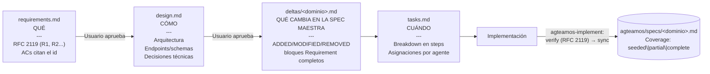
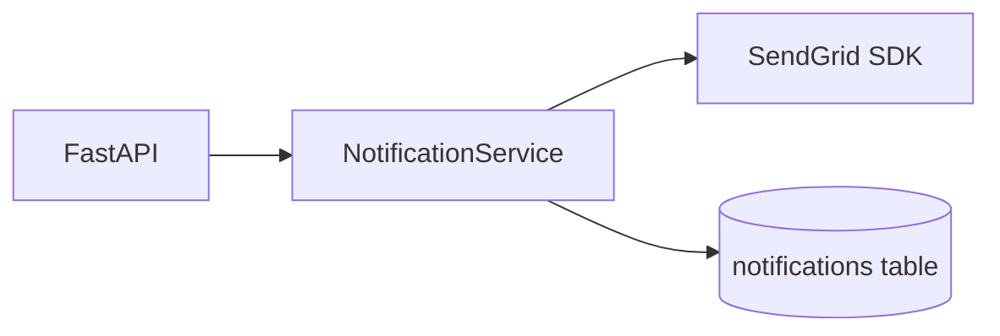

# SDD y specs maestras — Spec-Driven Development

## ¿Qué es?

SDD (Spec-Driven Development) es la metodología central de AgTeamOS. Garantiza que **nunca se escribe una línea de código sin especificación aprobada**. La spec es la fuente de verdad — el código es su expresión.

Hay dos capas de spec, con vidas distintas, y es la distinción más importante de todo el protocolo:

| Capa | Archivo | Vida | Quién la escribe |
|---|---|---|---|
| **Spec maestra** (fuente de verdad) | `agteamos/specs/<dominio>.md` | **Persistente y acumulativa** — vive mientras exista el dominio | Nadie a mano durante la tarea: la actualiza `agteamos-implement` en su paso `sync`, o la siembra `agteamos-knowledge` |
| **Delta** (diff propuesto) | `agteamos/changes/<id>-<slug>/specs/deltas/<dominio>.md` | **Efímero** — nace y muere con la tarea, queda en el archive como historia | `@architect`, junto con `design.md` |

El delta no es "la capa de specs" — es el diff contra ella. Las dos usan el **mismo formato canónico**, y eso es justamente lo que hace posible que el merge del paso `sync` sea determinista en vez de interpretativo.

## Regla crítica

> **No se escribe código hasta que el usuario apruebe `design.md`.**
> Si el usuario pide cambios, se actualiza `design.md` primero y luego se reimplementa.
> La spec manda — el código se adapta a la spec, no al revés.

## El formato canónico: `### Requirement:` + `#### Scenario:` + RFC 2119

Tanto la spec maestra como el delta se escriben con la misma estructura de tres niveles — no es una elección estética, es lo que hace que un requirement se pueda **anclar** para el merge y **clasificar** para el gate de cierre:

```markdown
### Requirement: Welcome Email On Registration
El sistema MUST enviar un email de bienvenida dentro de los 5 segundos
posteriores a un registro exitoso.

#### Scenario: Registro exitoso
- GIVEN un email que no existe en el sistema
- WHEN el usuario completa el registro
- THEN se envia un email de bienvenida a esa direccion
- AND queda registrada una notificacion con type = welcome

#### Scenario: El proveedor de email falla
- GIVEN el proveedor de email responde con error 500
- WHEN se intenta enviar el email de bienvenida
- THEN el registro del usuario se conserva
- AND la notificacion queda en estado failed para reintento
```

- **`### Requirement: <Nombre>`** — un comportamiento, una frase, un solo modal RFC 2119. El nombre es la **ancla de merge**: tiene que ser único y estable dentro del dominio, porque es por ese nombre (carácter por carácter) que el paso `sync` encuentra el bloque a reemplazar o borrar.
- **`#### Scenario: <caso>`** — GIVEN/WHEN/THEN, mínimo un escenario por requirement, cubriendo también error y borde, no solo el happy path.
- **Modal RFC 2119, dentro de la frase, no como etiqueta aparte**:

| Modal | Significado | Efecto en el gate `verify` |
|---|---|---|
| `MUST` / `SHALL` | Requisito duro | Incumplido → **FAIL**, bloquea el cierre |
| `SHOULD` | Recomendación fuerte | Incumplido → **WARNING**, se documenta, no bloquea |
| `MAY` | Opcional | No se chequea |

**Test rápido para distinguir spec de implementación**: si el código puede cambiar sin que cambie el comportamiento observable, eso no va en la spec — va en `design.md`. Nombres de clases, la librería elegida, el esquema de tablas: `design.md`. Inputs, outputs, condiciones de error, restricciones externas: la spec.

## La spec maestra y su header `## Coverage`

`agteamos/specs/<dominio>.md` no nace completa — en un proyecto existente se **siembra parcialmente** (`agteamos-knowledge` documenta lo que puede inferir del código real) y crece tarea a tarea. El header `## Coverage` es lo que hace esa parcialidad honesta en vez de silenciosa:

```markdown
# Spec: notifications

## Coverage
- **Estado**: partial
- **Cubre**: emails transaccionales (bienvenida, reset de password), rate limiting por usuario
- **No cubre (todavia)**: notificaciones push, preferencias de suscripcion del usuario, digest semanal
- **Ultima tarea aplicada**: TASK-42 (2026-08-09)
- **Origen**: deltas de tareas

## Purpose
Envio y trazabilidad de notificaciones salientes hacia los usuarios, y las
reglas que limitan ese envio.

## Requirements

### Requirement: Welcome Email On Registration
El sistema MUST enviar un email de bienvenida dentro de los 5 segundos
posteriores a un registro exitoso.

#### Scenario: Registro exitoso
- GIVEN un email que no existe en el sistema
- WHEN el usuario completa el registro
- THEN se envia un email de bienvenida a esa direccion

### Requirement: Per-User Send Rate Limit
El sistema MUST rechazar los envios que superen 10 notificaciones por minuto
para un mismo usuario.

#### Scenario: Limite excedido
- GIVEN un usuario con 10 notificaciones enviadas en el ultimo minuto
- WHEN se dispara una notificacion mas
- THEN el envio se rechaza con un error de rate limit
```

| Estado | Significado |
|---|---|
| `seeded` | Recién creada (onboarding o primer delta). Cubre una porción mínima del dominio. |
| `partial` | Varios requirements documentados, pero `No cubre (todavia)` no está vacío. |
| `complete` | Todo el comportamiento observable del dominio está especificado. |

**Por qué existe esto**: en un proyecto brownfield real, pretender que la spec maestra está "completa" desde el día uno sería mentir — el código lleva años acumulando comportamiento que nadie escribió como spec. `agteamos-knowledge` (ver [Adoptar un proyecto existente](../primeros-pasos/04-adoptar-proyecto-existente.md)) documenta lo que puede confirmar contra el código real, deja explícito qué queda afuera todavía, y el resto se llena tarea a tarea a medida que `agteamos-implement` aplica deltas. Quien lee una spec `seeded` o `partial` **no asume que lo ausente no existe** — lo verifica contra el código antes de escribir un delta nuevo.

## El delta: `specs/deltas/<dominio>.md`

Un delta **no es una lista de bullets en prosa** — es un fragmento de spec real, con bloques `### Requirement:`/`#### Scenario:` completos, organizado en tres secciones:

```markdown
# Spec Delta: Email notifications con rate limit → dominio: notifications

## Spec maestra afectada
agteamos/specs/notifications.md

## ADDED Requirements

### Requirement: Per-User Send Rate Limit
El sistema MUST rechazar los envios que superen 10 notificaciones por minuto
para un mismo usuario.

#### Scenario: Dentro del limite
- GIVEN un usuario con 9 notificaciones enviadas en el ultimo minuto
- WHEN se dispara una notificacion mas
- THEN la notificacion se envia

#### Scenario: Limite excedido
- GIVEN un usuario con 10 notificaciones enviadas en el ultimo minuto
- WHEN se dispara una notificacion mas
- THEN el envio se rechaza con un error de rate limit
- AND el rechazo queda registrado como notificacion en estado throttled

## MODIFIED Requirements

### Requirement: Password Reset Token Validity
El sistema MUST invalidar el token de reset de password 30 minutos despues de
haberlo emitido, y despues de un unico uso exitoso.
(Antes: solo expiraba a los 60 minutos, el reuso no estaba especificado)

#### Scenario: Reset dentro de la ventana
- GIVEN un token de reset emitido hace 5 minutos y no usado
- WHEN el usuario envia una password nueva con ese token
- THEN la password se actualiza
- AND el token queda invalidado

#### Scenario: Token expirado
- GIVEN un token de reset emitido hace 31 minutos
- WHEN el usuario envia una password nueva con ese token
- THEN la operacion se rechaza con un error de token invalido

## REMOVED Requirements

### Requirement: Unbounded Bulk Send
Razon: reemplazado por "Per-User Send Rate Limit" — el envio masivo sin limite
permitia agotar la cuota del proveedor desde una sola cuenta.
```

### Semántica de merge (la ejecuta `agteamos-implement`, paso `sync`)

| Sección | Ancla | Efecto sobre la spec maestra |
|---|---|---|
| `## Purpose` | — | Siembra el `## Purpose` de la spec maestra si `sync` la crea por primera vez. Se ignora si ya existe. |
| `## ADDED Requirements` | nombre nuevo | **Append** — el bloque se agrega tal cual bajo `## Requirements`. |
| `## MODIFIED Requirements` | nombre existente | **Replace** — el bloque con ese nombre se reemplaza **íntegro** (requirement + todos sus escenarios, incluidos los que no cambian). |
| `## REMOVED Requirements` | nombre existente | **Delete** — el bloque con ese nombre se borra de la spec maestra. |

La regla que más se rompe en la práctica es `MODIFIED`: lleva la **versión nueva completa** del requirement, no un diff ni "cambiar X por Y" ni solo el escenario que cambió — porque el merge reemplaza el bloque entero, y lo que no esté en el delta **se pierde** de la spec maestra. Y el nombre en `MODIFIED`/`REMOVED` tiene que coincidir carácter por carácter con el de la spec maestra — si no coincide, no hay bloque que reemplazar y `sync` falla.

Si la tarea no cambia el contrato de ningún dominio (fix interno, ajuste de estilo), el delta lo declara explícitamente: `## Sin cambios en la spec maestra` — un archivo vacío o ausente nunca es una señal válida de "no hay cambios".

**Una tarea puede tocar 2+ dominios**: se escribe un archivo por dominio dentro de `specs/deltas/` (ej. `deltas/notifications.md` y `deltas/billing.md`), cada uno aplicado independientemente contra su propia spec maestra.

## Esquema `full` vs `lite`

No toda tarea necesita los cuatro artefactos completos. AgTeamOS distingue dos niveles, declarados en el campo `schema` de `task.yml`:

| Schema | Cuándo se usa | Qué produce |
|---|---|---|
| **`full`** | Features nuevas, cambios cross-team, o con impacto en el contrato de un dominio — `agteamos-task` / `agteamos-implement` | Los 4 artefactos completos: `requirements.md` + `design.md` + `specs/deltas/<dominio>.md` + `tasks.md` |
| **`lite`** | Cambios triviales sin impacto de contrato: bug fix acotado, hotfix, typo — `agteamos-fix` / `agteamos-debug` | `task.yml` + `progress.md` con resumen, test de regresión y gates durables. No crea `specs/` ni toca la spec maestra |

`lite` no lleva delta ni modifica `agteamos/specs/<dominio>.md` — por definición, un cambio `lite` no altera el contrato observable del dominio, así que no hay nada que mergear. Si al implementar aparece que sí cambia comportamiento, la tarea está mal clasificada: se promueve a `full` y se escribe el delta, nunca "se documenta después".



## Los 4 artefactos (schema `full`)

### 1. `requirements.md` — QUÉ (`@product-manager`)

La sección clave es `## Requirements (RFC 2119)`: es la **fuente de datos** del gate `verify` — sin ella el gate no tiene nada que clasificar.

```markdown
# Feature: Email Notifications

## Objetivo de negocio
Reducir el churn un 15% enviando recordatorios antes de vencimiento.

## User Stories
- Como usuario registrado, quiero recibir un email al completar mi registro,
  para confirmar que mi cuenta fue creada exitosamente.

## Requirements (RFC 2119)
- **R1**: El sistema MUST enviar un email de bienvenida dentro de los 5s del registro
- **R2**: El sistema MUST rechazar envios que superen 10/min por usuario
- **R3**: El sistema SHOULD reintentar hasta 3 veces con backoff ante fallo del proveedor

## Acceptance Criteria (verificables)
- [ ] **R1** · Given usuario completa el registro, When hace click en "Crear cuenta",
      Then recibe email de bienvenida en menos de 60 segundos
- [ ] **R2** · Given 10 envios en el ultimo minuto, When se dispara uno mas,
      Then se rechaza con error de rate limit

## Out of Scope
- Notificaciones push (ticket separado)

## Definition of Done
- [ ] Todos los ACs pasan
- [ ] Unit tests: happy path + error + edge
- [ ] E2E con screenshots como evidencia
- [ ] PR aprobado por QA
```

Cada AC cita el id del requirement que verifica (`R1`, `R2`...) — un AC sin id es un AC huérfano, un requirement sin ningún AC es un requirement no verificable. Estos mismos requirements son los que luego se escriben como bloques `### Requirement: <Nombre>` en el delta: en `requirements.md` se identifican por id porque el alcance es la tarea; en el delta y la spec maestra, por nombre, porque el alcance es el dominio.

### 2. `design.md` — CÓMO (`@architect`)

```markdown
# Design: Email Notifications

## Arquitectura


## Modelo de datos
CREATE TABLE notifications (...)

## Decisiones técnicas
| Decisión | Alternativas | Razón |
|----------|-------------|-------|
| SendGrid | SMTP, SES | SDK oficial Python, deliverability superior |
```

### 3. `specs/deltas/<dominio>.md` — QUÉ CAMBIA EN LA SPEC MAESTRA (`@architect`, junto con `design.md`)

Ver la sección completa arriba. Se commitea en el **mismo PR** que el código que lo implementa — nunca aparte (disciplina tomada de OpenSpec: "OpenSpec never touches git" fuera del ciclo normal de PR).

### 4. `tasks.md` — CUÁNDO (`@product-manager`)

```markdown
# Tasks: Email Notifications
## Branch: feature/42-email-notifications

### Backend (@backend-engineer)
1. [ ] Migration: CREATE TABLE notifications
2. [ ] NotificationService.send_welcome()
3. [ ] Unit tests (mín. 3)

### QA (@qa-engineer)
4. [ ] E2E: usuario recibe email en < 60s
5. [ ] Screenshots en evidence/

### Closure (@product-manager)
6. [ ] Verificar ACs cubiertos, mergear, sync de la spec maestra
```

## Ubicación de artefactos

Mientras la tarea está activa, todo vive junto en su carpeta de `changes/`:

```
agteamos/changes/42-email-notifications/
├── task.yml
├── brief.md                          ← input original del usuario (schema full), inmutable
├── progress.md                       ← tracking de sesión/handoff
├── report.html                       ← reporte visual de la tarea
├── verify-report.md                  ← aparece recién al cierre (paso "verify")
├── evidence/                         ← screenshots QA
└── specs/
    ├── requirements.md                ← SDD Fase 1
    ├── design.md                      ← SDD Fase 2
    ├── tasks.md                       ← SDD Fase 4
    └── deltas/
        └── notifications.md           ← SDD Fase 3 — delta contra la spec maestra
```

La **spec maestra** persistente vive en `agteamos/specs/<dominio>.md` — fuera de la carpeta de la tarea, porque su vida no termina cuando la tarea se archiva. Ver el árbol completo en [Estructura de carpetas](../referencia/estructura-de-carpetas.md).

## Preflight y `verify`

Antes del primer cambio de código, `agteamos-analyze --stage preflight`
comprueba que requirements, ACs, tasks, rutas de diseño y deltas formen un
contrato coherente. También contrasta `ADDED`/`MODIFIED`/`REMOVED` con la spec
maestra real; un exit no cero bloquea implementación.

Después de QA, sync y review, `agteamos-analyze --stage verify` exige la
cobertura completa y `agteamos-implement` genera `verify-report.md`,
chequeando:

- Todos los items de `tasks.md` están `done`.
- Todo lo declarado en `specs/deltas/<dominio>.md` tiene al menos una tarea asociada completada en `tasks.md` — el delta es también un gate, no solo un log.
- Severidad RFC 2119, leída directamente de `## Requirements (RFC 2119)` en `requirements.md`: `MUST`/`SHALL` incumplido → **FAIL** (bloquea el cierre); `SHOULD` incumplido → **WARNING** (no bloquea, se documenta); `MAY` no se chequea.
- Goal-backward: cada verdad observable del objetivo enlaza un artefacto,
  wiring crítico y una prueba no tautológica.

Este archivo alimenta el reporte derivado de la tarea; el HTML se regenera y
no es fuente de verdad.

## Documentación humana derivada al cerrar

Después de verify, merge y archive, `agteamos-implement` dispara
`agteamos-knowledge --human-docs --scope changed`. La tarea archivada bajo
`agteamos/changes/archive/` es la fuente de `CHANGELOG.md`; arquitectura u
operaciones se actualizan solo si cambiaron sus artefactos canónicos. Estas
vistas llevan marcadores, `Sources` y `Last verified`, y nunca reemplazan la
spec maestra como fuente de verdad.

## Contexto perezoso al implementar (context tiers)

`agteamos-implement` no carga todo el contexto de una vez — usa 3 niveles de carga perezosa (ver detalle en [Context Engineering](./context-engineering.md)):

- **Tier 1** (~1KB): identidad de la tarea + qué hay que hacer — para retomar rápido.
- **Tier 2** (default): + paths de standards relevantes devueltos por
  `agteamos-knowledge --inject` + spec del dominio afectado.
- **Tier 3** (completo): + spec maestra completa + ADRs relacionados + decision-log — solo en tareas complejas o cross-dominio.

## Cuándo se aplica SDD

| Situación | ¿SDD obligatorio? |
|---|---|
| Feature nueva (`agteamos-task`) | Sí, schema `full` |
| Ticket existente con descripción incompleta | Sí, se completan los artefactos faltantes |
| Ticket existente con descripción completa | Puede omitir `requirements.md` |
| Bug fix simple (`agteamos-fix`) | Schema `lite` — resumen + test de regresión |
| Refactoring | Solo `design.md` si el cambio es significativo |

## Checklist de revisión SDD

**requirements.md**: cada AC cita un id de `## Requirements (RFC 2119)` · out of scope explícito · sin ambigüedad en el happy path.

**design.md**: el diagrama refleja el diseño real · endpoints con método/ruta/payload · decisiones justificadas.

**specs/deltas/<dominio>.md**: bloques `### Requirement:`/`#### Scenario:` completos, no bullets en prosa · nombres de `MODIFIED`/`REMOVED` coinciden carácter por carácter con la spec maestra · si no hay impacto, lo dice explícitamente.

**tasks.md**: cada step es un commit atómico · el orden respeta dependencias (DB → API → UI) · queda claro qué agente hace qué.

Ver el detalle operativo completo (anti-patterns, plantillas exactas) en la skill `agteamos-spec`.
