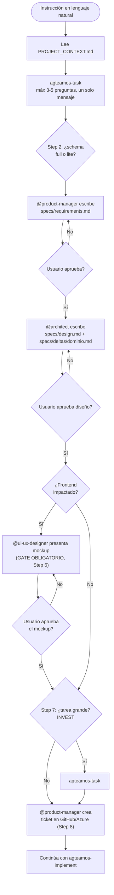
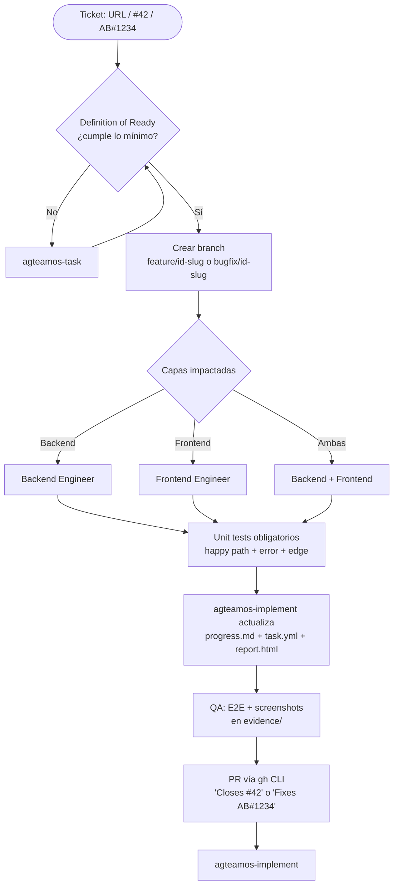

# Crear y cerrar una tarea

Referencia rápida de `agteamos-task` → `agteamos-implement`. Si es tu primera vez, prefiere el recorrido guiado en [Quickstart](../primeros-pasos/01-quickstart.md); esta página asume que ya conoces el flujo y solo necesitas el comando o el paso exacto.

## Cómo se activa cada flujo (tabla de detección)

| Input del usuario | Skill activada |
|---|---|
| `"Agrega notificaciones por email"` + proyecto existente | `agteamos-task` |
| `"#42"`, `"issue 42"`, URL de GitHub Issues | `agteamos-implement` (GitHub) |
| `"AB#1234"`, URL de Azure DevOps | `agteamos-implement` (Azure DevOps) |
| `/agteamos-fix` (o la forma completa `/agteamos:agteamos-fix`) | `agteamos-fix` — directo a implementación, sin SDD completo |

## `agteamos-task` — de lenguaje natural a ticket



Orden real (ver `skills/new-task/SKILL.md`): requirements → aprobación → design + delta → aprobación → **mockup de UI (obligatorio si hay Frontend, nunca se saltea)** → story-breakdown → ticket. Todo esto vive en `agteamos/changes/<id>-<slug>/specs/`. Cada gate requiere aprobación explícita antes de avanzar — nunca se saltea, y el mockup en particular bloquea cualquier código de UI hasta tener luz verde.

## `agteamos-implement` — de ticket a PR



**Naming de branches:**

| Plataforma | Formato | Ejemplo |
|---|---|---|
| GitHub | `feature/{id}-{slug}` o `bugfix/{id}-{slug}` | `feature/42-jwt-auth` |
| Azure DevOps | `feature/AB{id}-{slug}` | `feature/AB1234-email-notifications` |

**Definition of Ready mínima**: título descriptivo, descripción con el valor de negocio, al menos un Acceptance Criteria, capa identificada (backend/frontend/fullstack). Si falta algo, se pregunta antes de continuar.

## `agteamos-implement` — checklist de cierre, en orden (Steps 0 a 12)

0. **Bifurcación**: leer `schema` en `task.yml`. Con `schema: lite` el cierre se reduce a test de regresión pasando + merge + archive, sin los pasos de `verify`/`sync` de abajo. Con `schema: full`, seguir los Steps 1-12.
1. Verificar todos los ACs de `requirements.md` cubiertos, tests pasando, sin secrets hardcodeados.
2. **Sync**: aplicar `specs/deltas/<dominio>.md` contra `agteamos/specs/<dominio>.md` — antes de abrir el PR, para que el commit set del PR incluya la spec maestra ya sincronizada.
3. Crear el PR (`gh pr create` con `Closes #<id>` en el body, incluyendo código + delta + spec maestra) — `task.yml.status` pasa a `in_review`.
4. QA revisa en 6 dimensiones y aprueba con evidencia.
5. Generar `verify-report.md`: fuente real de severidad es `## Requirements (RFC 2119)` de `requirements.md`; cada `tasks.md` debe estar `done`; cada `MUST`/`SHALL` sin cumplir es `FAIL` (bloquea el cierre); cada `SHOULD` sin cumplir es `WARNING` (no bloquea, se documenta).
6. Mergear el PR (squash + delete branch) — `task.yml.status` pasa a `done`.
7. Verificar cierre automático del ticket (`Closes #42` en GitHub, `Fixes AB#1234` en Azure DevOps).
8. Actualizar `agteamos/` si hubo cambios arquitectónicos — se salta este paso si `task.yml` tiene `doc_impact: false`.
9. Escribir `agteamos/changes/<id>-<slug>/knowledge-base.md` con los aprendizajes y decisiones reutilizables de la tarea.
10. Archivar: mover `agteamos/changes/<id>-<slug>/` → `agteamos/changes/archive/<fecha>-<id>-<slug>/`, y limpiar la rama si no se eliminó en el merge.
11. Regenerar `report.html` de la tarea y `agteamos/dashboard.html`.
12. Pregunta opcional de fricción (una línea, nunca bloqueante) — si el usuario propone algo, se ofrece como fila nueva de `BACKLOG.md` del propio plugin, nunca se escribe sin confirmación.

```bash
gh pr merge <number> --squash --delete-branch
```

> **Nota de esta ronda de cambios**: la bifurcación del Step 0, el orden `sync` (Step 2) antes de crear el PR (Step 3), la transición a `in_review`/`done` y el Step 9 (`knowledge-base.md`) reflejan una decisión ya tomada para `skills/task-closure/SKILL.md`. Al momento de escribir esta guía, ese archivo lo está actualizando otro agente en paralelo — re-verificar que el número y el orden final de Steps coincida exactamente una vez esa edición termine.

## Comparativa de flujos

| Aspecto | `new-task` | `implement` | `fix` |
|---|---|---|---|
| **Trigger** | Lenguaje natural, sin ticket | URL, `#id`, `AB#id` | Bug rápido, cambio menor |
| **SDD** | Completo (schema `full`) | Completo (si no viene de `new-task`) | `lite` — resumen + test de regresión |
| **Branch** | Crea ticket → pasa a `implement` | Sí, siempre | Sí |
| **Output** | Ticket + transición | PR mergeado + ticket cerrado | Fix + test de regresión |

Ver el detalle de los artefactos SDD y el esquema `lite`/`full` en [SDD y specs maestras](../conceptos/sdd-y-specs-maestras.md).
