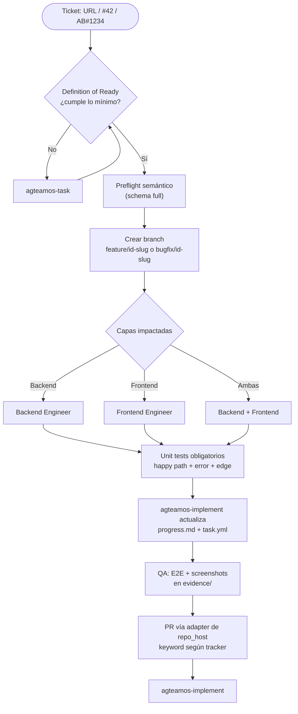

# Crear y cerrar una tarea

Referencia rápida de `agteamos-task` → `agteamos-implement`. Si es tu primera vez, prefiere el recorrido guiado en [Quickstart](../primeros-pasos/01-quickstart.md); esta página asume que ya conoces el flujo y solo necesitas el comando o el paso exacto.

## Cómo se activa cada flujo (tabla de detección)

| Input del usuario | Skill activada |
|---|---|
| `"Agrega notificaciones por email"` + proyecto existente | `agteamos-task` |
| `"Valida estas Stories antes de crearlas"` + desglose existente | `agteamos-task` → `AUDIT-BREAKDOWN` read-only |
| `"#42"`, `"AB#1234"` o URL de item general | lectura real → `agteamos-implement` |
| ID/URL cuyo tipo real es Bug | `agteamos-fix` → `BUG-INTAKE` simple-lite o complejo-full |
| `/agteamos-fix` (o la forma completa `/agteamos:agteamos-fix`) | `agteamos-fix` — directo a implementación, sin SDD completo |

## Auditar un desglose existente

Cuando el usuario ya trae Stories/Bugs/Tasks, AgTeamOS no los normaliza ni
crea de inmediato. Primero entrega un reporte read-only de:

- cobertura y duplicados;
- dependencias, ciclos y jerarquía según el tracker real;
- completitud y criterios verificables;
- tamaños incoherentes sin reestimar;
- límites entre repos/equipos y freshness de mirrors.

El veredicto `READY` no es aprobación para escribir. Solo si el usuario pide
continuar se preserva el input original en `brief.md` y se ejecuta el flujo
SDD normal.

## `agteamos-task` — de lenguaje natural a ticket

```mermaid
flowchart TD
    START([Instrucción en lenguaje natural]) --> CTX[Lee PROJECT_CONTEXT.md]
    CTX --> CLARIFY["agteamos-task\nmáx 3-5 preguntas, un solo mensaje"]
    CLARIFY --> SCHEMA{"Step 2: ¿schema\nfull o lite?"}
    SCHEMA --> PO["@product-manager escribe\nspecs/requirements.md"]
    PO --> GATE1{Usuario aprueba?}
    GATE1 -->|No| PO
    GATE1 -->|Sí| DES["@architect escribe\nspecs/design.md + specs/deltas/dominio.md"]
    DES --> GATE2{Usuario aprueba diseño?}
    GATE2 -->|No| DES
    GATE2 -->|Sí| FEQ{"¿Frontend\nimpactado?"}
    FEQ -->|Sí| MOCKUP["@ui-ux-designer presenta mockup\n(GATE OBLIGATORIO, Step 6)"]
    MOCKUP --> GATE3{Usuario aprueba\nel mockup?}
    GATE3 -->|No| MOCKUP
    GATE3 -->|Sí| INVEST
    FEQ -->|No| INVEST{"Step 7: ¿tarea grande?\nINVEST"}
    INVEST -->|Sí| SPLIT[agteamos-task]
    INVEST -->|No| WI
    SPLIT --> WI["agteamos-work-items inspecciona\nrepo + tracker reales"]
    WI --> PREVIEW{Usuario aprueba\nchange set exacto?}
    PREVIEW -->|No| WI
    PREVIEW -->|Sí| TICKET["Crea y verifica\nticket/jerarquía"]
    TICKET --> F3[Continúa con agteamos-implement]
```

Orden real (ver `skills/task/SKILL.md`): requirements → aprobación → design +
delta → aprobación → **mockup de UI** → story-breakdown → inspección del repo
y tracker → dry-run → aprobación → ticket verificado. La evidencia real del
repo sustenta cada work item; lo que no puede comprobarse queda pendiente.
Antes del primer `apply`, provider doctor verifica capacidades sin escribir.

`agteamos/changes/` tampoco existe desde onboarding: se materializa cuando
comienza la primera tarea trazable y `archive/` al cerrar la primera.

## `agteamos-implement` — de ticket a PR

**Naming de branches:**

| Plataforma | Formato | Ejemplo |
|---|---|---|
| GitHub | `feature/{id}-{slug}` o `bugfix/{id}-{slug}` | `feature/42-jwt-auth` |
| Azure DevOps | `feature/AB{id}-{slug}` | `feature/AB1234-email-notifications` |

**Definition of Ready mínima**: título descriptivo, descripción clara,
al menos 2 Acceptance Criteria verificables, tipo definido, independencia y
forma de prueba. La fuente canónica es `skills/implement/SKILL.md` Step 2.

## `agteamos-implement` — gates de implementación y cierre

1. **Tracking durable**: todo cambio, incluso `lite`, crea
   `task.yml`/`progress.md` con workflow v3, gates, riesgo y SHA de review.
2. **Full preflight**: antes de código,
   `agteamos-analyze --stage preflight` valida trazabilidad de requirements,
   ACs, tasks, diseño y deltas.
3. **Implement/Reconcile**: se ejecuta una unidad y se contrasta contra
   requirements, design, delta y task antes de tomar la siguiente.
4. **QA/riesgo**: evidencia proporcional; clasifica
   `standard|high|critical` desde auth, pagos, datos/migración,
   infraestructura, contrato cross-repo y blast radius.
5. **Docs/sync**: se actualiza documentación afectada y se aplica cada delta a
   su spec maestra antes del PR.
6. **Validador pre-PR**: `agteamos-validate` debe terminar con exit cero y
   persiste `validator_pass: true`.
7. **PR/review**: standard usa review normal; high/critical exige review
   independiente adicional ligado al SHA. Cambios de SHA resetean gates.
8. **Verify goal-backward**: `agteamos-analyze --stage verify` y
   `verify-report.md` comprueban tasks, requirements, cadenas
   objetivo→artefacto→wiring→evidencia y tests no tautológicos.
9. **Validador pre-cierre**: se repite contra el SHA revisado; cualquier cambio
   invalida el gate anterior.
10. **Merge aprobado y leído nuevamente**: solo entonces
    `merge_confirmed: true`.
11. **Ticket reconciliado**: cualquier cierre/comentario/estado manual pasa por
    change set con fingerprint, aprobación y read-back; no se supone `Closed`.
    `tracker-result.md` conserva fingerprint, IDs/URLs y resultado sanitizado.
12. **Archive**: únicamente con gates de entrega válidos se mueve el cambio,
    se regenera dashboard/portal y se ofrece capturar fricción.

La fuente canónica es `skills/implement/SKILL.md` y sus módulos por fase.

## Abandonar sin perder trabajo

Una petición explícita carga `ABANDON-CHANGE.md`: inspecciona branch, PR,
artefactos y tracker; muestra un dry-run; pide aprobación y usa change set
externo. La transición es `ABANDONING → ABANDONED` y conserva
`abandon-record.md`. No sincroniza deltas/knowledge parciales ni fabrica QA,
review o merge. Si la cancelación externa falla, queda durable en
`ABANDONING`; nunca hace reset o borrado compensatorio.

## Comparativa de flujos

| Aspecto | `agteamos-task` | `agteamos-implement` | `agteamos-fix` |
|---|---|---|---|
| **Trigger** | Lenguaje natural, sin ticket | URL, `#id`, `AB#id` | Bug rápido, cambio menor |
| **SDD** | Completo (schema `full`) | Completo (si no viene de `agteamos-task`) | `lite` — resumen + test de regresión |
| **Branch** | Crea ticket → pasa a `implement` | Sí, siempre | Sí |
| **Output** | Ticket + transición | PR mergeado + ticket cerrado | Fix + test de regresión |

Ver el detalle de los artefactos SDD y el esquema `lite`/`full` en [SDD y specs maestras](../conceptos/sdd-y-specs-maestras.md).
