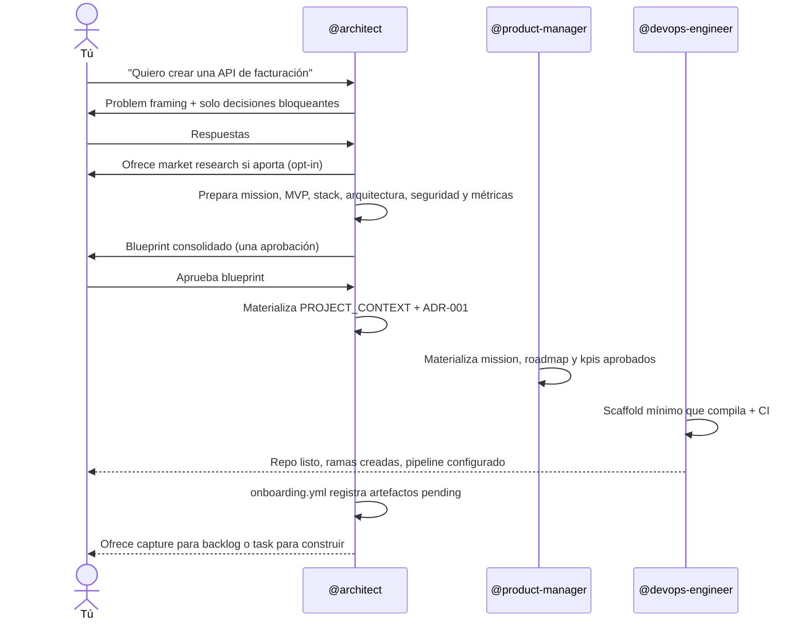
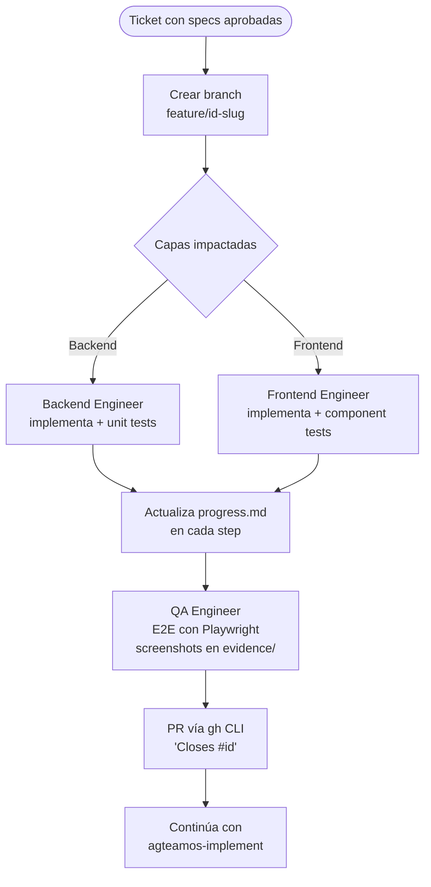

# Quickstart: instalación y tu primer proyecto

Recorrido guiado, paso a paso, para instalar AgTeamOS y llevar una idea desde cero hasta la primera tarea cerrada. Si ya conoces AgTeamOS y solo necesitas el comando exacto para crear o cerrar una tarea, ve directo a la guía rápida: [Crear y cerrar una tarea](../guias/crear-y-cerrar-una-tarea.md).

## Instalación

### Prerrequisitos

- Claude Code instalado y configurado
- Git
- Node.js en el `PATH` — los hooks de seguridad de AgTeamOS son scripts `.js` (exec form, sin shell), y ya es una dependencia implícita hoy vía `npx` en los MCP servers del plugin

### Instalación como plugin de Claude Code

AgTeamOS se distribuye como plugin a través de un marketplace de Claude Code. Desde cualquier proyecto:

```bash
/plugin marketplace add EJBereguete/claude-plugins
/plugin install agteamos
```

Esto instala el plugin a nivel de usuario (scope `user`, el default): queda disponible en **cualquier proyecto** que abras después, para siempre — no hace falta repetir la instalación por cada repo.

Para verificar que quedó activo:

```
@architect
```

o directamente:

```
/agteamos-setup
```

Si el plugin está instalado correctamente, Claude Code resuelve `@architect` como el agente CTO de AgTeamOS y cualquier skill responde tanto a la forma corta (`/agteamos-setup`) como a la forma completa con namespace (`/agteamos:agteamos-setup`).

### Qué pasa la primera vez que se usa en un proyecto

AgTeamOS no toca nada de tu proyecto hasta que le pides algo. La primera instrucción real que le des dispara `agteamos-router` (Step 0, siempre corre primero), que decide entre dos caminos:

| Estado del repo | Qué pasa |
|---|---|
| Repo vacío o solo `README`/`.gitignore` | Se activa el flujo de proyecto nuevo — sigue leyendo abajo |
| Repo con código ya existente | Se activa `agteamos-knowledge` para documentar lo que ya existe — ver [Adoptar un proyecto existente](./04-adoptar-proyecto-existente.md) |

El estado canónico vive en `agteamos/`. Los documentos humanos opcionales
(`README.md`, `CHANGELOG.md` y dos archivos bajo `docs/`) son vistas derivadas,
no otra fuente de verdad.

¿Quieres que tu equipo también lo use? Ver [Compartir con tu equipo](./03-compartir-con-tu-equipo.md).

## Tu primer proyecto

Si tu repo está vacío, este es el recorrido guiado.

### Paso 0 — `agteamos-router` (automático, no lo invocas tú)

Cualquier instrucción que le des a `@architect` dispara primero este chequeo: ¿el repo tiene código?, ¿existe `agteamos/`?, ¿hay tareas activas en `agteamos/changes/` de una sesión anterior? Si el repo está vacío, sigue leyendo. Si ya tiene código, ve a [Adoptar un proyecto existente](./04-adoptar-proyecto-existente.md).

### Paso 1 — `agteamos-setup`: configura la plataforma antes de nada

```
@architect Quiero crear una API de facturación con FastAPI y PostgreSQL
```

Antes de diseñar nada, el Architect dispara `agteamos-setup` porque
`agteamos/platform.yml` todavía no existe. La Ronda 0 confirma únicamente
host del código, tracker y estrategia de branching; CI/CD, deploy, PRs y los
IDs específicos se completan cuando se usan. El resultado queda persistido
solo en `agteamos/platform.yml` — ver
[Configurar la plataforma](../guias/configurar-la-plataforma.md).

### Paso 2 — `agteamos-bootstrap`: la base del proyecto

Con la plataforma configurada, el Architect activa `agteamos-bootstrap` automáticamente. Aquí es donde entra **todo el equipo**, no solo el Architect:



Al terminar tienes stack, producto y arquitectura lean, ADR-001, scaffold y
CI. Si aprobaste research también existe `product/market-research.md`; nunca
es obligatorio. Todavía no existen backlog, tickets, design system, `standards/`,
`specs/`, `devops/` ni `docs/`. Cada uno aparece al escribir su primer
artefacto real. El backlog solo se crea cuando lo pides explícitamente.

Para anotar sin implementar:

```text
Guarda "exportar facturas a PDF" en el backlog de este proyecto.
```

Eso materializa `agteamos/product/backlog.md`. Crear además un ticket externo
requiere doctor, dry-run y tu aprobación.

### Paso 3 — `agteamos-task`: tu primera feature en lenguaje natural

Este es el flujo que vas a usar todos los días. No hace falta invocar la skill directamente — cualquier instrucción en lenguaje natural sobre un proyecto que ya tiene código la dispara:

```
@architect Agrega autenticación con JWT a la API
```

1. **Clarificación** (`agteamos-task`) — 3 a 5 preguntas focalizadas, en un único mensaje, nunca una por una.
2. **`requirements.md`** — lo escribe `@product-manager` con Acceptance Criteria en formato Given/When/Then. Tú apruebas antes de seguir.
3. **`design.md`** — lo escribe `@architect`: arquitectura, endpoints, cambios de esquema. Tú apruebas antes de seguir.
4. **`deltas/<dominio>.md`** — el delta contra la spec maestra del dominio (`agteamos/specs/<dominio>.md`), estilo OpenSpec — ver [SDD y specs maestras](../conceptos/sdd-y-specs-maestras.md).
5. **`tasks.md`** — lo escribe `@product-manager`, con el breakdown ordenado por agente.
6. Se crea el ticket en tu tracker y el flujo continúa automáticamente con `agteamos-implement`.

Todo esto vive en `agteamos/changes/<id>-<slug>/specs/` mientras la tarea está activa.

### Paso 4 — `agteamos-implement`: la implementación real



`agteamos-implement` mantiene `agteamos/changes/<id>-<slug>/progress.md` (checkpoints, Next Action) y `task.yml` actualizados en cada paso, y regenera `report.html` de la tarea automáticamente. Si tus tokens se agotan a mitad de camino, la siguiente sesión (con cualquier agente) lee `progress.md`, encuentra el campo `Next Action`, y retoma exactamente ahí — ver [Context Engineering](../conceptos/context-engineering.md).

### Paso 5 — `agteamos-implement`: cerrar con disciplina

Cuando QA aprueba, `agteamos-implement` corre en este orden:

1. Verifica que todos los Acceptance Criteria de `requirements.md` están cubiertos.
2. Genera `verify-report.md` — chequea `tasks.md` completo y clasifica requirements incumplidos como `FAIL` (MUST/SHALL) o `WARNING` (SHOULD). Un `FAIL` bloquea el cierre.
3. Sincroniza `deltas/<dominio>.md` contra la spec maestra antes del PR.
4. Crea/revisa el PR; high/critical exige review adicional del mismo SHA.
5. Mergea solo tras aprobación y read-back.
6. Archiva en `agteamos/changes/archive/<fecha>-<id>-<slug>/`.
7. Regenera dashboard y portal en modo best-effort.

Si decides abandonar, el flujo alternativo preserva branch/artefactos,
reconcilia el tracker con aprobación y archiva un `abandon-record.md`; no
finge merge ni elimina trabajo parcial.

Al final, `agteamos-implement` sugiere el siguiente paso y —de forma opcional, sin bloquear el cierre— pregunta si algo del flujo te resultó torpe. `agteamos-meta` lo presenta como candidato y, solo si confirmas, `agteamos-capture` lo guarda con un ID `AGF-*` en el outbox durable `~/.claude/agteamos/plugin-feedback.md`. Ese outbox es la fuente de verdad; cualquier `BACKLOG.md` es solo un mirror opcional.

### Resultado final

Después de este recorrido tienes: un proyecto con arquitectura documentada,
una feature implementada con tests y evidencia, un PR mergeado, un ticket
cerrado y dos vistas regenerables. `agteamos/dashboard.html` resume el proyecto
y el portal global reúne todos los proyectos registrados:

```text
/agteamos-dashboard --portal
```

El portal se abre desde `~/.claude/agteamos/portal.html`; es un snapshot local,
no una vista live del tracker. Para la siguiente feature, repites desde el
Paso 3 — el Paso 1 y 2 solo se hacen una vez por proyecto. Ver
[Portal multi-proyecto](../guias/portal-multiproyecto.md).
