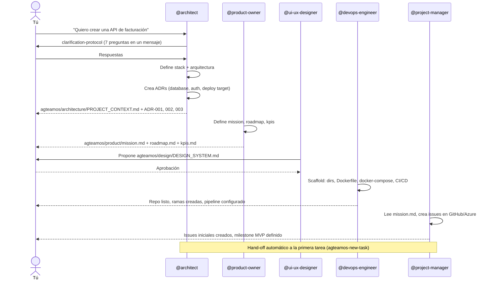
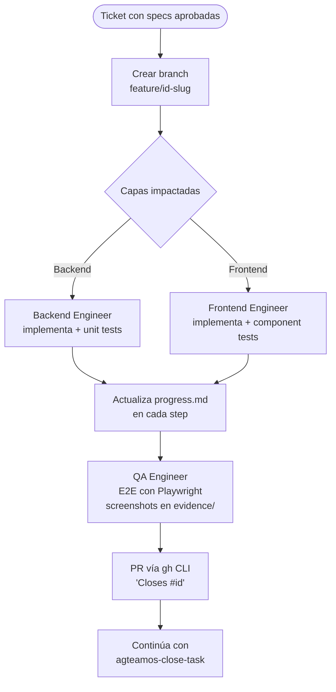

# Tu primer proyecto con AgTeamOS

Recorrido guiado, paso a paso, para llevar una idea desde cero hasta la primera tarea cerrada. Si ya conoces AgTeamOS y solo necesitas el comando exacto para crear o cerrar una tarea, ve directo a la guía rápida: [Crear y cerrar una tarea](../guias/crear-y-cerrar-una-tarea.md).

## Paso 0 — `agteamos-repo-context-check` (automático, no lo invocas tú)

Cualquier instrucción que le des a `@architect` dispara primero este chequeo: ¿el repo tiene código?, ¿existe `agteamos/`?, ¿hay tareas activas en `agteamos/changes/` de una sesión anterior? Si el repo está vacío, sigue leyendo. Si ya tiene código, ve a [Adoptar un proyecto existente](./04-adoptar-proyecto-existente.md).

## Paso 1 — `agteamos-setup`: configura la plataforma antes de nada

```
@architect Quiero crear una API de facturación con FastAPI y PostgreSQL
```

Antes de diseñar nada, el Architect dispara `agteamos-setup` porque `agteamos/platform.yml` todavía no existe. Te hace 8 preguntas en un único mensaje: dónde vive el código y los tickets (GitHub/Azure DevOps), estrategia de branching, CI/CD, deploy target, convención de PR, y el modo de *handoff* entre agentes (`explicit` por default, o `auto`). El resultado queda persistido en `agteamos/platform.yml` — ver el detalle completo en [Configurar la plataforma](../guias/configurar-la-plataforma.md).

## Paso 2 — `agteamos-new-project`: la base del proyecto

Con la plataforma configurada, el Architect activa `agteamos-new-project` automáticamente. Aquí es donde entra **todo el equipo**, no solo el Architect:



Al terminar este paso tienes: stack y arquitectura definidos con ADRs, un Design System base, `docker-compose up` funcionando, CI/CD configurado, y un backlog inicial de issues en tu tracker.

## Paso 3 — `agteamos-new-task`: tu primera feature en lenguaje natural

Este es el flujo que vas a usar todos los días. No hace falta invocar la skill directamente — cualquier instrucción en lenguaje natural sobre un proyecto que ya tiene código la dispara:

```
@architect Agrega autenticación con JWT a la API
```

1. **Clarificación** (`agteamos-clarification-protocol`) — 3 a 5 preguntas focalizadas, en un único mensaje, nunca una por una.
2. **`requirements.md`** — lo escribe `@product-owner` con Acceptance Criteria en formato Given/When/Then. Tú apruebas antes de seguir.
3. **`design.md`** — lo escribe `@architect`: arquitectura, endpoints, cambios de esquema. Tú apruebas antes de seguir.
4. **`deltas/<dominio>.md`** — el delta contra la spec maestra del dominio (`agteamos/specs/<dominio>.md`), estilo OpenSpec — ver [SDD y specs maestras](../conceptos/sdd-y-specs-maestras.md).
5. **`tasks.md`** — lo escribe `@project-manager`, con el breakdown ordenado por agente.
6. Se crea el ticket en tu tracker y el flujo continúa automáticamente con `agteamos-implement`.

Todo esto vive en `agteamos/changes/<id>-<slug>/specs/` mientras la tarea está activa.

## Paso 4 — `agteamos-implement`: la implementación real



`agteamos-task-tracking` mantiene `agteamos/changes/<id>-<slug>/progress.md` (checkpoints, Next Action) y `task.yml` actualizados en cada paso, y regenera `report.html` de la tarea automáticamente. Si tus tokens se agotan a mitad de camino, la siguiente sesión (con cualquier agente) lee `progress.md`, encuentra el campo `Next Action`, y retoma exactamente ahí — ver [Context Engineering](../conceptos/context-engineering.md).

## Paso 5 — `agteamos-close-task`: cerrar con disciplina

Cuando QA aprueba, `agteamos-close-task` corre en este orden:

1. Verifica que todos los Acceptance Criteria de `requirements.md` están cubiertos.
2. Genera `verify-report.md` — chequea `tasks.md` completo y clasifica requirements incumplidos como `FAIL` (MUST/SHALL) o `WARNING` (SHOULD). Un `FAIL` bloquea el cierre.
3. Mergea el PR (el delta de spec y el código van juntos, en el mismo PR — nunca specs separadas del código).
4. Sincroniza `deltas/<dominio>.md` contra la spec maestra `agteamos/specs/<dominio>.md`.
5. Archiva la tarea en `agteamos/changes/archive/<fecha>-<id>-<slug>/`.
6. Regenera `agteamos/dashboard.html` con el estado actualizado de todas las tareas.

Al final, `agteamos-close-task` sugiere el siguiente paso y — de forma opcional, sin bloquear el cierre — pregunta si algo del flujo te resultó torpe (`agteamos-self-audit`, ver el `BACKLOG.md` del propio plugin).

## Resultado final

Después de este recorrido tienes: un proyecto con arquitectura documentada, una feature implementada con tests y evidencia, un PR mergeado, un ticket cerrado, y `agteamos/dashboard.html` mostrando quién (persona real, no el agente de IA) trabajó cada tarea. Para la siguiente feature, repites desde el Paso 3 — el Paso 1 y 2 solo se hacen una vez por proyecto.
