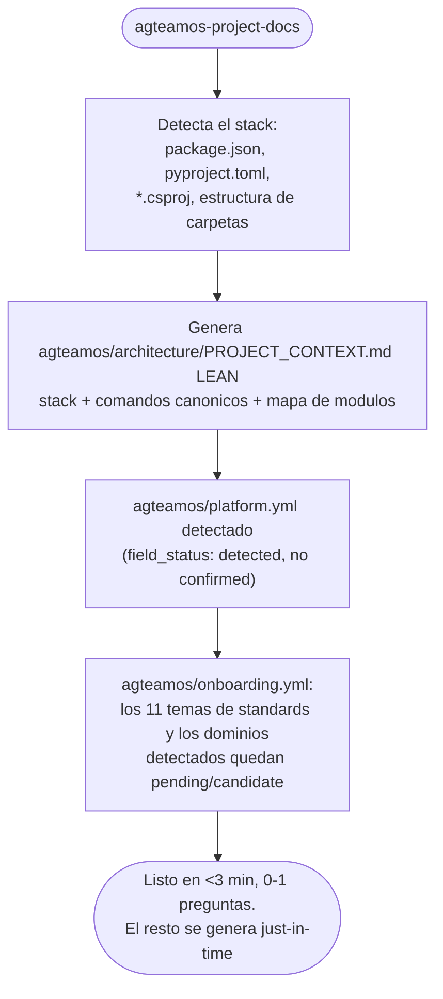

# Adoptar AgTeamOS en un proyecto con código ya existente

A diferencia de un proyecto nuevo (`agteamos-new-project`), aquí ya tienes código, decisiones tomadas y probablemente deuda técnica. `agteamos-project-docs` hace ingeniería inversa del repo y **arranca la carpeta `agteamos/` con lo mínimo que puede confirmar contra el código real** (modo L0, default), cada dato con su nivel de confianza declarado — no pretende completitud desde el primer pase, y el resto se genera recién cuando una tarea real lo necesita.

Esto es deliberado, no una limitación: en un proyecto con historia, buena parte del comportamiento real vive solo en el código, y fingir que un escaneo automático lo documentó todo de una pasada sería peor que admitir honestamente qué falta. Un dato marcado "no verificado todavía" es información útil; un dato inventado para parecer completo es un riesgo — el próximo agente que lo lea lo tomaría como verdad.

## Cuándo se dispara

Automáticamente, la primera vez que le pides algo a `@architect` en un repo que tiene código pero no tiene carpeta `agteamos/`. También puedes invocarlo explícitamente:

```
/agteamos-project-docs          # L0: onboarding mínimo (default) — menos de 3 minutos, 0-1 preguntas
/agteamos-project-docs --full   # L2: genera todo de una sola vez (modo histórico) — útil antes de un
                            # primer /agteamos-quality o un traspaso formal de equipo
```

## Qué hace, paso a paso (L0 — default)



Nada de esto bloquea ninguna tarea: genera el contexto mínimo con lo que puede inferir del código real y continúa. Los campos que no se pudieron determinar con confianza quedan marcados explícitamente en vez de inventados — ver el header `Estado`/`Confidence` en [Capa de standards](../conceptos/filosofia-y-arquitectura.md#capa-de-standards).

## El resto se genera solo, cuando hace falta (L1 — just-in-time)

`api/endpoints.md`, `design/DESIGN_SYSTEM.md`, `devops/INFRASTRUCTURE.md`, cada tema de `agteamos/standards/<tema>/`, y la spec maestra de cada dominio (`agteamos/specs/<dominio>.md`) **no se generan en el onboarding** — quedan declarados en `agteamos/onboarding.yml` con su disparador, y se generan la primera vez que una tarea real los toca (protocolo `ensure-artifact`, ver `agteamos-context-engineering` §Lazy Artifacts). Por ejemplo: la primera vez que pides "agregá el endpoint de reembolsos", `agteamos-build` genera solo `standards/api-design/` y el mapa de API del módulo tocado — no los 11 estándares ni el árbol completo.

Si preferís tenerlo todo generado de entrada (por ejemplo antes de un `/agteamos-quality` inicial, o para dejar el proyecto documentado de punta a punta para un traspaso), corré `/agteamos-project-docs --full` — es el comportamiento histórico completo, sin diferir nada.

## Lo más importante que genera: `PROJECT_CONTEXT.md`

Es el archivo que **todos los agentes leen antes de cualquier acción** a partir de este momento. Ejemplo:

```markdown
# Project Context

**Generated**: 2026-08-09 (auto-detected via agteamos-project-docs)
**Stack**: Python 3.12 + FastAPI 0.115 + PostgreSQL 16 + React 19 + TypeScript 5.7
**Architecture**: Monorepo, Clean Architecture (backend), Component-based (frontend)

## Backend
- Framework: FastAPI 0.115
- ORM: SQLAlchemy 2.0 + Alembic migrations
- Patterns detected: Repository pattern, Service layer, Pydantic DTOs

## Frontend
- Framework: React 19 + Vite 6
- State: Zustand

## Coding Conventions
- Conventional Commits (feat, fix, chore, test, refactor, docs)
- Python: type hints en todas las funciones, async/await
```

## Las specs maestras nacen `seeded` — y eso es lo correcto

El paso más importante del onboarding de un proyecto legacy no es el stack detectado ni el mapa de endpoints — es la siembra de `agteamos/specs/<dominio>.md`, la spec maestra persistente de cada dominio (ver [SDD y specs maestras](../conceptos/sdd-y-specs-maestras.md)).

`agteamos-project-docs` no puede leer todo el código y producir una spec `complete` de una sola pasada — ningún escaneo automático puede, y prometerlo sería la misma mentira que un `PROJECT_CONTEXT.md` inventado. En vez de eso, cada spec maestra sembrada arranca con un header `## Coverage` explícito:

```markdown
# Spec: notifications

## Coverage
- **Estado**: seeded
- **Cubre**: envío de email de bienvenida (confirmado leyendo services/notification_service.py)
- **No cubre (todavia)**: rate limiting, reintentos, notificaciones push — el código las tiene
  pero no se alcanzó a verificar con suficiente confianza en este pase
- **Ultima tarea aplicada**: — (recién sembrada, ninguna tarea todavía)
- **Origen**: onboarding (ingenieria inversa)
```

**Por qué esto es mejor que las dos alternativas obvias**:

- **Mejor que no tener nada**: sin esta siembra, la primera tarea sobre `notifications` empezaría de cero, sin ningún registro de que el rate limiting y los reintentos ya existen en el código aunque no estén documentados.
- **Mejor que fingir completitud**: una spec que dijera `Estado: complete` sin haber verificado línea por línea le mentiría al primer agente que la lea — y ese agente construiría un delta sobre una base falsa.

Cada tarea posterior sobre ese dominio agranda la spec: `agteamos-implement` aplica su delta en el paso `sync`, actualiza `Cubre`/`No cubre (todavia)`, y el estado avanza de `seeded` a `partial` y eventualmente a `complete` — a medida que el trabajo real lo confirma, no antes.

## Modo `--init` vs modo `--maintain`

Ambos viven en la misma skill, `agteamos-project-docs`, como dos modos
distintos. `--init` (lo que describe esta página) es la **generación
inicial** — corre una vez, cuando `agteamos/` todavía no existe. `--maintain`
es **mantenimiento continuo**: reporta qué quedó desactualizado o falta y
regenera solo eso, sin volver a escanear todo el repo desde cero. Después del
onboarding inicial, es `agteamos-project-docs --maintain` la que mantiene la
carpeta al día.

## Qué hacer después del onboarding

1. Revisa `agteamos/architecture/PROJECT_CONTEXT.md` — corrige a mano cualquier cosa mal detectada antes de seguir.
2. Corre `/agteamos-setup` si `agteamos/platform.yml` no quedó definido (branch strategy, deploy target, etc.).
3. Revisa `agteamos/standards/standards.yml` — en modo L0 vas a ver la mayoría de los temas en `pending` (se generan solos, tema por tema, a medida que los tocas). A medida que se generan verás cuáles `applies`, cuáles quedaron `adapted` y cuáles `deviates` con su razón documentada. Ver [Mantener los standards al día](../guias/mantener-standards-al-dia.md).
4. Empieza tu primera tarea normalmente con lenguaje natural — ver [Crear y cerrar una tarea](../guias/crear-y-cerrar-una-tarea.md).

## Recomendación

Si el proyecto tiene deuda técnica considerable o llevas tiempo sin auditar, corre `/agteamos-quality` justo después del onboarding — te da el Radar de Deuda Técnica completo antes de empezar a agregar features nuevas. Ver [Ejecutar una auditoría](../guias/ejecutar-una-auditoria.md).
