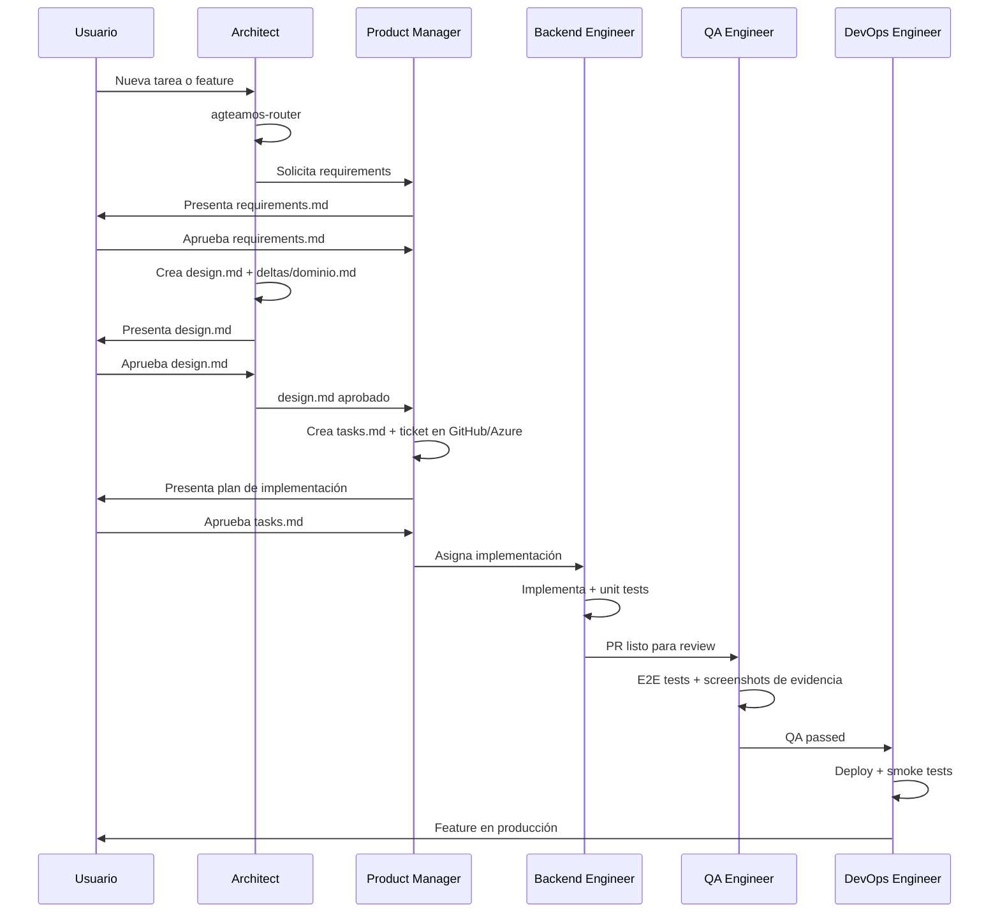

# Agentes y skills

Referencia de consulta rápida sobre las **22 skills** y los **8 agentes** de AgTeamOS, vista desde los dos ejes posibles: por skill (qué hace cada una y quién la usa) y por agente (qué hace cada agente y qué skills tiene asignadas).

> **Fuente de verdad**: el `name:`/`description:` del frontmatter de cada `skills/*/SKILL.md`, y el campo `skills:` (y `model:`) del frontmatter de cada `agents/*.md`. Esta página se regenera leyendo esos archivos directamente — si alguna vez diverge, el frontmatter gana, no esta tabla.

## Por skill

Cada `name:` del frontmatter lleva el prefijo `agteamos-` — se invocan tanto en forma corta (`/agteamos-<nombre>`) como en forma completa con namespace (`/agteamos:agteamos-<nombre>`). El `name:` no siempre coincide con el nombre de la carpeta en disco (ej. la skill `agteamos-router` vive en `skills/router/`, y `agteamos-implement` incluye inline las fases que antes eran `definition-of-ready`, `task-tracking` y `task-closure`).

### Entry Point (2)

| Skill | Descripción | Usado por |
|---|---|---|
| `agteamos-router` | Punto de entrada compartido por todos los flujos, ejecutado en casi cada sesión. Tres fases: (A) resolver a qué proyecto moverse si el usuario lo nombra, (B) verificar el estado del repo actual, (C) rutear al flujo correcto. Fusiona `project-switch` + `repo-context-check` + `flow-router`. | Architect |
| `agteamos-setup` | Configuración inicial de la plataforma: repo host, task tracker, branching, CI/CD, deploy target, convención de PR y `handoff_mode`. Persiste en `agteamos/platform.yml`. | Architect |

### Workflows (3)

| Skill | Descripción | Usado por |
|---|---|---|
| `agteamos-bootstrap` | Bootstrap de un proyecto nuevo desde un repo vacío: stack, arquitectura, design system, CI/CD y backlog inicial, con SRS formal opcional. | Architect, Product Manager, DevOps, UI/UX |
| `agteamos-task` | Tareas nuevas sin ticket existente. Incluye inline `clarification-protocol` (Step 1) y `story-breakdown`/INVEST (Step 7). Clarifica, diseña, crea el ticket y continúa con `agteamos-implement`. | Architect, Product Manager, UI/UX |
| `agteamos-implement` | Tareas con ticket existente. Incluye inline `definition-of-ready` (Step 2), `task-tracking` (Step 4) y `task-closure` (Step 9: PR, verify-report, merge, sync de specs, archivado, dashboard). Carga por tiers (1/2/3). | Architect, Backend, Frontend, QA, DevOps, Product Manager, Security |

### Architecture and Governance (1)

| Skill | Descripción | Usado por |
|---|---|---|
| `agteamos-decisions` | Los cuatro sub-tipos de gobernanza de decisiones en `agteamos/decisions/`: RFC (discusión abierta), ADR formato Nygard (decisión inmutable), Out-of-scope (dirección rechazada) y Premortem (crítica opcional de 8 ángulos). | Architect, Product Manager, Security |

### Process (2)

| Skill | Descripción | Usado por |
|---|---|---|
| `agteamos-spec` | Spec-Driven Development: formato canónico de spec, spec maestra persistente `agteamos/specs/<dominio>.md`, esquema `full` (4 artefactos) y `lite` (resumen + test de regresión). | Architect, Backend, Frontend, Product Manager, UI/UX |
| `agteamos-context` | Gestiona el estado compartido entre agentes, el protocolo de handoff y el presupuesto de tokens (context tiers). | Architect, Backend, Frontend, DevOps, Product Manager, Security, UI/UX |

### Quality (1)

| Skill | Descripción | Usado por |
|---|---|---|
| `agteamos-quality` | Calidad de código en cuatro modos: `--mode pr-review` (8 dimensiones), `--mode domain-review` (10 domain smells con ratchet), `--mode static-analysis` (linting/typing/security en CI) y `--mode auditoria-integral` (Radar de Deuda Técnica + DORA). | Architect, Product Manager, QA, Security, DevOps |

### Project Docs (1)

| Skill | Descripción | Usado por |
|---|---|---|
| `agteamos-knowledge` | Documentación del proyecto en 4 modos: `--init` (ingeniería inversa L0/L1/L2), `--maintain` (default: mantenimiento continuo, distingue pendiente-por-diseño de falta real), `--topic <tema>` (convention-detection vía `ensure-artifact`) y `--learn` (captura de convenciones aprendidas en uso). | Architect, DevOps, Product Manager, UI/UX |

### DevOps (2)

| Skill | Descripción | Usado por |
|---|---|---|
| `agteamos-deploy` | Checklist de preparación para producción (infra, seguridad, observabilidad, BD, rollback) como Step 0 interno, seguido del deploy monitoreado con PRR, smoke tests y DORA metrics. Nunca despliega sin QA approval. | Architect, QA, Security, DevOps |
| `agteamos-metrics` | Las 4 métricas DORA (deployment frequency, lead time, change failure rate, MTTR) y la definición/medición de SLOs, SLIs y error budgets. | Architect, DevOps, Product Manager |

### Operations (5)

| Skill | Descripción | Usado por |
|---|---|---|
| `agteamos-debug` | Debugging sistemático: 5 Whys, reproducción del error, fix mínimo y test de regresión obligatorio. | Backend, Frontend, QA |
| `agteamos-fix` | Hotfix rápido y táctico (schema `lite`), test de regresión obligatorio, PR hacia la rama correcta. | Backend, Frontend, QA, Product Manager |
| `agteamos-build` | Construcción quirúrgica tanto de Backend (endpoints, modelos, migraciones, tests) como de Frontend (componentes respetando el design system), cada sección con su propia numeración de Steps. | Architect, Backend, Frontend, UI/UX |
| `agteamos-security` | OWASP ASVS v5.0 (checklists L1/L2, Python/TypeScript) combinado con threat modeling PASTA + STRIDE + LINDDUN (DFD en Mermaid, matriz de riesgo). | Architect, Backend, QA, Security |
| `agteamos-incidents` | Incident response (severidad P1-P4, roles, ciclo de 5 fases, post-mortems) y autoría/ejecución de runbooks y playbooks. | QA, DevOps |

### Reportes (1)

| Skill | Descripción | Usado por |
|---|---|---|
| `agteamos-dashboard` | Dueña única de los templates HTML: `report.html` por tarea y `agteamos/dashboard.html` general, sin librerías externas. Incluye modo `--pulse` de solo lectura (salud del proyecto). | Architect, Backend, Frontend, QA, DevOps, Product Manager |

### Exploración (1)

| Skill | Descripción | Usado por |
|---|---|---|
| `agteamos-explore` | Modo de exploración previa a comprometerse con una tarea: lee el código real y compara opciones con trade-offs concretos. No crea artefactos ni código. Propone pasar a `agteamos-task` o seguir explorando. | Architect |

### Meta AgTeamOS (2)

Distintas de las skills de "Operations": estas auditan y mejoran **el propio AgTeamOS**, no el proyecto consumidor.

| Skill | Descripción | Usado por |
|---|---|---|
| `agteamos-capture` | Captura de baja fricción en dos modos: "Modo plugin" (ideas de mejora del propio AgTeamOS en `BACKLOG.md`) y "Modo proyecto" (pedidos de producto en `agteamos/product/roadmap.md` + ticket opcional). El usuario dice "idea: X" sin interrumpir el trabajo en curso. | Todos los agentes |
| `agteamos-meta` | Ciclo completo de mejora del propio sistema: auditoría (detecta fricción en `verify-report.md`/`dashboard.html`/`task.yml`, propone filas en `BACKLOG.md`) y ejecución (aplica el cambio quirúrgico y reporta el diff). | Architect, Backend, Frontend, QA, Product Manager |

### PR Standards (1)

| Skill | Descripción | Usado por |
|---|---|---|
| `agteamos-pr` | Estándares para crear, revisar y mergear Pull Requests. Toda PR referencia un ticket, incluye tests y pasa por review antes de merge. | Architect, Backend, Frontend, QA, Product Manager |

## Por agente

### Architect
**Modelo**: `opus` — **excepción deliberada**, no el `sonnet` (alias) que usan los otros 7 agentes. Se mantiene fijo en Opus por su rol de mayor razonamiento (CTO / Principal Architect): resuelve trade-offs de arquitectura, aprueba entregables de todo el equipo y es el punto de entrada de cualquier flujo — el costo extra de Opus se paga una vez por sesión, no por tarea.

**Rol**: CTO y Principal Architect. Punto de entrada de cualquier flujo — toda sesión nueva pasa por aquí primero.

**Responsabilidades**: ejecutar `agteamos-router` en cada sesión · interpretar el objetivo de negocio real detrás del request · diseñar arquitectura de sistemas · crear y gestionar ADRs · revisar y aprobar entregables del equipo.

**Skills asignadas** (19): `agteamos-router`, `agteamos-bootstrap`, `agteamos-task`, `agteamos-implement`, `agteamos-decisions`, `agteamos-spec`, `agteamos-context`, `agteamos-quality`, `agteamos-knowledge`, `agteamos-deploy`, `agteamos-setup`, `agteamos-capture`, `agteamos-build`, `agteamos-dashboard`, `agteamos-metrics`, `agteamos-meta`, `agteamos-pr`, `agteamos-security`, `agteamos-explore`

**Herramientas**: Read, Write, Edit, Grep, Glob, WebFetch

---

### Product Manager
**Modelo**: `sonnet`

**Rol**: Fusiona los roles de Product Owner (Estrategia: visión, ROI, KPIs, aprobación de negocio) y Project Manager (Ejecución: backlog técnico, tickets, seguimiento, cierre).

**Responsabilidades**: escribir `requirements.md` con ACs verificables (Given/When/Then) · definir scope in/out · escribir `tasks.md` · crear tickets en GitHub Issues/Azure DevOps · gestionar `agteamos/changes/` · eliminar bloqueos entre agentes · regenerar `dashboard.html`.

**Skills asignadas** (14): `agteamos-spec`, `agteamos-task`, `agteamos-context`, `agteamos-implement`, `agteamos-quality`, `agteamos-knowledge`, `agteamos-capture`, `agteamos-bootstrap`, `agteamos-decisions`, `agteamos-metrics`, `agteamos-pr`, `agteamos-meta`, `agteamos-dashboard`, `agteamos-fix`

**Herramientas**: Read, Write, Edit, Bash, Glob

---

### Backend Engineer
**Modelo**: `sonnet`

**Rol**: Implementador de APIs, servicios, lógica de negocio y esquemas de base de datos.

**Responsabilidades**: implementar siguiendo el `design.md` aprobado · escribir unit tests obligatorios (mín. 3: happy path + error + edge) · documentar cada archivo en `progress.md` · commits atómicos con Conventional Commits · actualizar el campo `Next Action` antes de cada pausa.

**Stacks**: Python/FastAPI + SQLAlchemy 2.0 + pytest, C#/.NET + EF Core + xUnit, TypeScript/Node.js + Prisma + Vitest

**Skills asignadas** (11): `agteamos-implement`, `agteamos-spec`, `agteamos-context`, `agteamos-pr`, `agteamos-security`, `agteamos-build`, `agteamos-debug`, `agteamos-fix`, `agteamos-capture`, `agteamos-dashboard`, `agteamos-meta`

**Herramientas**: Read, Write, Edit, Bash, Grep, Glob

---

### Frontend Engineer
**Modelo**: `sonnet`

**Rol**: Transforma los diseños del UI/UX Designer en código de producción robusto y performante.

**Responsabilidades**: implementar componentes basados en el Design System · diseñar arquitectura de estado (Zustand, Redux, Context) · integrar endpoints de forma segura y tipada · implementar Error Boundaries y estados de carga · optimizar TBT/LCP/CLS · verificar accesibilidad (WCAG 2.2 AA).

**Stacks**: React 19 + TypeScript + Vite, Vue 3 + Pinia, Angular + RxJS

**Skills asignadas** (10): `agteamos-implement`, `agteamos-spec`, `agteamos-context`, `agteamos-pr`, `agteamos-debug`, `agteamos-fix`, `agteamos-build`, `agteamos-capture`, `agteamos-dashboard`, `agteamos-meta`

**Herramientas**: Read, Write, Edit, Bash, Playwright

---

### QA Engineer
**Modelo**: `sonnet`

**Rol**: Garantiza que nada pase a producción roto. Última línea de defensa antes del merge.

**Responsabilidades**: ejecutar tests E2E con Playwright y guardar screenshots como evidencia · revisar código contra los ACs de `requirements.md` · verificar cobertura de unit tests · aprobar/rechazar PRs con justificación · auditar accesibilidad con axe-core.

**Skills asignadas** (11): `agteamos-implement`, `agteamos-deploy`, `agteamos-pr`, `agteamos-security`, `agteamos-quality`, `agteamos-incidents`, `agteamos-debug`, `agteamos-fix`, `agteamos-capture`, `agteamos-dashboard`, `agteamos-meta`

**Herramientas**: Read, Bash, Grep, Glob

---

### Security Engineer
**Modelo**: `sonnet`

**Rol**: AppSec Specialist. Identifica proactivamente vulnerabilidades y resuelve fallos de seguridad.

**Responsabilidades**: threat modeling (STRIDE) de nuevas features · revisión contra OWASP Top 10 · verificación con checklist ASVS · detectar secrets hardcodeados, SQL injection, XSS, CSRF · crear ADRs y issues de seguridad con severidad y plan de remediación.

**Skills asignadas** (7): `agteamos-quality`, `agteamos-security`, `agteamos-context`, `agteamos-implement`, `agteamos-deploy`, `agteamos-decisions`, `agteamos-capture`

**Herramientas**: Read, Write, Edit, Bash, Grep, Glob

---

### DevOps Engineer
**Modelo**: `sonnet`

**Rol**: Infraestructura, CI/CD, contenedores y operaciones.

**Responsabilidades**: crear y optimizar Dockerfiles y docker-compose · configurar pipelines CI/CD · desplegar en Cloud Run, VPS, Railway, Vercel, Fly.io, AWS, Azure · gestionar secrets y variables de entorno · configurar monitoreo, alertas y rollback · ejecutar smoke tests post-deploy.

**Skills asignadas** (10): `agteamos-deploy`, `agteamos-metrics`, `agteamos-context`, `agteamos-incidents`, `agteamos-knowledge`, `agteamos-quality`, `agteamos-capture`, `agteamos-implement`, `agteamos-dashboard`, `agteamos-bootstrap`

**Herramientas**: Read, Write, Edit, Bash, Grep, Glob

---

### UI/UX Designer
**Modelo**: `sonnet`

**Rol**: Guardián de la experiencia del usuario. Diseña la visión que el Frontend Engineer implementará.

**Responsabilidades**: diseñar wireframes y flujos de usuario · definir y mantener el Design System · prototipar interacciones en texto (no genera imágenes, describe con precisión) · verificar accesibilidad visual · obtener aprobación del usuario antes de que Frontend implemente — el gate es obligatorio, no una sugerencia.

**Skills asignadas** (7): `agteamos-task`, `agteamos-spec`, `agteamos-context`, `agteamos-knowledge`, `agteamos-build`, `agteamos-capture`, `agteamos-bootstrap`

**Herramientas**: Read, Write, Edit, Bash, Playwright, WebFetch

---

## Flujo de interacción entre agentes

## Modelos por agente

| Agente | Modelo | Justificación |
|--------|--------|---------------|
| Architect | `opus` | Excepción deliberada — rol de mayor razonamiento (CTO), punto de entrada de todo flujo, aprueba entregables de los otros 7 agentes |
| Los otros 7 agentes | `sonnet` (alias) | Balance velocidad/calidad; el alias resuelve a la versión vigente sin quedar hardcodeado a un modelo obsoleto |

## Matriz completa: skill por agente

Fuente de verdad: el campo `skills:` del frontmatter de cada `agents/*.md`. 22 skills en total, 8 agentes.

| Skill | Architect | Product Manager | Backend | Frontend | QA | Security | DevOps | UI/UX |
|-------|:---------:|:----------------:|:-------:|:--------:|:--:|:--------:|:------:|:-----:|
| agteamos-router | ✓ | | | | | | | |
| agteamos-setup | ✓ | | | | | | | |
| agteamos-explore | ✓ | | | | | | | |
| agteamos-bootstrap | ✓ | ✓ | | | | | ✓ | ✓ |
| agteamos-task | ✓ | ✓ | | | | | | ✓ |
| agteamos-implement | ✓ | ✓ | ✓ | ✓ | ✓ | ✓ | ✓ | |
| agteamos-decisions | ✓ | ✓ | | | | ✓ | | |
| agteamos-spec | ✓ | ✓ | ✓ | ✓ | | | | ✓ |
| agteamos-context | ✓ | ✓ | ✓ | ✓ | | ✓ | ✓ | ✓ |
| agteamos-quality | ✓ | ✓ | | | ✓ | ✓ | ✓ | |
| agteamos-knowledge | ✓ | ✓ | | | | | ✓ | ✓ |
| agteamos-deploy | ✓ | | | | ✓ | ✓ | ✓ | |
| agteamos-capture | ✓ | ✓ | ✓ | ✓ | ✓ | ✓ | ✓ | ✓ |
| agteamos-build | ✓ | | ✓ | ✓ | | | | ✓ |
| agteamos-dashboard | ✓ | ✓ | ✓ | ✓ | ✓ | | ✓ | |
| agteamos-metrics | ✓ | ✓ | | | | | ✓ | |
| agteamos-meta | ✓ | ✓ | ✓ | ✓ | ✓ | | | |
| agteamos-pr | ✓ | ✓ | ✓ | ✓ | ✓ | | | |
| agteamos-security | ✓ | | ✓ | | ✓ | ✓ | | |
| agteamos-incidents | | | | | ✓ | | ✓ | |
| agteamos-debug | | | ✓ | ✓ | ✓ | | | |
| agteamos-fix | | ✓ | ✓ | ✓ | ✓ | | | |

`agteamos-capture` está wireada a los 8 agentes por igual — cualquiera puede capturar una idea en `BACKLOG.md` del repo del propio plugin (modo plugin) o en `agteamos/product/roadmap.md` del proyecto (modo proyecto) en el momento en que surge, sin interrumpir el flujo en curso.

**Total por agente**: Architect 19 · Product Manager 14 · QA 11 · Backend 11 · DevOps 10 · Frontend 10 · Security 7 · UI/UX 7.
