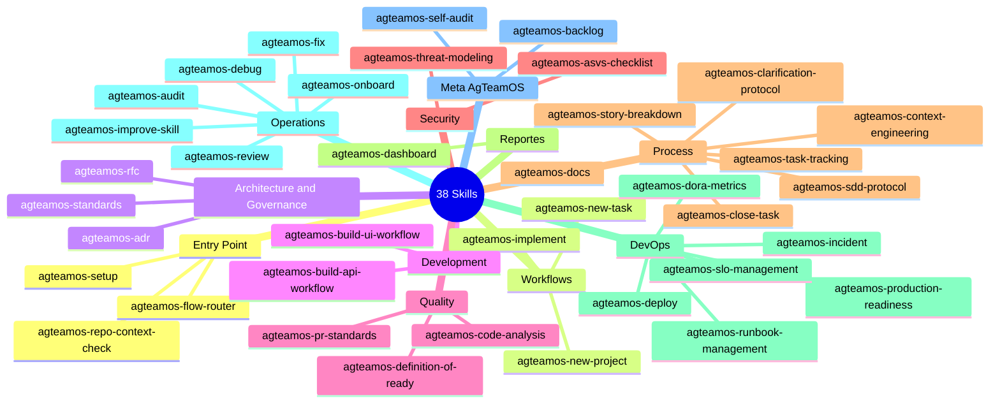

# Catálogo de skills

AgTeamOS tiene **38 skills**. Cada `name:` del frontmatter lleva el prefijo `agteamos-` — se invocan tanto en forma corta (`/agteamos-<nombre>`) como en forma completa con namespace (`/agteamos:agteamos-<nombre>`). El `name:` no siempre coincide con el nombre de la carpeta en disco (ej. la skill `agteamos-close-task` vive en `skills/task-closure/`).

## Mapa completo de skills

## Skills por categoría

### Entry Point (3)

| Skill | Descripción | Usado por |
|---|---|---|
| `agteamos-repo-context-check` | Step 0 obligatorio. Detecta si el repo tiene código real, si existe `agteamos/`, y si hay tareas activas de sesiones anteriores. | Architect |
| `agteamos-flow-router` | Determina cuál de los 3 flujos activar según el input del usuario y el estado del repo. | Architect |
| `agteamos-setup` | Configuración inicial de la plataforma: repo host, task tracker, branching, CI/CD, deploy target, convención de PR y `handoff_mode`. Persiste el resultado en `agteamos/platform.yml`. | Architect |

### Workflows (3)

| Skill | Descripción | Usado por |
|---|---|---|
| `agteamos-new-project` | Bootstrapea un proyecto nuevo desde un repo vacío: stack, arquitectura, design system, CI/CD y backlog inicial. | Architect, PM |
| `agteamos-new-task` | Tareas nuevas sin ticket existente. Clarifica, diseña, crea el ticket y continúa automáticamente con `agteamos-implement`. | Architect, PM |
| `agteamos-implement` | Tareas con ticket existente. Branch, implementación con tests, evidencia E2E y cierre. | Architect, PM |

### Architecture and Governance (3)

| Skill | Descripción | Usado por |
|---|---|---|
| `agteamos-adr` | Architecture Decision Records en formato Nygard. Numeración, índice, inmutabilidad. | Architect |
| `agteamos-rfc` | Request for Comments para cambios arquitectónicamente significativos o cross-team. | Architect, PM |
| `agteamos-standards` | Lee el código real del proyecto y lo compara contra los 11 estándares base del plugin; escribe `agteamos/standards/<tema>/`. | Architect |

### Development (2)

| Skill | Descripción | Usado por |
|---|---|---|
| `agteamos-build-api-workflow` | Construcción quirúrgica de API: endpoints, modelos, migraciones y tests. | Backend |
| `agteamos-build-ui-workflow` | Construcción de componentes de frontend, respetando el design system. | Frontend, UI/UX |

### Quality (3)

| Skill | Descripción | Usado por |
|---|---|---|
| `agteamos-code-analysis` | Análisis estático, code smells, complejidad ciclomática. | Security |
| `agteamos-pr-standards` | Estándares para crear, revisar y mergear PRs. Toda PR referencia un ticket, incluye tests y pasa por review. | Backend, Frontend, PM, QA |
| `agteamos-definition-of-ready` | Valida si un ticket tiene lo mínimo para empezar. Si no, activa `agteamos-clarification-protocol`. | PO, PM, QA |

### Security (2)

| Skill | Descripción | Usado por |
|---|---|---|
| `agteamos-asvs-checklist` | OWASP ASVS v5.0, checklists L1/L2 con patrones en Python y TypeScript. | Backend, QA, Security |
| `agteamos-threat-modeling` | PASTA + STRIDE + LINDDUN. DFD en Mermaid y matriz de riesgo. | Security |

### Process (7)

| Skill | Descripción | Usado por |
|---|---|---|
| `agteamos-sdd-protocol` | Los 4 artefactos SDD: `requirements.md`, `design.md`, `deltas/<dominio>.md`, `tasks.md`. Esquema `full`/`lite`. | Architect, PO, PM, Backend, Frontend, UI/UX |
| `agteamos-clarification-protocol` | Preguntas para obtener contexto completo antes de empezar cualquier tarea. | PO, UI/UX |
| `agteamos-story-breakdown` | Evalúa si una user story debe dividirse (criterios INVEST). | PO, PM |
| `agteamos-task-tracking` | Crea y mantiene `agteamos/changes/<id>-<slug>/progress.md` + `task.yml`, incl. `owner` capturado vía git config. | Backend, Frontend, PM, QA, Security |
| `agteamos-close-task` | Cierre completo: verify-report, PR, merge, sync de deltas contra la spec maestra, archivado. | Backend, Frontend, PM |
| `agteamos-context-engineering` | Gestiona el estado compartido, el protocolo de handoff y el presupuesto de tokens (context tiers). | Architect, PO, PM, Backend, Frontend, Security, DevOps, UI/UX |
| `agteamos-docs` | Mantenimiento continuo de `agteamos/` (distinto de `agteamos-onboard`, que es la generación inicial). | Architect, PO |

### Reportes (1)

| Skill | Descripción | Usado por |
|---|---|---|
| `agteamos-dashboard` | Dueña del template HTML. Genera `report.html` por tarea y `agteamos/dashboard.html` general, sin librerías externas. | PM, Architect |

### DevOps (6)

| Skill | Descripción | Usado por |
|---|---|---|
| `agteamos-deploy` | Deploy monitoreado con `agteamos-production-readiness` obligatorio, smoke tests, rollback, DORA metrics. | DevOps |
| `agteamos-dora-metrics` | Mide y trackea las 4 métricas DORA. | DevOps, PM |
| `agteamos-production-readiness` | Checklist previo a cualquier deploy: infraestructura, seguridad, observabilidad, BD, rollback. | Architect, DevOps, QA, Security |
| `agteamos-slo-management` | Define, mide y gestiona SLOs/SLIs con error budgets. | DevOps |
| `agteamos-incident` | Clasificación de severidad P1-P4, roles, ciclo de vida de 5 fases, post-mortem. | DevOps, QA |
| `agteamos-runbook-management` | Runbooks (tácticos) y playbooks (estratégicos) para procedimientos operativos. | DevOps |

### Operations (6)

| Skill | Descripción | Usado por |
|---|---|---|
| `agteamos-debug` | Debugging sistemático: 5 Whys, reproducción, fix mínimo, test de regresión obligatorio. | Backend, Frontend, QA |
| `agteamos-fix` | Hotfix rápido y táctico, schema `lite`, test de regresión obligatorio. | Backend, Frontend, QA |
| `agteamos-audit` | Auditoría integral: arquitectura, seguridad, calidad, deuda técnica, DORA. Radar de Deuda Técnica priorizado. | Architect, PO, PM, QA, DevOps |
| `agteamos-review` | Code review en 6 dimensiones: seguridad, correctitud, performance, mantenibilidad, tests, deuda técnica. | Architect, QA, Security |
| `agteamos-improve-skill` | Meta-aprendizaje: mejora una skill del equipo con feedback del usuario, quirúrgicamente. | PM |
| `agteamos-onboard` | Ingeniería inversa de un proyecto existente. Genera `agteamos/` completo. | Architect, PO, PM, DevOps, UI/UX |

### Meta AgTeamOS (2)

Distintas de las skills de "Operations": estas auditan y mejoran **el propio AgTeamOS**, no el proyecto consumidor.

| Skill | Descripción | Usado por |
|---|---|---|
| `agteamos-backlog` | Captura ideas de mejora del propio plugin en `BACKLOG.md` (bajísima fricción, no interrumpe el trabajo en curso). | Todos los agentes |
| `agteamos-self-audit` | Detecta fricción propia del framework (patrones de FAIL/WARNING repetidos, tareas estancadas). No confundir con `agteamos-audit`, que audita el proyecto consumidor. | PM, Architect |

## Skills por agente (matriz completa)

Ver [Matriz de agentes y skills](./matriz-agentes-y-skills.md) para la tabla cruzada completa con los 9 agentes.
