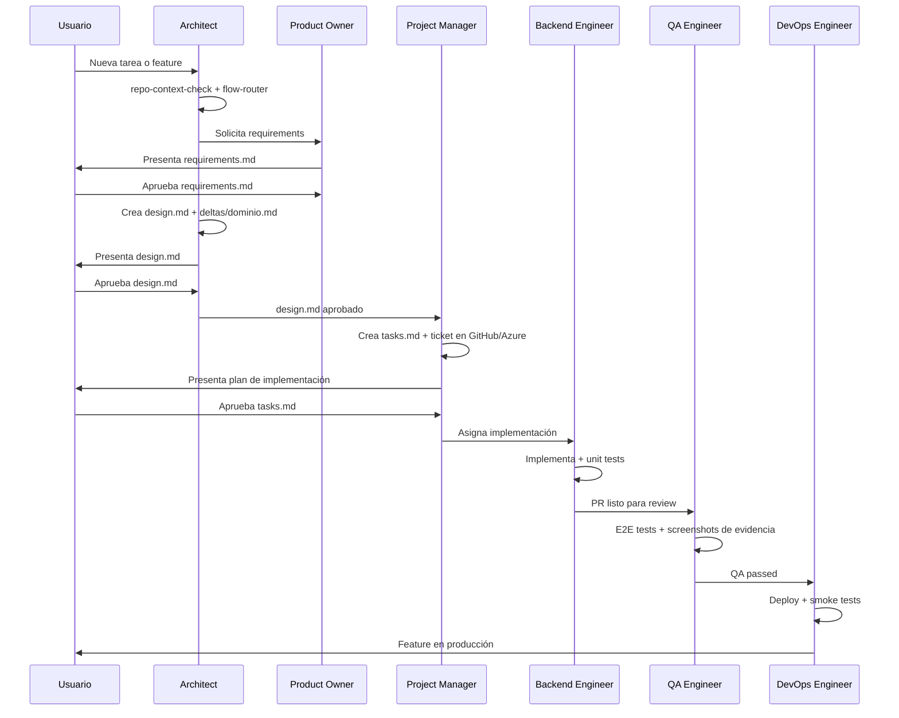

# Matriz de agentes y skills

Referencia de consulta rápida: qué hace cada uno de los 9 agentes y qué skills tiene asignadas. Para el diseño general (por qué existen agentes especializados) ver [Filosofía y arquitectura](../conceptos/filosofia-y-arquitectura.md).

> **Fuente de verdad**: el campo `skills:` (y `model:`) del frontmatter de cada `agents/*.md`. Esta página se regenera leyendo esos 9 archivos directamente — si alguna vez diverge, el frontmatter gana, no esta tabla.

## Detalle por agente

---

### Architect
**Modelo**: `opus` — **excepción deliberada**, no el `sonnet` (alias) que usan los otros 8 agentes. Se mantiene fijo en Opus por su rol de mayor razonamiento (CTO / Principal Architect): resuelve trade-offs de arquitectura, aprueba entregables de todo el equipo y es el punto de entrada de cualquier flujo — el costo extra de Opus se paga una vez por sesión, no por tarea.

**Rol**: CTO y Principal Architect. Punto de entrada de cualquier flujo — toda sesión nueva pasa por aquí primero.

**Responsabilidades**: ejecutar `agteamos-repo-context-check` y `agteamos-flow-router` en cada sesión · interpretar el objetivo de negocio real detrás del request · diseñar arquitectura de sistemas · crear y gestionar ADRs · revisar y aprobar entregables del equipo.

**Skills asignadas** (27): `agteamos-repo-context-check`, `agteamos-flow-router`, `agteamos-new-project`, `agteamos-new-task`, `agteamos-implement`, `agteamos-adr`, `agteamos-sdd-protocol`, `agteamos-rfc`, `agteamos-context-engineering`, `agteamos-audit`, `agteamos-onboard`, `agteamos-review`, `agteamos-production-readiness`, `agteamos-setup`, `agteamos-standards`, `agteamos-docs`, `agteamos-backlog`, `agteamos-build-api-workflow`, `agteamos-clarification-protocol`, `agteamos-dashboard`, `agteamos-dora-metrics`, `agteamos-improve-skill`, `agteamos-pr-standards`, `agteamos-self-audit`, `agteamos-slo-management`, `agteamos-story-breakdown`, `agteamos-threat-modeling`

**Herramientas**: Read, Write, Edit, Grep, Glob, WebFetch

---

### Product Owner
**Modelo**: `sonnet`

**Rol**: Responsable máximo del valor de negocio. Enlace estratégico entre el usuario y el equipo técnico.

**Responsabilidades**: escribir `requirements.md` con ACs verificables (Given/When/Then, citando el id RFC 2119 que verifican) · definir scope in/out · validar que el equipo construye lo correcto · aplicar `agteamos-clarification-protocol`.

**Skills asignadas** (11): `agteamos-sdd-protocol`, `agteamos-story-breakdown`, `agteamos-clarification-protocol`, `agteamos-context-engineering`, `agteamos-definition-of-ready`, `agteamos-audit`, `agteamos-onboard`, `agteamos-docs`, `agteamos-backlog`, `agteamos-new-project`, `agteamos-new-task`

**Herramientas**: Read, Write, Edit, Bash, Glob

---

### Project Manager
**Modelo**: `sonnet`

**Rol**: Ejecución táctica — el "cuándo" y "cómo operativo", mientras el PO gestiona el "qué".

**Responsabilidades**: escribir `tasks.md` · crear tickets en GitHub Issues/Azure DevOps · gestionar `agteamos/changes/` · aplicar `agteamos-task-tracking` durante la ejecución · ejecutar `agteamos-close-task` al finalizar · regenerar `dashboard.html`.

**Skills asignadas** (20): `agteamos-task-tracking`, `agteamos-close-task`, `agteamos-story-breakdown`, `agteamos-dora-metrics`, `agteamos-sdd-protocol`, `agteamos-context-engineering`, `agteamos-definition-of-ready`, `agteamos-rfc`, `agteamos-new-project`, `agteamos-new-task`, `agteamos-implement`, `agteamos-pr-standards`, `agteamos-audit`, `agteamos-onboard`, `agteamos-improve-skill`, `agteamos-backlog`, `agteamos-dashboard`, `agteamos-fix`, `agteamos-self-audit`, `agteamos-slo-management`

**Herramientas**: Read, Write, Edit, Bash, Glob

---

### Backend Engineer
**Modelo**: `sonnet`

**Rol**: Implementador de APIs, servicios, lógica de negocio y esquemas de base de datos.

**Responsabilidades**: implementar siguiendo el `design.md` aprobado · escribir unit tests obligatorios (mín. 3: happy path + error + edge) · documentar cada archivo en `progress.md` · commits atómicos con Conventional Commits · actualizar el campo `Next Action` antes de cada pausa.

**Stacks**: Python/FastAPI + SQLAlchemy 2.0 + pytest, C#/.NET + EF Core + xUnit, TypeScript/Node.js + Prisma + Vitest

**Skills asignadas** (13): `agteamos-task-tracking`, `agteamos-sdd-protocol`, `agteamos-context-engineering`, `agteamos-pr-standards`, `agteamos-asvs-checklist`, `agteamos-build-api-workflow`, `agteamos-debug`, `agteamos-fix`, `agteamos-close-task`, `agteamos-backlog`, `agteamos-dashboard`, `agteamos-implement`, `agteamos-improve-skill`

**Herramientas**: Read, Write, Edit, Bash, Grep, Glob

---

### Frontend Engineer
**Modelo**: `sonnet`

**Rol**: Transforma los diseños del UI/UX Designer en código de producción robusto y performante.

**Responsabilidades**: implementar componentes basados en el Design System · diseñar arquitectura de estado (Zustand, Redux, Context) · integrar endpoints de forma segura y tipada · implementar Error Boundaries y estados de carga · optimizar TBT/LCP/CLS · verificar accesibilidad (WCAG 2.2 AA).

**Stacks**: React 19 + TypeScript + Vite, Vue 3 + Pinia, Angular + RxJS

**Skills asignadas** (12): `agteamos-task-tracking`, `agteamos-sdd-protocol`, `agteamos-context-engineering`, `agteamos-pr-standards`, `agteamos-debug`, `agteamos-fix`, `agteamos-close-task`, `agteamos-build-ui-workflow`, `agteamos-backlog`, `agteamos-dashboard`, `agteamos-implement`, `agteamos-improve-skill`

**Herramientas**: Read, Write, Edit, Bash, Playwright

---

### QA Engineer
**Modelo**: `sonnet`

**Rol**: Garantiza que nada pase a producción roto. Última línea de defensa antes del merge.

**Responsabilidades**: ejecutar tests E2E con Playwright y guardar screenshots como evidencia · revisar código contra los ACs de `requirements.md` · verificar cobertura de unit tests · aprobar/rechazar PRs con justificación · auditar accesibilidad con axe-core.

**Skills asignadas** (15): `agteamos-task-tracking`, `agteamos-production-readiness`, `agteamos-pr-standards`, `agteamos-asvs-checklist`, `agteamos-review`, `agteamos-incident`, `agteamos-debug`, `agteamos-fix`, `agteamos-definition-of-ready`, `agteamos-audit`, `agteamos-backlog`, `agteamos-close-task`, `agteamos-dashboard`, `agteamos-implement`, `agteamos-improve-skill`

**Herramientas**: Read, Bash, Grep, Glob

---

### Security Engineer
**Modelo**: `sonnet`

**Rol**: AppSec Specialist. Identifica proactivamente vulnerabilidades y resuelve fallos de seguridad.

**Responsabilidades**: threat modeling (STRIDE) de nuevas features · revisión contra OWASP Top 10 · verificación con checklist ASVS · detectar secrets hardcodeados, SQL injection, XSS, CSRF · crear ADRs y issues de seguridad con severidad y plan de remediación.

**Skills asignadas** (10): `agteamos-code-analysis`, `agteamos-threat-modeling`, `agteamos-asvs-checklist`, `agteamos-context-engineering`, `agteamos-task-tracking`, `agteamos-production-readiness`, `agteamos-review`, `agteamos-adr`, `agteamos-audit`, `agteamos-backlog`

**Herramientas**: Read, Write, Edit, Bash, Grep, Glob

---

### DevOps Engineer
**Modelo**: `sonnet`

**Rol**: Infraestructura, CI/CD, contenedores y operaciones.

**Responsabilidades**: crear y optimizar Dockerfiles y docker-compose · configurar pipelines CI/CD · desplegar en Cloud Run, VPS, Railway, Vercel, Fly.io, AWS, Azure · gestionar secrets y variables de entorno · configurar monitoreo, alertas y rollback · ejecutar smoke tests post-deploy.

**Skills asignadas** (14): `agteamos-production-readiness`, `agteamos-dora-metrics`, `agteamos-slo-management`, `agteamos-context-engineering`, `agteamos-incident`, `agteamos-runbook-management`, `agteamos-deploy`, `agteamos-onboard`, `agteamos-audit`, `agteamos-backlog`, `agteamos-close-task`, `agteamos-dashboard`, `agteamos-implement`, `agteamos-new-project`

**Herramientas**: Read, Write, Edit, Bash, Grep, Glob

---

### UI/UX Designer
**Modelo**: `sonnet`

**Rol**: Guardián de la experiencia del usuario. Diseña la visión que el Frontend Engineer implementará.

**Responsabilidades**: diseñar wireframes y flujos de usuario · definir y mantener el Design System · prototipar interacciones en texto (no genera imágenes, describe con precisión) · verificar accesibilidad visual · obtener aprobación del usuario antes de que Frontend implemente — el gate es obligatorio, no una sugerencia.

**Skills asignadas** (8): `agteamos-clarification-protocol`, `agteamos-sdd-protocol`, `agteamos-context-engineering`, `agteamos-onboard`, `agteamos-build-ui-workflow`, `agteamos-backlog`, `agteamos-new-project`, `agteamos-new-task`

**Herramientas**: Read, Write, Edit, Bash, Playwright, WebFetch

---

## Flujo de interacción entre agentes

## Modelos por agente

| Agente | Modelo | Justificación |
|--------|--------|---------------|
| Architect | `opus` | Excepción deliberada — rol de mayor razonamiento (CTO), punto de entrada de todo flujo, aprueba entregables de los otros 8 agentes |
| Los otros 8 agentes | `sonnet` (alias) | Balance velocidad/calidad; el alias resuelve a la versión vigente sin quedar hardcodeado a un modelo obsoleto |

## Matriz completa: skill por agente

Fuente de verdad: el campo `skills:` del frontmatter de cada `agents/*.md`. 38 skills en total (coincide con las 38 filas de abajo y con el conteo del [catálogo de skills](./catalogo-de-skills.md)).

| Skill | Architect | PO | PM | Backend | Frontend | QA | Security | DevOps | UI/UX |
|-------|:---------:|:--:|:--:|:-------:|:--------:|:--:|:--------:|:------:|:-----:|
| agteamos-repo-context-check | ✓ | | | | | | | | |
| agteamos-flow-router | ✓ | | | | | | | | |
| agteamos-new-project | ✓ | ✓ | ✓ | | | | | ✓ | ✓ |
| agteamos-new-task | ✓ | ✓ | ✓ | | | | | | ✓ |
| agteamos-implement | ✓ | | ✓ | ✓ | ✓ | ✓ | | ✓ | |
| agteamos-adr | ✓ | | | | | | ✓ | | |
| agteamos-sdd-protocol | ✓ | ✓ | ✓ | ✓ | ✓ | | | | ✓ |
| agteamos-rfc | ✓ | | ✓ | | | | | | |
| agteamos-context-engineering | ✓ | ✓ | ✓ | ✓ | ✓ | | ✓ | ✓ | ✓ |
| agteamos-audit | ✓ | ✓ | ✓ | | | ✓ | ✓ | ✓ | |
| agteamos-onboard | ✓ | ✓ | ✓ | | | | | ✓ | ✓ |
| agteamos-review | ✓ | | | | | ✓ | ✓ | | |
| agteamos-production-readiness | ✓ | | | | | ✓ | ✓ | ✓ | |
| agteamos-setup | ✓ | | | | | | | | |
| agteamos-standards | ✓ | | | | | | | | |
| agteamos-docs | ✓ | ✓ | | | | | | | |
| agteamos-backlog | ✓ | ✓ | ✓ | ✓ | ✓ | ✓ | ✓ | ✓ | ✓ |
| agteamos-build-api-workflow | ✓ | | | ✓ | | | | | |
| agteamos-clarification-protocol | ✓ | ✓ | | | | | | | ✓ |
| agteamos-dashboard | ✓ | | ✓ | ✓ | ✓ | ✓ | | ✓ | |
| agteamos-dora-metrics | ✓ | | ✓ | | | | | ✓ | |
| agteamos-improve-skill | ✓ | | ✓ | ✓ | ✓ | ✓ | | | |
| agteamos-pr-standards | ✓ | | ✓ | ✓ | ✓ | ✓ | | | |
| agteamos-self-audit | ✓ | | ✓ | | | | | | |
| agteamos-slo-management | ✓ | | ✓ | | | | | ✓ | |
| agteamos-story-breakdown | ✓ | ✓ | ✓ | | | | | | |
| agteamos-threat-modeling | ✓ | | | | | | ✓ | | |
| agteamos-definition-of-ready | | ✓ | ✓ | | | ✓ | | | |
| agteamos-task-tracking | | | ✓ | ✓ | ✓ | ✓ | ✓ | | |
| agteamos-close-task | | | ✓ | ✓ | ✓ | ✓ | | ✓ | |
| agteamos-fix | | | ✓ | ✓ | ✓ | ✓ | | | |
| agteamos-asvs-checklist | | | | ✓ | | ✓ | ✓ | | |
| agteamos-debug | | | | ✓ | ✓ | ✓ | | | |
| agteamos-build-ui-workflow | | | | | ✓ | | | | ✓ |
| agteamos-code-analysis | | | | | | | ✓ | | |
| agteamos-incident | | | | | | ✓ | | ✓ | |
| agteamos-runbook-management | | | | | | | | ✓ | |
| agteamos-deploy | | | | | | | | ✓ | |

`agteamos-backlog` está wireada a los 9 agentes por igual — cualquiera puede capturar una idea en `BACKLOG.md` del repo del propio plugin en el momento en que surge, sin interrumpir el flujo en curso.

**Total por agente**: Architect 27 · PM 20 · QA 15 · DevOps 14 · Backend 13 · Frontend 12 · PO 11 · Security 10 · UI/UX 8.
