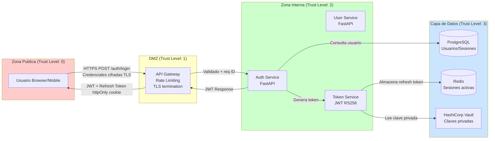
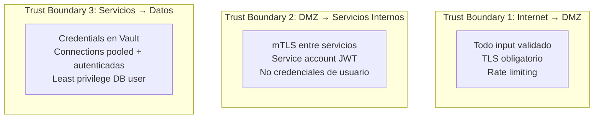

# Skill: Security (agteamos-security)

## CONTRACT

- **ASVS**: antes de aprobar cualquier PR que exponga un endpoint nuevo o
  modifique autenticacion/autorizacion, el agente debe ejecutar mentalmente
  el checklist ASVS y bloquear el merge si algun item L1 falla. Los items L2
  son obligatorios para endpoints que manejan datos sensibles (PII, pagos,
  salud).
- **Threat Modeling**: todo feature que introduzca un nuevo flujo de datos
  sensibles, un nuevo actor externo, un cambio en el modelo de
  autenticacion/autorizacion o un nuevo componente de infraestructura DEBE
  tener un threat model documentado antes de iniciar la implementacion. El
  threat model vive en `agteamos/security/threat-models/`.

---

## Checklist ASVS (L1/L2)

### CORE CONCEPTS

#### Niveles de verificacion

| Nivel | Contexto | Criterio de exigencia |
|-------|----------|----------------------|
| L1 | Todas las aplicaciones | Minimo no negociable — bloquea PR |
| L2 | Aplicaciones que manejan datos sensibles | Obligatorio en dominios criticos |
| L3 | Alta criticidad (finanzas, salud, defensa) | Verificacion formal + pentest |

#### Como leer cada item

Cada item tiene formato: `[ASVS-X.Y.Z] Descripcion (L1/L2)`.
- L1 = bloquea merge si falla
- L2 = bloquea deploy a produccion si falla

---

### CHECKLIST POR CAPITULO

#### V1 — Codificacion y Documentacion

- [ ] `[ASVS-1.1.1]` Todo el codigo del proyecto tiene un repositorio de control de versiones con historial completo (L1)
- [ ] `[ASVS-1.1.2]` Existe documentacion de arquitectura actualizada que incluye componentes de seguridad (L2)
- [ ] `[ASVS-1.1.3]` Los threat models estan documentados y revisados para cada feature critica (L2)
- [ ] `[ASVS-1.2.1]` Los componentes usan el principio de least privilege — cada servicio solo tiene los permisos que necesita (L1)

---

#### V2 — Autenticacion

- [ ] `[ASVS-2.1.1]` Las contrasenas tienen minimo 12 caracteres (L1)
- [ ] `[ASVS-2.1.2]` Las contrasenas de hasta 128 caracteres son permitidas (L1)
- [ ] `[ASVS-2.1.5]` El sistema permite cambiar contrasena y la nueva no puede ser igual a la anterior (L1)
- [ ] `[ASVS-2.1.6]` El formulario de cambio de contrasena requiere la contrasena actual (L1)
- [ ] `[ASVS-2.2.1]` Los controles anti-automatizacion (CAPTCHA, rate limiting) protegen endpoints de autenticacion (L1)
- [ ] `[ASVS-2.2.2]` Las cuentas se bloquean o introducen delays progresivos tras N intentos fallidos (L2)
- [ ] `[ASVS-2.3.1]` Las credenciales temporales (reset de contrasena, magic links) expiran en maximo 24h (L1)
- [ ] `[ASVS-2.3.2]` Las credenciales temporales son de un solo uso (L1)
- [ ] `[ASVS-2.4.1]` Las contrasenas se almacenan con Argon2id, bcrypt o PBKDF2 — nunca MD5/SHA1/SHA256 sin salt (L1)
- [ ] `[ASVS-2.5.1]` Los mensajes de error de autenticacion no revelan si el usuario existe o no (L1)
- [ ] `[ASVS-2.6.1]` Los TOTP son validos por una sola ventana de tiempo (L2)
- [ ] `[ASVS-2.7.1]` Los tokens OTP/magic link son generados con CSPRNG (L1)
- [ ] `[ASVS-2.8.1]` Los tokens de acceso tienen tiempo de expiracion <= 24h (L2)

---

#### V3 — Gestion de Sesiones

- [ ] `[ASVS-3.1.1]` Nunca se expone el session ID en URLs, logs ni headers de error (L1)
- [ ] `[ASVS-3.2.1]` Los session IDs se generan con un CSPRNG y tienen minimo 128 bits de entropia (L1)
- [ ] `[ASVS-3.2.2]` Se invalida el session ID anterior al hacer login exitoso (previene session fixation) (L1)
- [ ] `[ASVS-3.2.3]` La sesion expira tras inactividad configurada (L1)
- [ ] `[ASVS-3.3.1]` El logout invalida la sesion en el servidor — no solo borra la cookie del cliente (L1)
- [ ] `[ASVS-3.4.1]` Las cookies de sesion usan el atributo `HttpOnly` (L1)
- [ ] `[ASVS-3.4.2]` Las cookies de sesion usan el atributo `Secure` (L1)
- [ ] `[ASVS-3.4.3]` Las cookies de sesion usan `SameSite=Strict` o `SameSite=Lax` (L1)
- [ ] `[ASVS-3.4.5]` Las cookies de sesion tienen el atributo `Path` configurado al path minimo necesario (L1)
- [ ] `[ASVS-3.5.1]` Los JWT usan algoritmos seguros (RS256, ES256, PS256) — nunca `alg: none` (L1)
- [ ] `[ASVS-3.5.2]` Los JWT son validados completamente: firma, `exp`, `nbf`, `iss`, `aud` (L1)
- [ ] `[ASVS-3.7.1]` La aplicacion invalida tokens activos cuando el usuario cambia su contrasena (L2)

---

#### V4 — Control de Acceso

- [ ] `[ASVS-4.1.1]` El principio de deny-by-default es aplicado: acceso denegado salvo permiso explicito (L1)
- [ ] `[ASVS-4.1.2]` El control de acceso se verifica en el servidor — nunca solo en el cliente (L1)
- [ ] `[ASVS-4.1.3]` El control de acceso a nivel de fila/recurso esta implementado (previene IDOR) (L1)
- [ ] `[ASVS-4.2.1]` Los datos sensibles requieren re-autenticacion o MFA para acceder (L2)
- [ ] `[ASVS-4.2.2]` El ownership se valida antes de cada operacion sobre un recurso (L1)
- [ ] `[ASVS-4.3.1]` Las interfaces administrativas tienen controles de acceso adicionales (L1)
- [ ] `[ASVS-4.3.2]` El acceso directo a archivos o funciones del servidor esta prohibido (L1)

---

#### V5 — Validacion de Inputs y Sanitizacion

- [ ] `[ASVS-5.1.1]` El servidor valida todos los inputs independientemente de la validacion del cliente (L1)
- [ ] `[ASVS-5.1.2]` Los parametros de arrays, objetos y primitivos son validados en tipo, rango y longitud (L1)
- [ ] `[ASVS-5.1.3]` Los valores JSON son validados contra un schema definido (L1)
- [ ] `[ASVS-5.2.1]` El HTML no-confiable es sanitizado con una libreria probada (DOMPurify, bleach) antes de renderizar (L1)
- [ ] `[ASVS-5.2.2]` Los inputs de markdown son sanitizados antes de renderizar (L1)
- [ ] `[ASVS-5.2.3]` La salida hacia LDAP usa escape correcto para prevenir LDAP injection (L2)
- [ ] `[ASVS-5.2.5]` Las queries SQL usan parametros preparados — nunca concatenacion de strings (L1)
- [ ] `[ASVS-5.2.6]` Las queries NoSQL usan parametros o metodos del driver — nunca interpolacion (L1)
- [ ] `[ASVS-5.3.1]` El encoding de output es contextual: HTML para HTML, JS para JS, URL para URLs (L1)
- [ ] `[ASVS-5.3.3]` La proteccion contra XSS se aplica en todos los puntos de rendering (L1)
- [ ] `[ASVS-5.4.1]` La aplicacion no usa funciones peligrosas de memoria (si aplica al lenguaje) (L1)
- [ ] `[ASVS-5.5.1]` Los objetos serializados son validados antes de desserializar (L2)
- [ ] `[ASVS-5.5.2]` El sistema rechaza XML con DTD externas (previene XXE) (L1)

---

#### V6 — Criptografia

- [ ] `[ASVS-6.1.1]` Los datos sensibles (PII, credenciales, tokens) estan cifrados en reposo (L2)
- [ ] `[ASVS-6.2.1]` Solo se usan modulos criptograficos validados o libreria estandar del lenguaje (L1)
- [ ] `[ASVS-6.2.2]` El algoritmo de cifrado es AES-256-GCM o ChaCha20-Poly1305 — no AES-ECB, DES, RC4 (L1)
- [ ] `[ASVS-6.2.3]` Los IVs/nonces son unicos por operacion — nunca reutilizados (L1)
- [ ] `[ASVS-6.2.5]` Los modos de cifrado inseguros (ECB, CBC sin MAC) no se usan (L1)
- [ ] `[ASVS-6.3.1]` Los numeros aleatorios para tokens o keys se generan con CSPRNG (L1)
- [ ] `[ASVS-6.3.2]` Los UUIDs se generan con UUID v4 o superior (L1)
- [ ] `[ASVS-6.4.1]` Las claves criptograficas son intercambiables sin re-despliegue del codigo (L2)
- [ ] `[ASVS-6.4.2]` Las claves criptograficas no estan en el codigo fuente ni en variables de entorno del repo (L1)

---

#### V7 — Manejo de Errores y Logging

- [ ] `[ASVS-7.1.1]` Los logs no contienen credenciales, tokens, PII ni datos de tarjetas (L1)
- [ ] `[ASVS-7.1.2]` Los logs no contienen informacion de debug sensible en produccion (L1)
- [ ] `[ASVS-7.2.1]` Todos los controles de autenticacion logean exitos y fallos con contexto suficiente (L2)
- [ ] `[ASVS-7.2.2]` Todos los controles de acceso logean fallos con contexto suficiente (L2)
- [ ] `[ASVS-7.3.1]` Los logs estan protegidos contra inyeccion — los inputs de usuario se escapan antes de loguear (L2)
- [ ] `[ASVS-7.4.1]` Los errores de la aplicacion al usuario no exponen stack traces, IDs internos ni detalles del servidor (L1)
- [ ] `[ASVS-7.4.2]` Los errores tienen un identificador unico que permite correlacionar con los logs del servidor (L2)

---

#### V8 — Proteccion de Datos

- [ ] `[ASVS-8.1.1]` Los datos sensibles no se almacenan en cache del cliente (headers `Cache-Control: no-store`) (L2)
- [ ] `[ASVS-8.1.2]` Los datos en memoria son sobreescritos cuando ya no son necesarios (L2)
- [ ] `[ASVS-8.2.1]` Los datos PII tienen politica de retencion y borrado definida (L2)
- [ ] `[ASVS-8.3.1]` Los datos sensibles en requests/responses usan TLS — nunca HTTP plano (L1)
- [ ] `[ASVS-8.3.4]` Todos los datos sensibles son identificados y clasificados en la documentacion (L2)

---

#### V9 — Comunicaciones

- [ ] `[ASVS-9.1.1]` TLS 1.2+ es el minimo para toda comunicacion externa (L1)
- [ ] `[ASVS-9.1.2]` Los cipher suites inseguros (RC4, DES, 3DES, NULL) estan deshabilitados (L1)
- [ ] `[ASVS-9.1.3]` TLS 1.0 y TLS 1.1 estan deshabilitados (L1)
- [ ] `[ASVS-9.2.1]` Los certificados de cliente se validan cuando estan configurados (L2)
- [ ] `[ASVS-9.2.2]` Los errores de TLS/certificado estan logueados y no son ignorados silenciosamente (L2)

---

#### V13 — Seguridad de APIs

- [ ] `[ASVS-13.1.1]` Los endpoints de API tienen autenticacion excepto los explicitamente publicos (L1)
- [ ] `[ASVS-13.1.2]` Los endpoints de API tienen rate limiting contra abuso automatizado (L1)
- [ ] `[ASVS-13.1.3]` Los endpoints de API validan el Content-Type del request y rechazan tipos no soportados (L1)
- [ ] `[ASVS-13.1.4]` Los endpoints de API validan el Content-Type en la respuesta (L1)
- [ ] `[ASVS-13.2.1]` Los endpoints REST que modifican estado tienen proteccion CSRF o tokens anti-CSRF (L1)
- [ ] `[ASVS-13.2.2]` Los endpoints REST usan los HTTP methods correctos segun su semantica (L1)
- [ ] `[ASVS-13.3.1]` Los schemas de GraphQL tienen depth limiting para prevenir queries abusivas (L2)
- [ ] `[ASVS-13.3.2]` La introspection de GraphQL esta deshabilitada en produccion (L2)

---

### EXAMPLES (ASVS)

#### V2 — Almacenamiento de contrasenas

**INCORRECTO (Python):**
```python
import hashlib

def store_password(password: str) -> str:
    # MD5 sin salt — completamente inseguro
    return hashlib.md5(password.encode()).hexdigest()

def store_password_v2(password: str) -> str:
    # SHA256 sin salt — resiste brute-force pero rainbow tables lo rompen
    return hashlib.sha256(password.encode()).hexdigest()
```

**CORRECTO (Python):**
```python
from passlib.context import CryptContext

# Argon2id: ganador de Password Hashing Competition 2015 — ASVS v5 lo recomienda
pwd_context = CryptContext(
    schemes=["argon2"],
    argon2__memory_cost=65536,   # 64 MB
    argon2__time_cost=3,          # 3 iteraciones
    argon2__parallelism=4,
    deprecated="auto",
)

def hash_password(password: str) -> str:
    return pwd_context.hash(password)

def verify_password(plain: str, hashed: str) -> bool:
    return pwd_context.verify(plain, hashed)
```

---

#### V3 — JWT: validacion correcta

**INCORRECTO (TypeScript):**
```typescript
import jwt from 'jsonwebtoken'

// Solo decodifica sin verificar — completamente inseguro
const payload = jwt.decode(token)

// Acepta alg: none
const payload2 = jwt.verify(token, secret)  // sin options — acepta alg: none en algunas versiones
```

**CORRECTO (TypeScript):**
```typescript
import jwt, { JwtPayload } from 'jsonwebtoken'

interface TokenPayload extends JwtPayload {
  userId: string
  role: string
}

function verifyAccessToken(token: string): TokenPayload {
  // algorithms explicito — nunca permite alg: none
  const payload = jwt.verify(token, process.env.JWT_PUBLIC_KEY!, {
    algorithms: ['RS256'],
    issuer: process.env.JWT_ISSUER,
    audience: process.env.JWT_AUDIENCE,
  }) as TokenPayload

  return payload
}
```

---

#### V4 — IDOR prevention (ownership check)

**INCORRECTO (Python/FastAPI):**
```python
@router.get("/invoices/{invoice_id}")
async def get_invoice(invoice_id: int, db: AsyncSession = Depends(get_db)):
    # Cualquier usuario autenticado puede ver cualquier factura
    invoice = await db.get(Invoice, invoice_id)
    if not invoice:
        raise HTTPException(status_code=404)
    return invoice
```

**CORRECTO (Python/FastAPI):**
```python
@router.get("/invoices/{invoice_id}")
async def get_invoice(
    invoice_id: int,
    current_user: User = Depends(get_current_user),
    db: AsyncSession = Depends(get_db),
) -> InvoiceResponse:
    invoice = await db.get(Invoice, invoice_id)
    if not invoice:
        raise HTTPException(status_code=404, detail="Invoice not found")
    # Ownership check — ASVS 4.2.2
    if invoice.owner_id != current_user.id and current_user.role != "admin":
        raise HTTPException(status_code=403, detail="Access denied")
    return InvoiceResponse.model_validate(invoice)
```

---

#### V5 — SQL injection prevention

**INCORRECTO (Python):**
```python
async def find_user_by_email(email: str, db: AsyncSession):
    # Concatenacion directa — vulnerable a SQL injection
    result = await db.execute(
        text(f"SELECT * FROM users WHERE email = '{email}'")
    )
    return result.fetchone()
```

**CORRECTO (Python):**
```python
from sqlalchemy import select

async def find_user_by_email(email: str, db: AsyncSession) -> User | None:
    # ORM usa parametros preparados automaticamente
    result = await db.execute(
        select(User).where(User.email == email)
    )
    return result.scalar_one_or_none()

# Si necesitas SQL raw, siempre con parametros nombrados
async def find_user_raw(email: str, db: AsyncSession):
    result = await db.execute(
        text("SELECT * FROM users WHERE email = :email"),
        {"email": email},  # parametro — nunca interpolacion
    )
    return result.fetchone()
```

---

#### V7 — Error handling sin stack trace

**INCORRECTO (TypeScript/Express):**
```typescript
app.use((err: Error, req: Request, res: Response, next: NextFunction) => {
  // Expone stack trace y detalles internos al cliente
  res.status(500).json({
    error: err.message,
    stack: err.stack,
    query: req.query,
  })
})
```

**CORRECTO (TypeScript/Express):**
```typescript
import { randomUUID } from 'crypto'
import { logger } from './logger'

app.use((err: Error, req: Request, res: Response, _next: NextFunction) => {
  const errorId = randomUUID()

  // Stack trace solo en logs internos — ASVS 7.4.1
  logger.error({
    errorId,
    message: err.message,
    stack: err.stack,
    path: req.path,
    method: req.method,
  })

  // Al cliente: mensaje generico + correlation ID — ASVS 7.4.2
  res.status(500).json({
    type: 'https://api.example.com/errors/internal-error',
    title: 'Internal Server Error',
    status: 500,
    errorId,  // permite correlacionar con logs sin exponer detalles
  })
})
```

---

### ANTI-PATTERNS (ASVS)

1. **Validacion solo en el cliente.** El servidor debe validar todos los inputs sin excepcion.
2. **Mensajes de error informativos.** `"Invalid password for user john@example.com"` enumera usuarios — usar mensaje generico.
3. **JWT sin verificar `aud` e `iss`.** Un token valido de otro servicio del mismo ecosistema podria ser reutilizado.
4. **Comparacion de tokens con `==`.** Usar comparacion en tiempo constante (`hmac.compare_digest`) para prevenir timing attacks.
5. **Loguear el body completo del request.** Puede capturar contrasenas, tokens o tarjetas.
6. **Deshabilitar verificacion TLS en clientes HTTP internos.** `verify=False` en requests o `rejectUnauthorized: false` en Node.
7. **Secrets en variables de entorno del repositorio (`.env` commiteado).** Usar un gestor de secretos externo.
8. **UUIDs secuenciales o predecibles como IDs publicos.** Usar UUID v4 o IDs opacos.

---

## Threat Modeling (PASTA + STRIDE + LINDDUN)

### CORE CONCEPTS

#### Cuando usar cada framework

| Framework | Cuando aplicarlo | Resultado principal |
|-----------|-----------------|---------------------|
| **PASTA** | Analisis completo de un sistema nuevo o cambio arquitectonico mayor | Documento de amenazas priorizadas por riesgo de negocio |
| **STRIDE** | Revision rapida de un endpoint o componente especifico | Lista de amenazas por categoria tecnica |
| **LINDDUN** | Flujos que procesan datos personales (GDPR/privacidad) | Amenazas de privacidad priorizadas |

#### Regla de seleccion

```
Feature nueva compleja o sistema nuevo → PASTA completo
Endpoint nuevo o cambio en autenticacion → STRIDE
Procesamiento de PII o datos de salud → LINDDUN (puede combinarse con STRIDE)
Revision rapida en PR → STRIDE solo para los cambios del PR
```

---

### PASTA — 7 Fases

#### Fase 1: Definir objetivos de negocio
Identifica que activos de negocio estamos protegiendo y cuales son las
consecuencias de un compromiso.

```
Pregunta clave: Si este sistema falla de seguridad, que impacto tiene en
el negocio? (reputacional, financiero, legal, operacional)
```

#### Fase 2: Definir el scope tecnico
- Tecnologias, lenguajes, frameworks y dependencias del componente
- Limites de confianza (trust boundaries)
- Datos que fluyen por el sistema y su clasificacion

#### Fase 3: Descomposicion de la aplicacion
- Data Flow Diagrams (DFD) de nivel 0 y nivel 1
- Identificar todos los puntos de entrada y salida
- Documentar los actores (usuarios, sistemas externos, administradores)

#### Fase 4: Analisis de amenazas (usa STRIDE aqui)
Aplicar STRIDE a cada elemento del DFD.

#### Fase 5: Analisis de vulnerabilidades
Cruzar amenazas con vulnerabilidades conocidas (CVEs, OWASP Top 10, CWE).

#### Fase 6: Modelado de ataques
Construir arboles de ataque (attack trees) para las amenazas de mayor riesgo.

#### Fase 7: Analisis de riesgo y mitigaciones
Puntuar cada amenaza con la matriz Impact x Probability y definir mitigaciones.

---

### STRIDE — Referencia rapida

| Categoria | Amenaza | Objetivo | Control principal |
|-----------|---------|----------|------------------|
| **S**poofing | Suplantar identidad de usuario o servicio | Autenticacion | MFA, mTLS, certificados |
| **T**ampering | Modificar datos en transito o reposo | Integridad | MAC/firma digital, TLS, hashing |
| **R**epudiation | Negar haber realizado una accion | No-repudio | Audit logs firmados, timestamps |
| **I**nformation Disclosure | Exponer datos sensibles | Confidencialidad | Cifrado, control de acceso, sanitizacion |
| **D**enial of Service | Agotar recursos del sistema | Disponibilidad | Rate limiting, circuit breakers, autoscaling |
| **E**levation of Privilege | Obtener permisos no autorizados | Autorizacion | RBAC/ABAC, principio minimo privilegio |

---

### LINDDUN — Amenazas de privacidad

| Categoria | Descripcion | Ejemplo |
|-----------|-------------|---------|
| **L**inkability | Vincular datos de diferentes fuentes para identificar a una persona | Correlacion de IPs entre sesiones |
| **I**dentifiability | Identificar a un individuo a partir de datos anonimizados | Re-identificacion por combinacion de campos |
| **N**on-repudiation | El usuario no puede negar haber realizado una accion (puede ser problema de privacidad) | Logs detallados de comportamiento de usuario |
| **D**etectability | Determinar si alguien usa el sistema o tiene ciertos datos | Timing attacks en respuestas |
| **D**isclosure of information | Exposicion de datos personales | Data breach, over-sharing en APIs |
| **U**nawareness | El usuario no sabe como se usan sus datos | Falta de transparencia en procesamiento |
| **N**on-compliance | Violacion de regulaciones de privacidad | Almacenamiento de datos sin base legal |

---

### PLANTILLA DE DOCUMENTO DE AMENAZA

```markdown
# Threat Model: [Nombre del Sistema/Feature]

**Fecha:** YYYY-MM-DD
**Autor:** @nombre
**Revisado por:** @nombre
**Version:** 1.0
**Framework aplicado:** PASTA / STRIDE / LINDDUN

## 1. Alcance

### Descripcion
[Que hace este sistema/feature en una o dos oraciones]

### Activos a proteger
| Activo | Clasificacion | Consecuencia de compromiso |
|--------|--------------|---------------------------|
| Tokens de acceso | Critico | Acceso no autorizado a datos de usuario |
| PII de usuarios | Sensible | Violacion GDPR, dano reputacional |
| Claves de cifrado | Critico | Compromiso total de datos cifrados |

### Actores
| Actor | Tipo | Nivel de confianza |
|-------|------|--------------------|
| Usuario autenticado | Externo | Bajo |
| Servicio interno de pagos | Interno | Medio |
| Administrador | Interno | Alto |

## 2. Data Flow Diagram

[Insertar DFD en Mermaid — ver seccion EXAMPLES]

## 3. Amenazas identificadas

| ID | Categoria | Componente afectado | Descripcion | Probabilidad | Impacto | Riesgo | Estado |
|----|-----------|--------------------|----|---|---|---|---|
| T-001 | Spoofing | Auth endpoint | Brute force de credenciales | Alta | Alto | Critico | Mitigado |
| T-002 | Information Disclosure | User API | IDOR en GET /users/{id} | Media | Alto | Alto | Mitigado |

## 4. Mitigaciones

| ID Amenaza | Mitigacion | Implementado en | Evidencia |
|-----------|-----------|----------------|-----------|
| T-001 | Rate limiting 5 req/min + bloqueo tras 10 fallos | auth/middleware.py | PR #123 |
| T-002 | Ownership check en todos los endpoints de recurso | users/router.py:45 | PR #124 |

## 5. Amenazas aceptadas (riesgo residual)

| ID | Razon de aceptacion | Aprobado por |
|----|--------------------|----|
| T-005 | Riesgo bajo, costo de mitigacion desproporcionado | @architect |
```

---

### EXAMPLES (Threat Modeling)

#### Data Flow Diagram — Sistema de Autenticacion



#### Trust Boundaries en el DFD



---

#### Matriz de Riesgo (Impact x Probability)

```
              IMPACTO
              Bajo    Medio   Alto    Critico
          +-------+-------+-------+--------+
Alta      |  Medio |  Alto | Critico| Critico|
          +-------+-------+-------+--------+
PROB Media |  Bajo  | Medio |  Alto  | Critico|
          +-------+-------+-------+--------+
Baja      |  Bajo  |  Bajo | Medio  |  Alto  |
          +-------+-------+-------+--------+
Minima    | Minimo |  Bajo |  Bajo  | Medio  |
          +-------+-------+-------+--------+
```

**Escala de impacto:**
- **Critico:** Perdida de datos masiva, multa regulatoria, baja del servicio >24h
- **Alto:** Acceso no autorizado a datos de usuarios, perdida financiera significativa
- **Medio:** Degradacion del servicio, exposicion de datos no sensibles
- **Bajo:** Incomodidad de usuario, datos publicos expuestos

**Umbral de accion:**
- Critico → Bloquea release, fix inmediato
- Alto → Fix en el sprint actual
- Medio → Backlog prioritario, fix en los proximos 2 sprints
- Bajo → Backlog normal

---

#### Ejemplo completo: Sistema de autenticacion con STRIDE

##### Componente analizado: `POST /auth/login`

| ID | STRIDE | Descripcion de amenaza | Prob | Impacto | Riesgo | Mitigacion |
|----|--------|------------------------|------|---------|--------|-----------|
| T-001 | Spoofing | Brute force de contrasenas | Alta | Alto | Critico | Rate limiting 5/min, lockout tras 10 fallos, CAPTCHA |
| T-002 | Spoofing | Credential stuffing desde breaches externos | Alta | Alto | Critico | HaveIBeenPwned check, deteccion de IPs anomalas |
| T-003 | Tampering | Manipulacion del payload JWT despues de firmado | Baja | Critico | Critico | Firma RS256, validacion de firma en cada request |
| T-004 | Repudiation | Negacion de intento de login fraudulento | Media | Medio | Medio | Log de intentos con IP, user-agent, timestamp |
| T-005 | Information Disclosure | Enumeracion de usuarios via timing attack | Media | Medio | Medio | Tiempo constante en comparacion, mensaje generico |
| T-006 | Information Disclosure | Leak de hash de contrasena via SQL injection | Baja | Critico | Alto | ORM con parametros preparados, WAF |
| T-007 | Denial of Service | Flood de requests agota conexiones DB | Alta | Alto | Critico | Connection pool, rate limiting, circuit breaker |
| T-008 | Elevation of Privilege | Session fixation tras login exitoso | Media | Alto | Alto | Regenerar session ID tras autenticacion exitosa |

##### Attack tree para T-001 (Brute Force)

```
[Comprometer cuenta de usuario]
├── [Brute force directo]
│   ├── [Sin rate limiting] → MITIGADO: 5 req/min por IP
│   └── [Distributed brute force] → MITIGADO: rate limit por usuario + IP
├── [Credential stuffing]
│   ├── [Usar breach databases] → MITIGADO: HaveIBeenPwned check
│   └── [Probar variaciones] → MITIGADO: Lockout tras 10 fallos
└── [Phishing]
    └── [Fuera de scope del threat model — control de usuario]
```

---

### CHECKLIST (Threat Modeling)

- [ ] DFD de nivel 0 y nivel 1 documentados con trust boundaries
- [ ] Todos los actores identificados con su nivel de confianza
- [ ] Todos los activos clasificados (Critico / Sensible / Interno / Publico)
- [ ] STRIDE aplicado a cada elemento del DFD
- [ ] Cada amenaza tiene probabilidad, impacto y riesgo calculado
- [ ] Las amenazas Criticas y Altas tienen mitigacion documentada con PR de referencia
- [ ] Las amenazas aceptadas tienen justificacion y aprobacion documentada
- [ ] El documento esta en `agteamos/security/threat-models/` y referenciado en el issue

---

### ANTI-PATTERNS (Threat Modeling)

1. **Threat model como checkbox.** Hacerlo al final solo para cumplir un requisito. Debe realizarse antes de implementar.
2. **STRIDE aplicado al sistema completo de golpe.** Aplicarlo elemento por elemento del DFD para no perder amenazas.
3. **Ignorar las amenazas de supply chain.** Las dependencias de terceros son parte del DFD.
4. **No actualizar el threat model.** Cada cambio arquitectonico significativo requiere re-revision.
5. **Asumir que el cifrado en transito es suficiente.** Cifrado en reposo, en uso y en transito son capas independientes.
6. **Mitigaciones sin evidencia.** Cada mitigacion debe tener un PR o issue que demuestre que esta implementada.
7. **Omitir actores internos en el modelo.** Insiders maliciosos o comprometidos son una amenaza real — zero trust.
</content>
