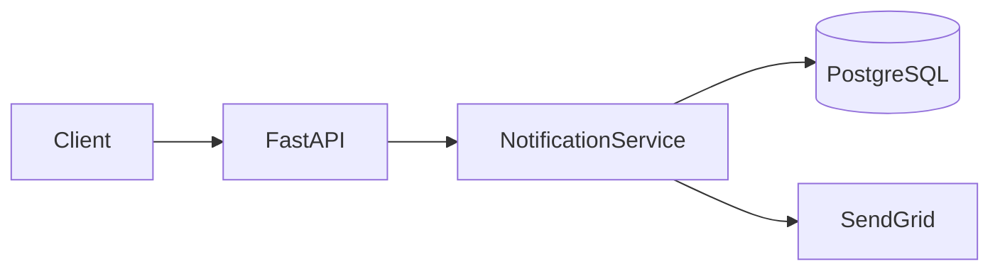

# Skill: SDD Protocol (Spec-Driven Development)

## CONTRACT
- **Input**: Feature request (del usuario o de un ticket)
- **Output**: artefactos en `agteamos/changes/<id>-<slug>/specs/`, según el schema aplicable
- **Regla**: No se escribe codigo hasta que design.md este aprobado (schema `full`)

## LAS DOS CAPAS DE SPEC

| Capa | Archivo | Vida | Quién la escribe |
|---|---|---|---|
| **Spec maestra** (fuente de verdad) | `agteamos/specs/<dominio>.md` | **Persistente y acumulativa** — vive mientras exista el dominio | Nadie a mano durante la tarea: la actualiza `agteamos-implement` en su paso `sync`, o la siembra `agteamos-knowledge` |
| **Delta** (diff propuesto) | `agteamos/changes/<id>-<slug>/specs/deltas/<dominio>.md` | **Efímero** — nace y muere con la tarea, queda en el archive como historia | `@architect`, junto con `design.md` |

El delta **no** es la capa de specs maestras: es el diff contra ella. Las dos
usan el **mismo formato canónico** (abajo) — eso es lo que hace que el merge
del paso `sync` sea determinista y no interpretativo.

## FORMATO CANONICO DE SPEC (vale para la spec maestra Y para el delta)

Estructura parseable de 3 niveles. No es decorativa: los nombres de los
`### Requirement:` son las **anclas de merge** del delta, y los modales
RFC 2119 son la **fuente de datos** del gate `verify` de `agteamos-implement`.

| Elemento | Regla |
|---|---|
| `## Purpose` | 1-2 líneas: para qué existe el dominio. Solo en la spec maestra (el delta lo lleva únicamente si la spec maestra todavía no existe). |
| `### Requirement: <Nombre>` | Un comportamiento, una frase, **un** modal RFC 2119. El nombre es la ancla de merge: único y estable dentro del dominio. |
| `#### Scenario: <caso>` | GIVEN / WHEN / THEN, una línea por paso, `- AND` para pasos extra. **Mínimo 1 escenario por requirement.** |

```markdown
### Requirement: Welcome Email On Registration
El sistema MUST enviar un email de bienvenida dentro de los 5 segundos
posteriores a un registro exitoso.

#### Scenario: Registro exitoso
- GIVEN un email que no existe en el sistema
- WHEN el usuario completa el registro
- THEN se envia un email de bienvenida a esa direccion
- AND queda registrada una notificacion con type = welcome

#### Scenario: El proveedor de email falla
- GIVEN el proveedor de email responde con error 500
- WHEN se intenta enviar el email de bienvenida
- THEN el registro del usuario se conserva
- AND la notificacion queda en estado failed para reintento
```

### Modales RFC 2119 — dentro del texto, no como metadato

| Modal | Significado | Efecto en el gate `verify` de `agteamos-implement` |
|---|---|---|
| `MUST` / `SHALL` | Requisito duro, no negociable | Incumplido → **FAIL** (bloquea el cierre) |
| `SHOULD` | Recomendación fuerte, admite excepción justificada | Incumplido → **WARNING** (se documenta, no bloquea) |
| `MAY` | Genuinamente opcional | No se chequea |

- **Un modal por requirement.** Si el texto tiene dos `MUST` o una cláusula
  "y además", son dos requirements: separarlos.
- El modal va **dentro de la frase del requirement**, nunca como etiqueta
  aparte ni en el encabezado — es lo que lo hace grepeable y clasificable.
- Por defecto `MUST`/`SHALL`. Usar `SHOULD` solo cuando de verdad significa
  "salvo que haya una buena razón para no hacerlo".

### Test comportamiento vs implementación

Una spec es un **contrato de comportamiento observable**, no un plan de
implementación.

> **Test rápido**: si la implementación puede cambiar sin que cambie el
> comportamiento observable, **no va en la spec** — va en `design.md`.

| Va en la spec | Va en `design.md` / `tasks.md` |
|---|---|
| Comportamiento que un usuario o un sistema externo observa | Nombres de clases, funciones, módulos |
| Inputs, outputs, condiciones de error | Elección de librería, framework o proveedor |
| Restricciones externas (seguridad, privacidad, compatibilidad, límites) | Esquema de tablas, índices, migraciones |
| Escenarios verificables | Pasos de implementación y su orden |

### Guía de autoría

- **Requirement observable**: alguien que nunca vio el código debe poder decir
  si se cumple. "MUST mostrar un banner de error cuando el archivo supera
  10 MB" es observable; "MUST manejar archivos grandes correctamente" no.
- **El escenario ejercita, no reformula**: un escenario que repite el
  requirement con otras palabras no verifica nada. Tiene que ser una situación
  concreta con un resultado concreto.
- **Nombrar el caso en el título**: `#### Scenario: Rechaza un token expirado`,
  no `#### Scenario: Caso 2`.
- **Cubrir error y borde, no solo el happy path**: el login válido es el caso
  fácil; el token expirado, el input vacío y el doble click son donde viven los
  bugs y donde el escenario vale más.
- **Antes de aprobar**, preguntarse: *¿cuál es el caso que me molestaría ver
  roto?* — y verificar que hay un escenario que lo nombra.

## LA SPEC MAESTRA — `agteamos/specs/<dominio>.md`

Un archivo por dominio, con el nombre del dominio declarado en `domains:` de
`task.yml` (`notifications.md`, `billing.md`, `auth.md`). Describe el
comportamiento **vigente completo** del dominio, no el cambio de una tarea.

Solo la modifican `agteamos-implement` (paso `sync`, aplicando deltas) y
`agteamos-knowledge` (siembra inicial por ingeniería inversa del código). Durante
la implementación se **lee**, no se edita a mano.

### Plantilla

```markdown
# Spec: <dominio>

## Coverage
- **Estado**: seeded | partial | complete
- **Cubre**: [comportamientos/subdominios especificados en este archivo]
- **No cubre (todavia)**: [comportamiento que existe en el codigo pero aun no esta especificado — vacio solo si Estado = complete]
- **Ultima tarea aplicada**: TASK-<id> (<YYYY-MM-DD>)
- **Origen**: onboarding (ingenieria inversa) | deltas de tareas

## Purpose
[1-2 lineas: para que existe este dominio y de que es responsable]

## Requirements

### Requirement: <Nombre unico y estable>
El sistema MUST <comportamiento observable>.

#### Scenario: <caso happy path>
- GIVEN <estado inicial>
- WHEN <accion>
- THEN <resultado observable>
- AND <resultado adicional>

#### Scenario: <caso de error o borde>
- GIVEN <estado inicial>
- WHEN <accion>
- THEN <resultado observable>

### Requirement: <Siguiente requirement>
El sistema SHOULD <comportamiento observable>.

#### Scenario: <caso>
- GIVEN ...
- WHEN ...
- THEN ...
```

### El header `## Coverage` es obligatorio

En proyectos existentes las specs maestras se **siembran parcialmente**:
`agteamos-knowledge` documenta lo que puede inferir del código y el resto se
completa tarea a tarea. Sin este header nadie puede distinguir "este
comportamiento no existe" de "este comportamiento nunca se documentó".

| Estado | Significado |
|---|---|
| `seeded` | Recién creada (por onboarding o por el primer delta). Cubre una porción mínima del dominio. |
| `partial` | Varios requirements documentados, pero `No cubre (todavia)` no está vacío. |
| `complete` | Todo el comportamiento observable del dominio está especificado. |

**Regla**: quien lee una spec `seeded` o `partial` (típicamente
`agteamos-implement` en Tier 2/3) **no asume que lo ausente no existe** —
verifica contra el código antes de escribir el delta. Y toda tarea que aplica
un delta actualiza `Ultima tarea aplicada`, y `Cubre` / `No cubre (todavia)`
si el alcance de la spec cambió.

### EXAMPLE: `agteamos/specs/notifications.md`

```markdown
# Spec: notifications

## Coverage
- **Estado**: partial
- **Cubre**: emails transaccionales (bienvenida, reset de password), rate limiting por usuario
- **No cubre (todavia)**: notificaciones push, preferencias de suscripcion del usuario, digest semanal
- **Ultima tarea aplicada**: TASK-42 (2026-08-09)
- **Origen**: deltas de tareas

## Purpose
Envio y trazabilidad de notificaciones salientes hacia los usuarios, y las
reglas que limitan ese envio.

## Requirements

### Requirement: Welcome Email On Registration
El sistema MUST enviar un email de bienvenida dentro de los 5 segundos
posteriores a un registro exitoso.

#### Scenario: Registro exitoso
- GIVEN un email que no existe en el sistema
- WHEN el usuario completa el registro
- THEN se envia un email de bienvenida a esa direccion
- AND queda registrada una notificacion con type = welcome

#### Scenario: El proveedor de email falla
- GIVEN el proveedor de email responde con error 500
- WHEN se intenta enviar el email de bienvenida
- THEN el registro del usuario se conserva
- AND la notificacion queda en estado failed para reintento

### Requirement: Password Reset Token Validity
El sistema MUST invalidar el token de reset de password 30 minutos despues de
haberlo emitido, y despues de un unico uso exitoso.

#### Scenario: Reset dentro de la ventana
- GIVEN un token de reset emitido hace 5 minutos y no usado
- WHEN el usuario envia una password nueva con ese token
- THEN la password se actualiza
- AND el token queda invalidado

#### Scenario: Token expirado
- GIVEN un token de reset emitido hace 31 minutos
- WHEN el usuario envia una password nueva con ese token
- THEN la operacion se rechaza con un error de token invalido
- AND la password no cambia

#### Scenario: Reuso del token
- GIVEN un token de reset ya usado con exito
- WHEN se vuelve a enviar el mismo token
- THEN la operacion se rechaza con un error de token invalido

### Requirement: Per-User Send Rate Limit
El sistema MUST rechazar los envios que superen 10 notificaciones por minuto
para un mismo usuario.

#### Scenario: Dentro del limite
- GIVEN un usuario con 9 notificaciones enviadas en el ultimo minuto
- WHEN se dispara una notificacion mas
- THEN la notificacion se envia

#### Scenario: Limite excedido
- GIVEN un usuario con 10 notificaciones enviadas en el ultimo minuto
- WHEN se dispara una notificacion mas
- THEN el envio se rechaza con un error de rate limit
- AND el rechazo queda registrado como notificacion en estado throttled

### Requirement: Provider Failure Retry
El sistema SHOULD reintentar hasta 3 veces con backoff exponencial una
notificacion que quedo en estado failed.

#### Scenario: Reintento exitoso
- GIVEN una notificacion en estado failed con 0 reintentos
- WHEN el proveedor vuelve a estar disponible
- THEN la notificacion se reenvia
- AND queda en estado sent
```

## ESQUEMA `full` VS `lite` (de OpenSpec)

No toda tarea necesita los 4 artefactos completos — OpenSpec distingue
explícitamente specs "lite" (bug fixes, cambio de 1 archivo) de "full"
(features, cross-team, compliance). AgTeamOS formaliza esto vía el campo
`schema` en `task.yml`:

| Schema | Cuándo se usa | Artefactos |
|---|---|---|
| **`full`** | Features nuevas, cambios que tocan 2+ capas, o con impacto en el contrato de un dominio. Skills: `agteamos-task`, `agteamos-implement`. | `requirements.md` + `design.md` + `specs/deltas/<dominio>.md` (uno por dominio afectado) + `tasks.md` |
| **`lite`** | Cambios triviales sin impacto de contrato: bug fix acotado, hotfix, typo, ajuste de 1 archivo. Skills: `agteamos-fix`, `agteamos-debug`. | Un resumen de 1 párrafo (en `progress.md` o directamente en el PR) + un test de regresión. No se crean los 4 artefactos de `specs/`. |

**`lite` no lleva delta ni toca la spec maestra — explícito**: con
`schema: lite` **no** se escribe `specs/deltas/<dominio>.md` y **no** se
modifica `agteamos/specs/<dominio>.md`. Por definición un cambio `lite` no
altera el contrato de comportamiento del dominio, así que no hay nada que
mergear en la spec maestra. El paso `sync` de `agteamos-implement` no aplica.
Si al implementar aparece que sí cambia comportamiento observable, la tarea
está mal clasificada: **promoverla a `full`** y escribir el delta, no
"documentarlo después".

**Regla de decisión**: si la tarea introduce o modifica comportamiento visible
en el contrato de un dominio (nuevo endpoint, nueva regla de negocio, cambio
de esquema), usar `full` aunque el cambio parezca chico — el delta es lo que
mantiene la spec maestra correcta. Si el cambio es puramente interno y no
altera contrato (fix de un bug de implementación, ajuste de estilo, typo),
`lite` es suficiente.

**Sobre crear o no la carpeta completa**: para un cambio de una línea con
schema `lite`, evaluar si vale la pena siquiera crear
`agteamos/changes/<id>-<slug>/` — si no aporta trazabilidad real, un commit
directo con el test de regresión y una mención en el PR puede bastar. Si se
crea la carpeta, con `schema: lite` solo lleva `task.yml` y `progress.md`
(el resumen de 1 párrafo va ahí), sin `specs/`.

## LOS 4 ARTEFACTOS (schema `full`)

### 1. requirements.md — QUE (produce @product-manager)

```markdown
# Feature: [Nombre descriptivo]

## Objetivo de negocio
[Por que existe esta feature — el valor real, no la tarea tecnica]

<!-- Si agteamos/architecture/SRS.md existe (ver agteamos-bootstrap Step 3.5),
     citar aqui el/los RF-XXX del catalogo global que esta feature implementa,
     en vez de redactar el requisito de nuevo. Si la feature no tiene un
     RF-XXX previo, agregarlo primero al SRS -- no crear una segunda fuente
     de verdad para el mismo requisito. -->
## Requisito SRS relacionado (solo si existe agteamos/architecture/SRS.md)
- RF-XXX: [copiar el enunciado exacto del SRS, no reformular]

## User Stories
- Como [rol], quiero [accion], para [beneficio]
- Como [rol], quiero [accion], para [beneficio]

## Requirements (RFC 2119)
- **R1**: El sistema MUST [comportamiento observable]
- **R2**: El sistema MUST [comportamiento observable]
- **R3**: El sistema SHOULD [comportamiento recomendado]
- **R4**: El sistema MAY [comportamiento opcional]

## Acceptance Criteria (verificables)
- [ ] **R1** · Given [contexto], When [accion], Then [resultado esperado]
- [ ] **R1** · Given [contexto de error], When [accion], Then [resultado esperado]
- [ ] **R2** · Given [contexto], When [accion], Then [resultado esperado]
- [ ] **R3** · Given [contexto], When [accion], Then [resultado esperado]

## Out of Scope
- [Lo que explicitamente NO incluye esta feature]
- [Lo que se hara en un futuro ticket separado]

## KPIs esperados
- [Metrica 1]: [valor actual] → [valor objetivo]

## Definition of Done
- [ ] Todos los ACs pasan
- [ ] Tests unitarios escritos (happy path + error + edge)
- [ ] Tests E2E con screenshots como evidencia
- [ ] PR aprobado por QA
- [ ] Documentacion de tarea actualizada
- [ ] Ticket cerrado
```

**Regla de `## Requisito SRS relacionado`**: esta sección solo existe si
`agteamos/architecture/SRS.md` existe en el proyecto (skill
`agteamos-bootstrap`, Step 3.5 — opt-in, no todos los proyectos lo tienen).
Si no existe ese archivo, omitir la sección por completo — no inventar
`RF-XXX` que no vienen de ningún catálogo real.

**Reglas de `## Requirements (RFC 2119)`** — esta sección es la **fuente de
datos del gate `verify`** de `agteamos-implement`; sin ella el gate no tiene
nada que clasificar y las severidades se inventan:

- Cada requirement lleva un **id** (`R1`, `R2`, …) y **un solo** modal
  RFC 2119 dentro de la frase. Dos modales o un "y además" = dos requirements.
- **Cada AC deriva de un requirement y lo cita por id.** Un AC sin id es un AC
  huérfano; un requirement sin ningún AC es un requirement no verificable —
  las dos cosas son errores, no estilos.
- Un requirement puede tener varios ACs (happy path + error + borde). Es lo
  normal y lo deseable.
- Severidad heredada por el gate: `MUST`/`SHALL` incumplido → **FAIL**;
  `SHOULD` incumplido → **WARNING**; `MAY` → no se chequea.
- Estos requirements son los **mismos** que después se escriben como bloques
  `### Requirement: <Nombre>` en `specs/deltas/<dominio>.md` — acá se
  identifican por id (`R1`) porque el alcance es la tarea; en el delta y en la
  spec maestra se identifican por **nombre**, porque el alcance es el dominio y
  el nombre es la ancla de merge. Mantener la correspondencia 1:1.

**Regla de `## Acceptance Criteria` — evitar el test tautológico**: un AC no
está bien escrito si el "resultado esperado" se calcula con la misma lógica
que la implementación (ej. AC dice "Then el total es la suma de line items"
y el test hace `assert total == sum(item.price for item in items)` —
recalcula lo mismo que el código de producción, así que pasa "por
construcción" incluso si la lógica real está mal). El resultado esperado en
un AC verificable debe ser un **valor concreto conocido de antemano**
(`Then el total es $45.50`), no una fórmula que se repite. Ver también
`agteamos-quality` Dimensión 5 (Tests).

### 2. design.md — COMO (produce @architect)

```markdown
# Design: [Nombre]

## Resumen tecnico
[1-3 lineas de la solucion propuesta]

## Arquitectura

### Componentes afectados
- [Servicio/modulo]: [que cambia y por que]
- [Base de datos]: [schema changes si aplica]
- [Frontend]: [componentes nuevos o modificados]

### Diagrama (Mermaid)


## Modelo de datos (si hay cambios en DB)

```sql
-- Migration: add notifications table
CREATE TABLE notifications (
    id UUID PRIMARY KEY DEFAULT gen_random_uuid(),
    user_id UUID NOT NULL REFERENCES users(id),
    type VARCHAR(50) NOT NULL,
    payload JSONB NOT NULL DEFAULT '{}',
    sent_at TIMESTAMPTZ,
    created_at TIMESTAMPTZ NOT NULL DEFAULT NOW()
);

CREATE INDEX idx_notifications_user_id ON notifications(user_id);
CREATE INDEX idx_notifications_type ON notifications(type);
```

## Decisiones tecnicas

| Decision | Alternativas evaluadas | Razon |
|----------|----------------------|-------|
| SendGrid | SMTP directo, SES | Mejor deliverability, SDK Python oficial, tier gratis suficiente |
| Async queue | Sincrono en request | Emails no deben bloquear la respuesta al usuario |

## Seguridad
- [Consideraciones STRIDE relevantes]
- [Headers, validaciones, auth requerida]

## Seams de testing (confirmar ANTES de escribir tests)
- [Punto exacto donde los tests van a interceptar — ej. "NotificationService.send() vía un fake de SendGrid", no "el código de notificaciones en general"]
- [Que dependencias se mockean vs cuales corren reales (ver categorias abajo)]

## ADRs generados
- ADR-NNN: [si hay decision arquitectonica nueva]
```

**Regla de `## Seams de testing`**: antes de que cualquier engineer escriba
el primer test, el seam (el punto exacto de interceptación) tiene que estar
**acordado en el design.md**, no decidido ad-hoc por quien escribe el test.
Esto evita que dos tests del mismo componente mockeen en capas distintas
(uno mockea el HTTP client, otro mockea el servicio completo) sin que nadie
lo haya decidido a propósito. Clasificar cada dependencia externa para saber
si necesita seam o no:

| Categoría | Ejemplo | ¿Necesita seam/mock? |
|---|---|---|
| In-process | Una función pura, un cálculo | No — llamar directo |
| Local sustituible | DB local, cache local | Rara vez — usar una instancia real de test (ej. sqlite en memoria) |
| Remota pero propia | Un microservicio propio del mismo equipo | Depende — si es lento/inestable en CI, sí |
| Externa verdadera | SendGrid, Stripe, un proveedor de terceros | Sí, siempre — nunca pegarle de verdad en tests |

### 3. specs/deltas/<dominio>.md — QUE CAMBIA EN LA SPEC MAESTRA (produce @architect, junto con design.md)

**Un delta no es una lista de cambios en prosa: es un fragmento de spec real.**
Cada sección (`## ADDED Requirements`, `## MODIFIED Requirements`,
`## REMOVED Requirements`) contiene bloques `### Requirement:` completos con
sus `#### Scenario:`, escritos en el formato canónico de arriba. Eso es lo que
hace que el merge sea determinista: `agteamos-implement` (paso `sync`)
mergea por **nombre de requirement**, sin interpretar prosa.

El delta es el diff propuesto contra `agteamos/specs/<dominio>.md`, y se
commitea en el **mismo PR** que el código que lo implementa. Si es la primera
vez que ese dominio recibe una spec, `sync` crea la spec maestra a partir del
delta (por eso el delta lleva `## Purpose` en ese caso).

**Una tarea puede tocar 2+ dominios** — en ese caso se escribe un archivo por
dominio dentro de `specs/deltas/` (ej. `specs/deltas/notifications.md` y
`specs/deltas/billing.md` si la tarea afecta ambos), cada uno aplicado
independientemente contra su propia spec maestra.

### Plantilla

```markdown
# Spec Delta: [Nombre de la feature] → dominio: <dominio>

## Spec maestra afectada
agteamos/specs/<dominio>.md

## Purpose
[SOLO si agteamos/specs/<dominio>.md todavia NO existe: 1-2 lineas que el paso
sync usara como Purpose de la spec maestra que va a crear. Si la spec maestra
ya existe, omitir esta seccion — se ignora.]

## ADDED Requirements

### Requirement: <Nombre nuevo, unico en el dominio>
El sistema MUST <comportamiento nuevo observable>.

#### Scenario: <caso happy path>
- GIVEN <estado inicial>
- WHEN <accion>
- THEN <resultado observable>

#### Scenario: <caso de error o borde>
- GIVEN <estado inicial>
- WHEN <accion>
- THEN <resultado observable>

## MODIFIED Requirements

### Requirement: <Nombre EXACTO tal como aparece en la spec maestra>
El sistema MUST <la version NUEVA y COMPLETA del comportamiento>.
(Antes: <una linea con lo que decia — opcional, solo para el reviewer>)

#### Scenario: <caso que cambia>
- GIVEN <estado inicial>
- WHEN <accion>
- THEN <resultado observable nuevo>

#### Scenario: <los demas escenarios del requirement, tambien INTEGROS aunque no cambien>
- GIVEN <estado inicial>
- WHEN <accion>
- THEN <resultado observable>

## REMOVED Requirements

### Requirement: <Nombre EXACTO tal como aparece en la spec maestra>
Razon: <por que se elimina o se deprecia, y que lo reemplaza si algo lo hace>

## Sin cambios en la spec maestra
[Si esta feature no altera el comportamiento documentado del dominio — ej. es
un fix interno sin impacto de contrato — declarar esto explicitamente en vez
de dejar el archivo vacio, y omitir las tres secciones de arriba]
```

### Semántica de merge (la ejecuta `agteamos-implement`, paso `sync`)

| Sección del delta | Ancla | Efecto sobre `agteamos/specs/<dominio>.md` |
|---|---|---|
| `## Purpose` | — | **Siembra** el `## Purpose` de la spec maestra cuando `sync` la crea. Se ignora si la spec maestra ya existe. |
| `## ADDED Requirements` | nombre nuevo | **Append** — el bloque `### Requirement:` completo se agrega tal cual bajo `## Requirements`. |
| `## MODIFIED Requirements` | nombre existente | **Replace** — el bloque con el mismo `### Requirement: <nombre>` se reemplaza **íntegro** (requirement + todos sus escenarios) por el del delta. |
| `## REMOVED Requirements` | nombre existente | **Delete** — el bloque con ese nombre se borra de la spec maestra. |

**Regla `MODIFIED` (la más importante)**: lleva la **versión nueva íntegra**
del requirement — el texto nuevo del requirement y **todos** sus escenarios,
incluidos los que no cambian. No un diff, no "cambiar X por Y", no solo el
escenario afectado. El merge reemplaza el bloque completo: **lo que no esté en
el delta se pierde de la spec maestra**. La línea `(Antes: ...)` es opcional y
existe solo para orientar al reviewer.

**Regla de ancla**: el nombre en `### Requirement:` de `MODIFIED` y `REMOVED`
debe coincidir **carácter por carácter** con el de la spec maestra. Si no
coincide no hay bloque que reemplazar ni borrar y `sync` falla. Ante la duda,
abrir `agteamos/specs/<dominio>.md` y copiar el nombre.

**ADDED vs MODIFIED**: si el requirement ya existe en la spec maestra va en
`MODIFIED`; si no existe va en `ADDED`. Clasificar mal rompe la spec maestra:
un cambio marcado como `ADDED` deja dos requirements compitiendo, y algo nuevo
marcado como `MODIFIED` no reemplaza nada.

**Regla de completitud**: si `ADDED`/`MODIFIED`/`REMOVED` están todos vacíos,
`specs/deltas/<dominio>.md` debe decir explícitamente "Sin cambios en la spec
maestra" — un archivo vacío o ausente no es una señal válida de "no hay
cambios", es una tarea incompleta.

**Regla de gate (usada por `agteamos-implement`, paso `verify`)**: todo
`### Requirement:` declarado en `ADDED`/`MODIFIED` debe tener al menos una
tarea asociada marcada como completada en `tasks.md`, y su modal RFC 2119 es
el que determina la severidad del gate (`MUST`/`SHALL` → FAIL, `SHOULD` →
WARNING, `MAY` → no se chequea). El delta es también un gate de verificación,
no solo un registro histórico.

### EXAMPLE: `specs/deltas/notifications.md`

```markdown
# Spec Delta: Email notifications con rate limit → dominio: notifications

## Spec maestra afectada
agteamos/specs/notifications.md

## ADDED Requirements

### Requirement: Per-User Send Rate Limit
El sistema MUST rechazar los envios que superen 10 notificaciones por minuto
para un mismo usuario.

#### Scenario: Dentro del limite
- GIVEN un usuario con 9 notificaciones enviadas en el ultimo minuto
- WHEN se dispara una notificacion mas
- THEN la notificacion se envia

#### Scenario: Limite excedido
- GIVEN un usuario con 10 notificaciones enviadas en el ultimo minuto
- WHEN se dispara una notificacion mas
- THEN el envio se rechaza con un error de rate limit
- AND el rechazo queda registrado como notificacion en estado throttled

## MODIFIED Requirements

### Requirement: Password Reset Token Validity
El sistema MUST invalidar el token de reset de password 30 minutos despues de
haberlo emitido, y despues de un unico uso exitoso.
(Antes: solo expiraba a los 60 minutos, el reuso no estaba especificado)

#### Scenario: Reset dentro de la ventana
- GIVEN un token de reset emitido hace 5 minutos y no usado
- WHEN el usuario envia una password nueva con ese token
- THEN la password se actualiza
- AND el token queda invalidado

#### Scenario: Token expirado
- GIVEN un token de reset emitido hace 31 minutos
- WHEN el usuario envia una password nueva con ese token
- THEN la operacion se rechaza con un error de token invalido
- AND la password no cambia

#### Scenario: Reuso del token
- GIVEN un token de reset ya usado con exito
- WHEN se vuelve a enviar el mismo token
- THEN la operacion se rechaza con un error de token invalido

## REMOVED Requirements

### Requirement: Unbounded Bulk Send
Razon: reemplazado por "Per-User Send Rate Limit" — el envio masivo sin limite
permitia agotar la cuota del proveedor desde una sola cuenta.
```

### 4. tasks.md — CUANDO (produce @product-manager)

```markdown
# Tasks: [Nombre]

## Branch: feature/<id>-<description>
## Estimated effort: [S/M/L/XL]
## Assigned engineers: @backend-engineer, @frontend-engineer

## Orden de implementacion

### Backend (@backend-engineer)
1. [ ] Crear migration para tabla notifications
2. [ ] Implementar NotificationService con metodos send_welcome, send_reset
3. [ ] Implementar endpoint POST /api/notifications/send (admin only)
4. [ ] Escribir tests unitarios (min 3: happy path, error, edge)
5. [ ] Documentar endpoint en openapi.yml

### Frontend (@frontend-engineer)
6. [ ] Crear componente NotificationBadge
7. [ ] Integrar con API de notificaciones
8. [ ] Escribir tests unitarios del componente
9. [ ] Verificar accesibilidad (WCAG 2.2 AA)

### QA (@qa-engineer)
10. [ ] Escribir tests E2E con Playwright
11. [ ] Tomar screenshots de evidencia en cada paso critico
12. [ ] Ejecutar audit de accesibilidad con axe-core
13. [ ] Aprobar o rechazar PR con evidencia

### Closure (@product-manager)
14. [ ] Verificar que todos los ACs de requirements.md estan cubiertos
15. [ ] Merge PR con "Closes #<id>"
16. [ ] Ejecutar agteamos-implement (verify → merge → sync → archive)
```

## ESQUEMA `lite` — resumen mínimo (para `agteamos-fix` / `agteamos-debug`)

```markdown
## Resumen (schema: lite)
[1 párrafo: qué se rompió o qué se ajustó, y por qué este fix es correcto —
sin ACs formales, sin design.md, sin `specs/deltas/<dominio>.md` y sin tocar
`agteamos/specs/<dominio>.md`, porque no hay cambio de contrato]

## Test de regresión
[1 test que falla antes del fix y pasa después — obligatorio incluso en lite]
```

## FLUJO SDD COMPLETO (schema `full`)

```
requirements.md              ←  @product-manager (Requirements RFC 2119 + ACs que los citan)
       ↓
    [Usuario aprueba requirements y ACs]
       ↓
design.md                    ←  @architect
       ↓
    [Usuario aprueba diseño tecnico]
       ↓
[Leer agteamos/specs/<dominio>.md vigente — para clasificar ADDED vs MODIFIED
 y copiar los nombres exactos de los requirements que se modifican/eliminan]
       ↓
specs/deltas/<dominio>.md    ←  @architect (junto con design.md, uno por dominio,
                                 bloques ### Requirement: completos)
       ↓
tasks.md                     ←  @product-manager
       ↓
    [Implementacion por engineers]
       ↓
    [QA valida contra ACs de requirements.md]
       ↓
    [agteamos-implement: verify (RFC 2119) → merge → sync aplica deltas sobre agteamos/specs/<dominio>.md]
       ↓
    [Task closure / archivado en agteamos/changes/archive/]
```

## FLUJO SDD MÍNIMO (schema `lite`)

```
Resumen de 1 párrafo + test de regresión   ←  el engineer que hace el fix
       ↓
    [Fix implementado, test pasa]
       ↓
    [agteamos-implement: verify (solo chequea el test de regresión) → merge → archive]
```

## REGLA CRITICA

**No se escribe codigo hasta que el usuario apruebe design.md** (schema `full`).
Si el usuario pide cambios, se actualiza design.md primero y luego se
reimplementa. La spec manda — el codigo se adapta a la spec, no al reves.
En schema `lite` esta regla se relaja al mínimo: el test de regresión sigue
siendo obligatorio antes de cerrar.

## ANTI-PATTERNS

### Formato de spec y de delta
- **Delta en prosa sin bloques `### Requirement:`** — un delta que es una lista
  de bullets ("agregar rate limiting", "cambiar el timeout") no es mergeable:
  el paso `sync` no tiene ancla ni contenido que aplicar y termina
  interpretando. Cada sección lleva bloques `### Requirement:` completos.
- **`MODIFIED` sin la versión nueva completa** — poner solo el escenario que
  cambió, o un "antes X ahora Y", borra de la spec maestra todo lo que no
  aparece en el delta. `MODIFIED` reemplaza el bloque íntegro: llevarlo íntegro.
- **Nombre de requirement que no coincide con la spec maestra** en
  `MODIFIED`/`REMOVED` — el nombre es la ancla de merge; si no coincide
  carácter por carácter no hay nada que reemplazar ni borrar.
- **Requirement sin modal RFC 2119** — sin `MUST`/`SHALL`/`SHOULD`/`MAY` en la
  frase, el gate `verify` de `agteamos-implement` no puede clasificar la
  severidad y la termina inventando. Un modal por requirement, dentro del texto.
- **Dos `MUST` en un mismo requirement** — o un "y además": son dos
  requirements con dos anclas distintas. Separarlos.
- **Escenario que reformula el requirement en vez de ejercitarlo** — "GIVEN el
  sistema / WHEN se envía una notificación / THEN se envía la notificación" no
  verifica nada. El escenario necesita una situación concreta y un resultado
  concreto, distinto del enunciado.
- **Requirement sin ningún escenario** — un requirement que nadie puede testear
  no es un contrato, es una intención. Mínimo un escenario, y los casos de
  error importantes cubiertos.
- **Clasificar mal ADDED vs MODIFIED** — marcar como `ADDED` algo que ya existe
  deja dos requirements compitiendo en la spec maestra; marcar como `MODIFIED`
  algo nuevo no reemplaza nada. Abrir la spec maestra y verificar antes.

### Spec maestra
- **Spec maestra que documenta implementación en vez de comportamiento** —
  nombres de clases, la librería elegida, el esquema de tablas o los pasos del
  algoritmo no van en `agteamos/specs/<dominio>.md`: van en `design.md`. Test
  rápido: si la implementación puede cambiar sin cambiar el comportamiento
  observable, no es spec.
- **Spec maestra sin el header `## Coverage`** — sin él nadie distingue "este
  comportamiento no existe" de "nunca se documentó", y en proyectos existentes
  las specs se siembran parcialmente por diseño.
- **Editar `agteamos/specs/<dominio>.md` a mano durante la implementación** —
  se actualiza solo vía el paso `sync` de `agteamos-implement` (o la siembra
  de `agteamos-knowledge`). Editarla directo saltea el gate de `verify` y deja el
  delta y la spec maestra contando historias distintas.
- **Asumir que lo ausente de una spec `seeded`/`partial` no existe** — hay que
  verificar contra el código antes de escribir el delta.

### requirements.md y esquemas
- **`requirements.md` sin `## Requirements (RFC 2119)`** — deja al gate
  `verify` sin fuente de datos: los ACs `Given/When/Then` por sí solos no
  tienen severidad.
- **AC sin requirement que lo respalde, o requirement sin ningún AC** — el
  primero es un AC huérfano, el segundo un requirement no verificable. La
  correspondencia es explícita, por id.
- **Usar `schema: lite` para un cambio que altera comportamiento observable** —
  se salta el delta y la spec maestra queda mintiendo. Si al implementar
  aparece que el contrato cambia, promover la tarea a `full` y escribir el
  delta, no "documentarlo después".
- **Escribir un delta en una tarea `lite`** — `lite` no lleva delta ni toca la
  spec maestra por definición. Si hace falta un delta, la tarea es `full`.

---

## Próximo paso sugerido

**Próximo paso sugerido**: depende de quién invoque este formato (no tiene
un "después" propio) — vuelve a la skill consumidora (ver
`agteamos-context` §Próximo paso).
