# team-software-engineering v5.0.0

> Plugin de Claude Code que simula un equipo completo de ingeniería de élite.
> **9 agentes** · **47 skills** · **3 flujos inteligentes** · **SDD + Context Engineering**

---

## El flujo completo de un vistazo

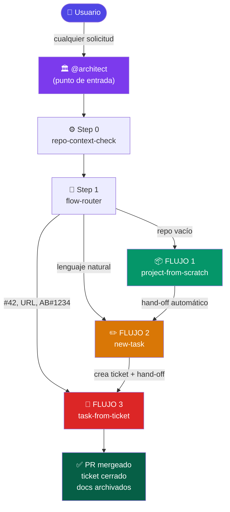

---

## Step 0 — repo-context-check

**Se ejecuta SIEMPRE, antes de cualquier otra cosa.**

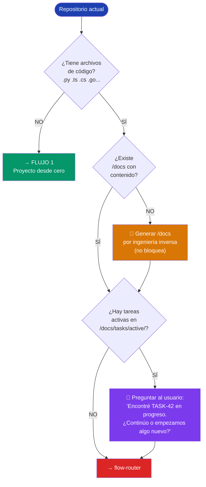

### Qué genera si no existe /docs

```
/docs/
├── 01-architecture/
│   ├── PROJECT_CONTEXT.md    ← stack detectado, dependencias, patrones
│   └── adr/                  ← decisiones arquitectónicas registradas
├── 02-api/
│   └── openapi.yml           ← endpoints encontrados en el código
├── 03-design/
│   └── DESIGN_SYSTEM.md      ← tokens extraídos de CSS/Tailwind/theme
├── 04-project/
│   └── BACKLOG.md
├── 05-security/
└── tasks/
    ├── active/               ← tareas en curso
    └── completed/            ← tareas archivadas
```

---

## Step 1 — flow-router

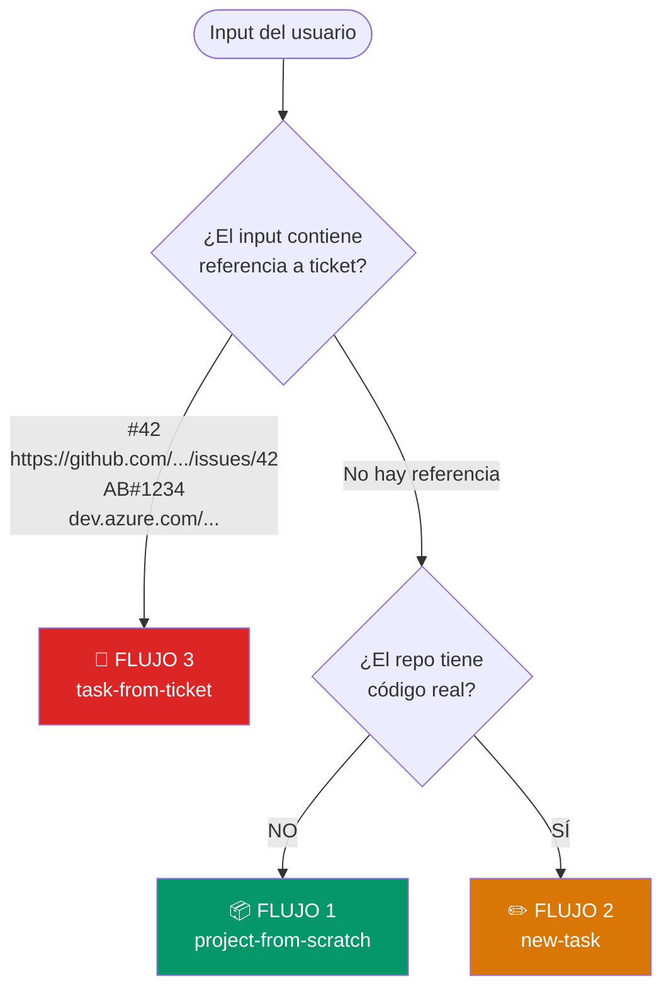

**Ejemplos de detección:**

| Input del usuario | Flujo activado |
|-------------------|---------------|
| `"Quiero crear una app de inventarios"` + repo vacío | Flujo 1 |
| `"Agrega notificaciones por email"` + proyecto existente | Flujo 2 |
| `"#42"` o `"issue 42"` | Flujo 3 (GitHub) |
| `https://github.com/user/repo/issues/42` | Flujo 3 (GitHub) |
| `"AB#1234"` | Flujo 3 (Azure DevOps) |

---

## FLUJO 1 — Proyecto desde cero

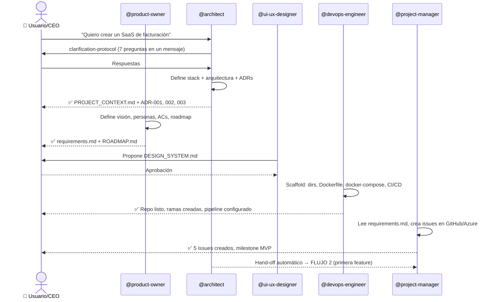

**Resultado al finalizar Flujo 1:**
- `/docs` completamente poblado
- Repo con código skeleton que compila
- `docker-compose up` funciona
- CI/CD configurado y pasando
- Backlog inicial en GitHub/Azure

---

## FLUJO 2 — Tarea nueva sin ticket

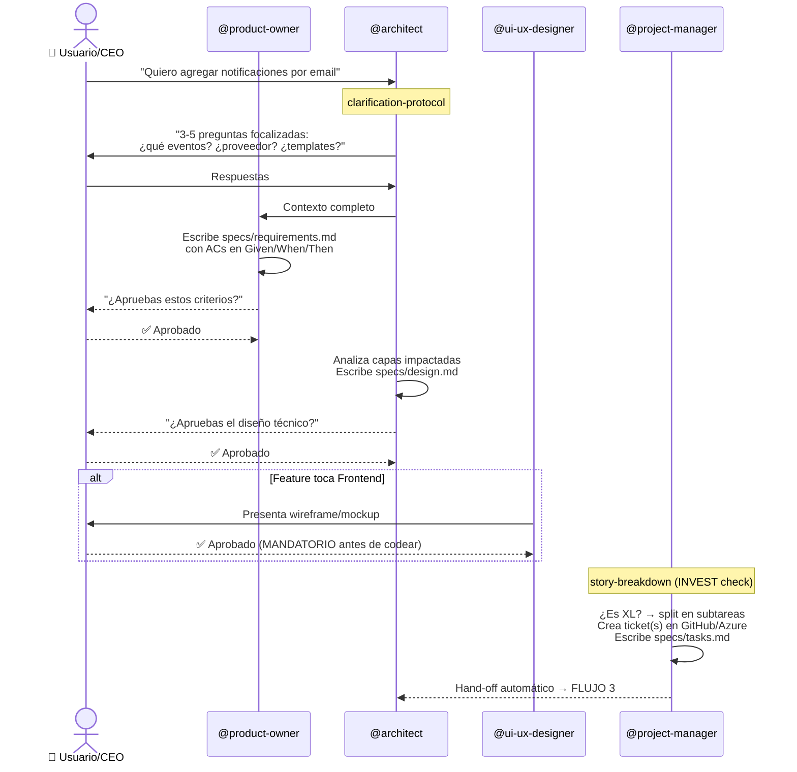

**SDD Checkpoints en Flujo 2:**

```
requirements.md  →  [CEO aprueba ACs]  →  design.md  →  [CEO aprueba diseño]  →  tasks.md  →  FLUJO 3
```

---

## FLUJO 3 — Tarea desde ticket existente

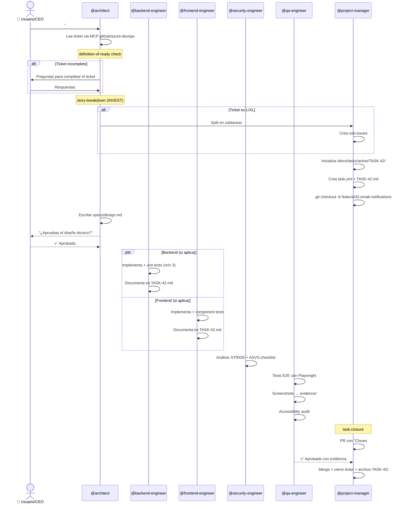

---

## SDD — Spec-Driven Development

**El principio:** la especificación es la fuente de verdad. El código es su expresión.

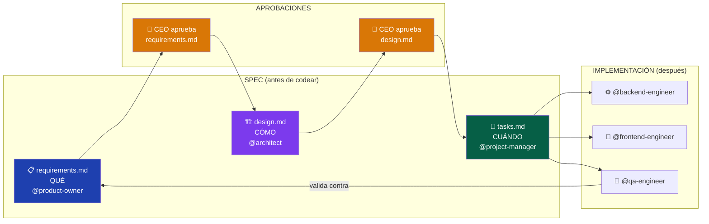

### Los 3 artefactos en detalle

**1. requirements.md** — escrito por `@product-owner`
```markdown
# Feature: Email Notifications

## Objetivo de negocio
Reducir el churn un 15% enviando recordatorios antes de vencimiento.

## User Stories
- Como usuario registrado, quiero recibir un email al completar mi registro,
  para confirmar que mi cuenta fue creada exitosamente.

## Acceptance Criteria
- [ ] Given: usuario completa el registro
  When: hace click en "Crear cuenta"
  Then: recibe email de bienvenida en menos de 60 segundos

## Out of Scope
- Notificaciones push (ticket separado)
- Emails de marketing

## Definition of Done
- [ ] Todos los ACs pasan
- [ ] Unit tests: happy path + error + edge
- [ ] E2E con screenshots como evidencia
- [ ] PR aprobado por QA
```

**2. design.md** — escrito por `@architect`
````markdown
# Design: Email Notifications

## Arquitectura
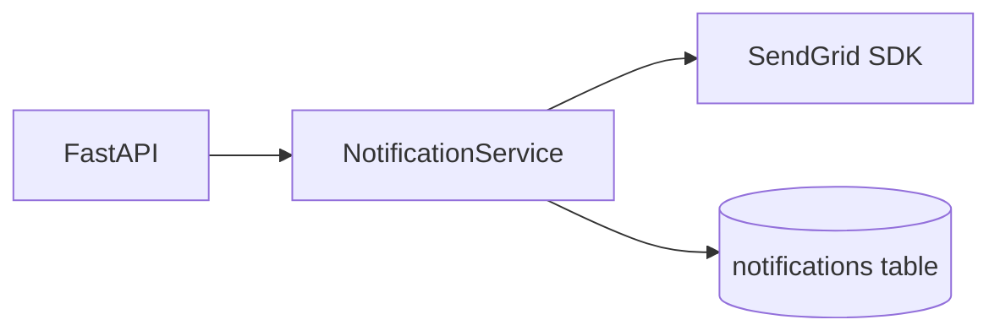

## Modelo de datos
CREATE TABLE notifications (
  id UUID PRIMARY KEY DEFAULT gen_random_uuid(),
  user_id UUID NOT NULL REFERENCES users(id),
  type VARCHAR(50) NOT NULL,
  sent_at TIMESTAMPTZ,
  created_at TIMESTAMPTZ NOT NULL DEFAULT NOW()
);

## Decisiones técnicas
| Decisión | Alternativas | Razón |
|----------|-------------|-------|
| SendGrid | SMTP, SES | SDK oficial Python, deliverability superior |
| Cola async | Síncrono | No bloquear la respuesta al usuario |
````

**3. tasks.md** — escrito por `@project-manager`
```markdown
# Tasks: Email Notifications
## Branch: feature/42-email-notifications

### Backend (@backend-engineer)
1. [ ] Migration: CREATE TABLE notifications
2. [ ] NotificationService.send_welcome()
3. [ ] NotificationService.send_reset_password()
4. [ ] POST /api/notifications/send (admin)
5. [ ] Unit tests (4 tests mínimo)

### QA (@qa-engineer)
6. [ ] E2E: usuario recibe email en < 60s
7. [ ] Screenshots en evidence/
8. [ ] Accessibility audit
```

---

## Context Engineering — Cómo los agentes no pierden contexto

**El problema:** los modelos de IA tienen ventanas de tokens finitas. Un sprint largo puede requerir múltiples sesiones.

**La solución:** todo el estado vive en archivos, nunca en la conversación.

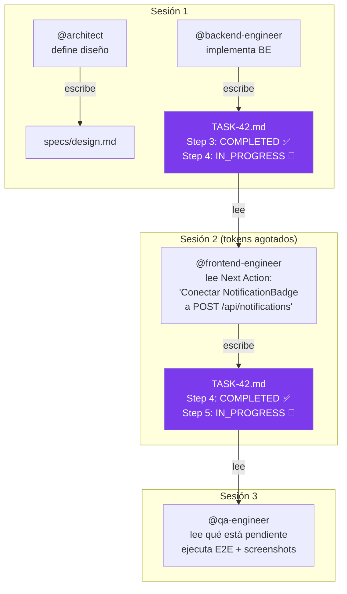

### La carpeta de cada tarea

```
/docs/tasks/active/TASK-42-email-notifications/
│
├── task.yml                    ← metadata estructurada
│   id: "42"
│   status: in_progress
│   branch: feature/42-email-notifications
│   layer: fullstack
│   assigned_to: [backend-engineer, frontend-engineer]
│
├── TASK-42-email-notifications.md   ← ESTADO PERSISTENTE
│   ├── Progress Log (step a step)
│   ├── Files Modified (tabla)
│   ├── Unit Tests Written (tabla)
│   ├── Evidence / Screenshots (tabla)
│   ├── Decisions Made (tabla)
│   └── ⭐ Next Action ← lo primero que lee el agente que retoma
│
├── evidence/
│   ├── e2e-registration-flow.png   ← screenshot obligatorio QA
│   ├── e2e-email-received.png
│   └── e2e-error-state.png
│
└── specs/
    ├── requirements.md
    ├── design.md
    └── tasks.md
```

### El checkpoint protocol

Cada agente actualiza `TASK-42.md` **en cada step**, no al final:

```markdown
## Next Action (si el contexto se resetea)

> Resume point: Step 4 — Frontend integration
> Branch: feature/42-email-notifications (último commit: abc123)
> Ejecutar: git checkout feature/42-email-notifications && git log --oneline -3
> Tarea: Conectar NotificationBadge.tsx a POST /api/notifications/send
> Luego: escribir tests con Testing Library
> Archivo: frontend/src/components/NotificationBadge.tsx (creado, falta integración)
```

### SQUAD_HANDOVER.md — entre agentes

Cuando un agente termina y otro debe continuar:

```markdown
# SQUAD_HANDOVER.md

## Tarea activa
- ID: TASK-42 | Branch: feature/42-email-notifications

## Completado
- [x] DoR check (PASSED)
- [x] design.md aprobado por CEO
- [x] Backend: NotificationService + 4 unit tests (PASSING)
- [x] Endpoint POST /api/notifications/send

## Pendiente
- [ ] Frontend: NotificationBadge component (@frontend-engineer)
- [ ] E2E + screenshots (@qa-engineer)
- [ ] task-closure

## Contexto crítico
- Usamos SendGrid (no SMTP) — ver ADR en design.md
- Rate limit: 10 emails/min/usuario (implementado en service.py:47)
- SENDGRID_API_KEY debe estar en .env
```

---

## Mapa de interacción entre agentes

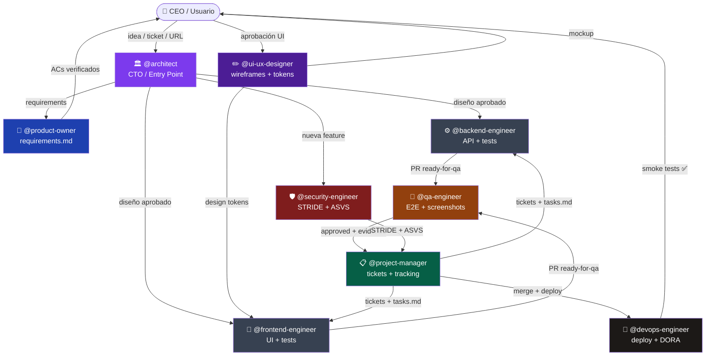

---

## Ciclo de vida completo de una tarea

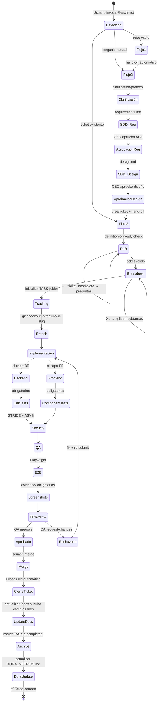

---

## Mapa de skills por categoría

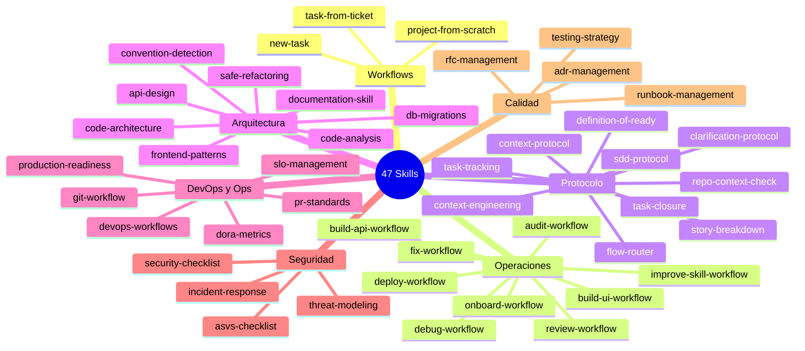

---

## Cómo interactúan las skills entre sí

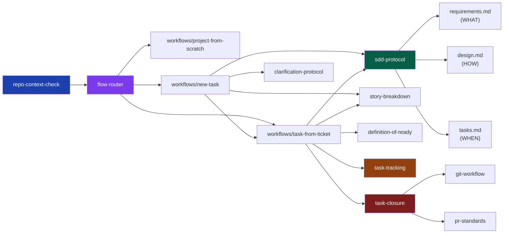

---

## Los 9 agentes y sus skills

| Agente | Modelo | Skills principales | Produce |
|--------|--------|-------------------|---------|
| **@architect** | opus-4 | repo-context-check, flow-router, 3 workflows, adr-management, sdd-protocol | design.md, ADRs, dirección técnica |
| **@product-owner** | sonnet-4 | sdd-protocol, clarification-protocol, story-breakdown | requirements.md, ROADMAP.md |
| **@project-manager** | sonnet-4 | task-tracking, task-closure, story-breakdown, dora-metrics | tasks.md, tickets, DORA_METRICS.md |
| **@backend-engineer** | sonnet-4 | api-design, db-migrations, testing-strategy, task-tracking | endpoints, unit tests, migraciones |
| **@frontend-engineer** | sonnet-4 | frontend-patterns, testing-strategy, sdd-protocol, task-tracking | componentes, component tests |
| **@qa-engineer** | sonnet-4 | testing-strategy, pr-standards, production-readiness, task-tracking | E2E tests, screenshots, aprobaciones |
| **@security-engineer** | sonnet-4 | threat-modeling, asvs-checklist, security-checklist | STRIDE analysis, ASVS checklist |
| **@devops-engineer** | sonnet-4 | devops-workflows, production-readiness, dora-metrics, slo-management | CI/CD, deploy, PRR, DORA updates |
| **@ui-ux-designer** | sonnet-4 | frontend-patterns, clarification-protocol, sdd-protocol | wireframes, DESIGN_SYSTEM.md |

---

## Standards — Código de referencia

Los 11 archivos en `/standards/` son guías prescriptivas con código real:

| Archivo | Qué cubre |
|---------|-----------|
| `clean-architecture.md` | Capas, regla de dependencias, Use Cases — Python/TS |
| `solid-principles.md` | Los 5 principios con before/after — Python/TS |
| `dry-kiss-yagni.md` | DRY, KISS, YAGNI + el AHA Principle |
| `domain-driven-design.md` | Entities, Aggregates, Repos, Domain Events |
| `api-design-standard.md` | REST naming, RFC 9457 errors, paginación, rate limiting |
| `database-standard.md` | Naming, Expand-Contract migrations, índices, SQLAlchemy async |
| `testing-standard.md` | Pirámide, Given/When/Then, factories, Playwright E2E |
| `frontend-standard.md` | React/TS, WCAG 2.2, Core Web Vitals, Testing Library |
| `git-standard.md` | Conventional Commits, PR template, merge strategy |
| `security-standard.md` | OWASP Top 10, headers, secrets, ASVS L1 |
| `devops-standard.md` | Dockerfile multi-stage, GH Actions, PRR, SLOs |

---

## DORA Metrics — Midiendo el rendimiento

El plugin trackea automáticamente las 4 métricas DORA:

```
Deployment Frequency  → ¿Cuántas veces deployamos? (Meta: múltiples/semana)
Lead Time for Changes → ¿Cuánto tarda un commit en llegar a prod? (Meta: < 1 día)
Change Failure Rate   → ¿Qué % de deploys causa incidentes? (Meta: < 15%)
MTTR                  → ¿Cuánto tardamos en recuperarnos? (Meta: < 1 hora)
```

Se actualizan en `/docs/04-project/DORA_METRICS.md` después de cada deploy.

---

## MCPs disponibles

| MCP | Usado por | Para qué |
|-----|-----------|----------|
| `github` | Todos | Issues, PRs, reviews, labels, milestones |
| `azure-devops` | PM, Architect | Work items, repos, pipelines en Azure |
| `playwright` | QA, Security | E2E tests, screenshots de evidencia, DAST |
| `filesystem` | Todos | Leer/escribir archivos del proyecto con seguridad |
| `postgres` | Backend, DevOps | Inspeccionar esquemas, validar migraciones |
| `docker` | DevOps | Builds, gestión de contenedores |
| `sentry` | DevOps, QA | Errores en producción, alertas |
| `sonarqube` | QA, Security | Análisis estático de calidad |
| `context7` | Todos | Documentación actualizada de cualquier librería |

---

## Hooks de seguridad automáticos

Se ejecutan sin que el usuario los invoque:

```
🔴 Anti-SQL destructivo  → bloquea DROP TABLE, TRUNCATE, DELETE sin WHERE
🔴 Secret scanning       → detecta API keys, tokens, passwords en el código
🟡 Quality feedback      → sugiere linters (Ruff, ESLint) al crear archivos
```

---

## Instalación

```bash
/plugin install team-software-engineering
```

### Variables de entorno requeridas

```bash
GITHUB_TOKEN=ghp_...          # Issues, PRs, reviews, merges
AZURE_DEVOPS_PAT=...          # (opcional) Si usas Azure DevOps
DATABASE_URL=postgresql://... # Inspección de esquemas con MCP postgres
SENTRY_AUTH_TOKEN=...         # Monitoreo de errores en producción
SONAR_TOKEN=...               # Análisis estático de calidad
```

### Cómo invocarlo

```bash
# Proyecto nuevo
@architect "Quiero crear una app de gestión de inventarios en FastAPI + React"

# Feature nueva (proyecto existente)
@architect "Agrega un módulo de reportes en PDF exportables"

# Ticket existente — GitHub
@architect "#42"
@architect "https://github.com/miorg/mirepo/issues/42"

# Ticket existente — Azure DevOps
@architect "AB#1234"

# Tareas específicas directas
@backend-engineer "Implementa el endpoint POST /invoices"
@qa-engineer "Haz code review del PR #15"
@devops-engineer "Despliega el servicio api a Cloud Run"
@security-engineer "Audita el módulo de autenticación"
```

---

## Estructura del plugin

```
team-software-engineering/
├── .claude-plugin/
│   └── plugin.json              ← manifiesto v5.0.0
├── .mcp.json                    ← 9 MCP servers configurados
├── agents/                      ← 9 agentes especializados
│   ├── architect.md             ← punto de entrada, usa opus-4
│   ├── backend-engineer.md
│   ├── frontend-engineer.md
│   ├── product-owner.md
│   ├── project-manager.md
│   ├── qa-engineer.md
│   ├── security-engineer.md
│   ├── devops-engineer.md
│   └── ui-ux-designer.md
├── skills/                      ← 47 skills organizadas
│   ├── workflows/               ← 3 flujos de trabajo completos
│   │   ├── project-from-scratch/SKILL.md
│   │   ├── new-task/SKILL.md
│   │   └── task-from-ticket/SKILL.md
│   ├── audit-workflow/          ← operaciones (ex-commands)
│   ├── build-api-workflow/
│   ├── build-ui-workflow/
│   ├── debug-workflow/
│   ├── deploy-workflow/
│   ├── fix-workflow/
│   ├── onboard-workflow/
│   ├── review-workflow/
│   ├── improve-skill-workflow/
│   ├── repo-context-check/      ← protocolo (Step 0)
│   ├── flow-router/             ← protocolo (Step 1)
│   ├── clarification-protocol/
│   ├── sdd-protocol/
│   ├── context-engineering/
│   ├── task-tracking/
│   ├── task-closure/
│   ├── story-breakdown/
│   ├── definition-of-ready/
│   └── [28 skills más...]
├── standards/                   ← 11 estándares con código real
│   ├── clean-architecture.md
│   ├── solid-principles.md
│   ├── dry-kiss-yagni.md
│   ├── domain-driven-design.md
│   ├── api-design-standard.md
│   ├── database-standard.md
│   ├── testing-standard.md
│   ├── frontend-standard.md
│   ├── git-standard.md
│   ├── security-standard.md
│   └── devops-standard.md
├── hooks/
│   └── hooks.json               ← seguridad automática
└── README.md                    ← este archivo
```

---

**Autor**: EJBereguete — [github.com/EJBereguete](https://github.com/EJBereguete)
**Versión**: `5.0.0` | Sin commands · Solo skills · SDD + Context Engineering
