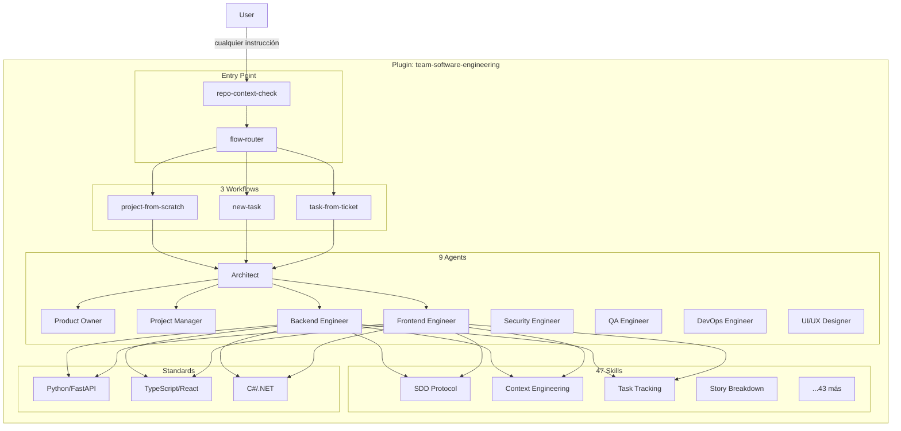

# Visión General: team-software-engineering

## ¿Qué es?

`team-software-engineering` es un **plugin para Claude Code** que convierte al asistente en un equipo completo de ingeniería de software. En lugar de un solo asistente genérico, el plugin orquesta **9 agentes especializados** que colaboran para entregar software de calidad profesional.

Cada agente tiene un rol definido, skills específicas, y estándares de código que aplica automáticamente. El plugin implementa **Spec-Driven Development (SDD)** y **Context Engineering** para mantener coherencia entre sesiones largas y garantizar que el contexto no se pierda cuando se agota la ventana de tokens.

## ¿Qué problema resuelve?

### 1. Un solo asistente no puede ser experto en todo al mismo tiempo

Un asistente genérico tiene que cambiar de mentalidad constantemente: arquitecto, desarrollador backend, tester, DevOps... Esto reduce la profundidad de cada rol. `team-software-engineering` asigna agentes especializados a cada tarea: el Architect diseña, el Backend Engineer implementa, el QA Engineer valida. Cada agente activa solo las skills relevantes para su función.

### 2. El contexto se pierde cuando los tokens se agotan

En proyectos reales, las sesiones se interrumpen. Si Claude pierde el hilo, el usuario tiene que re-explicar todo el contexto. El plugin resuelve esto con **Context Engineering**: persiste el estado de cada tarea en archivos dentro del proyecto (`/docs/tasks/active/TASK-XXX/`). Al iniciar una nueva sesión, el agente lee el archivo, encuentra el campo `Next Action` y retoma exactamente donde se quedó.

### 3. No hay estándares consistentes entre sesiones

Sin un marco de trabajo, el código generado varía en estructura, naming, y calidad. El plugin incluye estándares documentados por stack (Python/FastAPI, TypeScript/React, C#/.NET) y los agentes los consultan antes de generar código. El resultado es consistencia real entre sesiones, archivos y agentes.

## ¿Para quién es?

- Desarrolladores full-stack trabajando solos que quieren simular un equipo con roles claros
- Equipos pequeños que necesitan estructura y estándares reproducibles
- Proyectos desde cero que requieren arquitectura y planificación antes de escribir código
- Features complejas que requieren múltiples perspectivas (backend, frontend, seguridad, QA)

## Beneficios clave

### Arquitectura bien pensada
El Architect siempre revisa las decisiones técnicas antes de implementar. Toda decisión relevante queda registrada como ADR (Architecture Decision Record).

### Especificaciones antes de código
SDD garantiza que requirements → design → tasks estén aprobados por el usuario antes de escribir una línea de código. La especificación es el contrato — el código es su expresión.

### Contexto persistente
Si los tokens se agotan a la mitad de una tarea, el plugin sabe exactamente dónde quedó. El archivo `TASK-XXX.md` tiene un campo `Next Action` que permite a cualquier agente retomar sin contexto previo.

### Tests obligatorios
Cada engineer debe escribir unit tests (mínimo: happy path + error case + edge case). El QA engineer valida con E2E tests y guarda screenshots como evidencia en la carpeta de la tarea.

### Multi-stack
Python/FastAPI, TypeScript/React, C#/.NET — estándares de código y ejemplos de referencia para los tres stacks.

## Arquitectura del plugin

## ¿Cómo se instala?

El plugin se instala clonando el repositorio y registrándolo en la configuración de Claude Code. Una vez instalado, todos los agentes están disponibles con `@nombre-agente` y los comandos con `/team-software-engineering:comando`. Para más detalles, ver [02 — Inicio Rápido](./02-getting-started.md).
