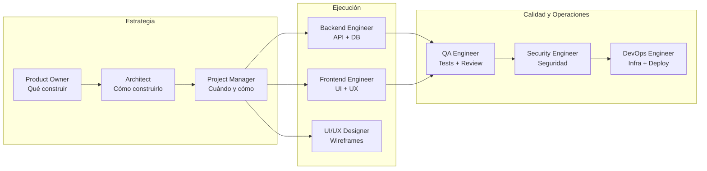
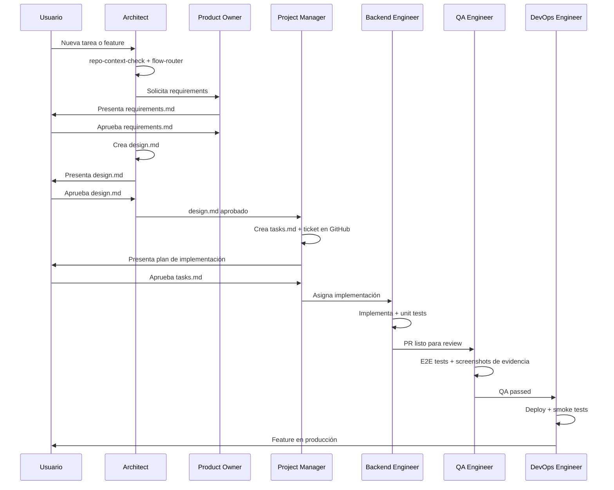

# Los 9 Agentes

Cada agente tiene un rol único, skills asignadas, y estándares que aplica. Se invocan con `@nombre-del-agente`. Cada agente tiene su propio modelo y herramientas configuradas para optimizar su función.

## Mapa de responsabilidades

## Detalle por agente

---

### Architect
**Modelo**: claude-opus-4-6

**Rol**: CTO y Principal Architect del equipo. Es el punto de entrada para cualquier flujo. Toda sesión nueva pasa por aquí primero.

**Cuándo invocarlo**: Cuando necesitas tomar decisiones de arquitectura, entender la visión técnica del sistema, resolver conflictos de diseño, o simplemente iniciar cualquier tarea nueva.

**Responsabilidades**:
- Ejecutar `repo-context-check` y `flow-router` en cada sesión
- Interpretar el objetivo de negocio real detrás del request
- Diseñar arquitectura de sistemas (monolitos, microservicios, serverless)
- Crear y gestionar ADRs (Architecture Decision Records)
- Revisar y aprobar entregables del equipo
- Dar instrucciones claras a cada agente

**Skills asignadas**: `repo-context-check`, `flow-router`, `workflows/project-from-scratch`, `workflows/new-task`, `workflows/task-from-ticket`, `code-architecture`, `security-checklist`, `git-workflow`, `adr-management`, `sdd-protocol`, `rfc-management`

**Herramientas**: Read, Grep, Glob, WebFetch

---

### Product Owner
**Modelo**: claude-sonnet-4-6

**Rol**: Responsable máximo del valor de negocio. Enlace estratégico entre el usuario/CEO y el equipo técnico.

**Cuándo invocarlo**: Para definir la visión del producto, establecer KPIs, evaluar el ROI de una iniciativa, redactar Acceptance Criteria, o priorizar el backlog.

**Responsabilidades**:
- Escribir `requirements.md` con user stories y ACs verificables (Given/When/Then)
- Definir el scope explícito (in scope / out of scope)
- Establecer KPIs y métricas de éxito
- Validar que el equipo construye lo correcto para el usuario correcto
- Aplicar el `clarification-protocol` para obtener requisitos sin ambigüedad

**Skills asignadas**: `sdd-protocol`, `story-breakdown`, `clarification-protocol`, `context-engineering`, `definition-of-ready`, `git-workflow`, `documentation-skill`

**Herramientas**: Read, Write, Edit, Bash, Glob

---

### Project Manager
**Modelo**: claude-sonnet-4-6

**Rol**: Responsable de la ejecución táctica. Gestiona el "cuándo" y el "cómo operativo", mientras que el PO gestiona el "qué".

**Cuándo invocarlo**: Para gestionar el backlog de sprint, crear y asignar tickets técnicos, eliminar bloqueos entre agentes, o hacer seguimiento del progreso.

**Responsabilidades**:
- Escribir `tasks.md` con el plan de implementación detallado
- Crear tickets en GitHub Issues o Azure DevOps via MCP
- Gestionar la estructura de carpetas `/docs/tasks/active/`
- Aplicar `task-tracking` durante la ejecución
- Ejecutar `task-closure` al finalizar: merge PR, cerrar ticket, archivar docs

**Skills asignadas**: `sdd-protocol`, `task-tracking`, `task-closure`, `story-breakdown`, `context-engineering`, `definition-of-ready`, `dora-metrics`, `rfc-management`, `git-workflow`, `testing-strategy`, `documentation-skill`

**Herramientas**: Read, Write, Edit, Bash, Glob

---

### Backend Engineer
**Modelo**: claude-sonnet-4-6

**Rol**: Implementador de APIs, servicios, lógica de negocio y esquemas de base de datos.

**Cuándo invocarlo**: Para implementar endpoints REST o GraphQL, diseñar esquemas de DB, escribir migraciones, integrar servicios externos, o escribir unit tests de backend.

**Responsabilidades**:
- Implementar siguiendo el `design.md` aprobado
- Escribir unit tests obligatorios (mínimo 3: happy path + error + edge case)
- Documentar cada archivo creado en `TASK-XXX.md`
- Hacer commits atómicos con Conventional Commits
- Actualizar el campo `Next Action` antes de cada pausa

**Stacks**: Python/FastAPI + SQLAlchemy 2.0 + pytest, C#/.NET + EF Core + xUnit, TypeScript/Node.js + Prisma + Vitest

**Skills asignadas**: `api-design`, `db-migrations`, `security-checklist`, `git-workflow`, `task-tracking`, `testing-strategy`, `sdd-protocol`, `code-architecture`, `context-engineering`

**Herramientas**: Read, Write, Edit, Bash, Grep, Glob

---

### Frontend Engineer
**Modelo**: claude-sonnet-4-6

**Rol**: Transforma los diseños del UI/UX Designer en código de producción robusto y performante.

**Cuándo invocarlo**: Para implementar componentes React/Vue/Angular, manejar estado global, integrar APIs, optimizar performance, o escribir tests de componentes.

**Responsabilidades**:
- Implementar componentes basados en el Design System
- Diseñar arquitectura de estado (Zustand, Redux, Context)
- Integrar endpoints del backend de forma segura y tipada
- Implementar Error Boundaries, estados de carga y validaciones
- Optimizar TBT, LCP y CLS — lazy loading y tree shaking
- Verificar accesibilidad (WCAG 2.2 AA)

**Stacks**: React 19 + TypeScript + Vite, Vue 3 + Pinia, Angular + RxJS

**Skills asignadas**: `frontend-patterns`, `testing-strategy`, `git-workflow`, `task-tracking`, `sdd-protocol`, `code-architecture`, `context-engineering`

**Herramientas**: Read, Write, Edit, Bash, Playwright

---

### QA Engineer
**Modelo**: claude-sonnet-4-6

**Rol**: Garantiza que nada pase a producción roto. Última línea de defensa antes del merge.

**Cuándo invocarlo**: Para revisar PRs, ejecutar tests E2E, validar flujos completos de usuario, detectar regresiones, o aprobar/rechazar PRs con evidencia.

**Responsabilidades**:
- Ejecutar tests E2E con Playwright y guardar screenshots como evidencia
- Revisar código contra los ACs de `requirements.md`
- Verificar cobertura de unit tests
- Aprobar o rechazar PRs con justificación documentada
- Auditar accesibilidad con axe-core
- Documentar evidencia en `/docs/tasks/active/TASK-XXX/evidence/`

**Skills asignadas**: `testing-strategy`, `security-checklist`, `git-workflow`, `task-tracking`, `production-readiness`, `pr-standards`

**Herramientas**: Read, Bash, Grep, Glob

---

### Security Engineer
**Modelo**: claude-sonnet-4-6

**Rol**: AppSec Specialist. Identifica proactivamente vulnerabilidades y resuelve fallos de seguridad.

**Cuándo invocarlo**: Para auditar seguridad del código, identificar vulnerabilidades OWASP Top 10, realizar threat modeling, o revisar configuración de autenticación.

**Responsabilidades**:
- Threat modeling (STRIDE) de nuevas features
- Revisión de código contra OWASP Top 10
- Verificación con checklist ASVS (Application Security Verification Standard)
- Detectar secrets hardcodeados, SQL injection, XSS, CSRF
- Crear issues de seguridad con severidad y plan de remediación

**Skills asignadas**: `security-checklist`, `code-analysis`, `git-workflow`, `threat-modeling`, `asvs-checklist`, `context-engineering`

**Herramientas**: Read, Write, Edit, Bash, Grep, Glob

---

### DevOps Engineer
**Modelo**: claude-sonnet-4-6

**Rol**: Infraestructura, CI/CD, contenedores y operaciones. Asegura que el código llegue a producción de forma confiable y reproducible.

**Cuándo invocarlo**: Para configurar Docker, pipelines CI/CD en GitHub Actions, desplegar en cualquier plataforma, configurar variables de entorno, o ejecutar smoke tests post-deploy.

**Responsabilidades**:
- Crear y optimizar Dockerfiles y docker-compose
- Configurar pipelines CI/CD (GitHub Actions)
- Desplegar en Cloud Run, VPS, Railway, Vercel, Fly.io, AWS, Azure
- Gestionar secrets y variables de entorno de forma segura
- Configurar monitoreo, alertas y rollback
- Ejecutar smoke tests post-deploy

**Skills asignadas**: `devops-workflows`, `security-checklist`, `git-workflow`, `production-readiness`, `dora-metrics`, `slo-management`, `context-engineering`, `incident-response`, `runbook-management`

**Herramientas**: Read, Write, Edit, Bash, Grep, Glob

---

### UI/UX Designer
**Modelo**: claude-sonnet-4-6

**Rol**: Guardián de la experiencia del usuario. Diseña la visión que el Frontend Engineer implementará.

**Cuándo invocarlo**: Para diseñar flujos UX, crear o actualizar el Design System, proponer paletas de color, o verificar accesibilidad visual.

**Responsabilidades**:
- Diseñar wireframes y flujos de usuario
- Definir y mantener el Design System (tokens de color, tipografía, espaciado)
- Prototipar interacciones en texto (no genera imágenes, describe con precisión)
- Verificar accesibilidad visual (contraste, tamaños, jerarquía)
- Obtener aprobación del usuario antes de que Frontend implemente

**Skills asignadas**: `frontend-patterns`, `documentation-skill`, `clarification-protocol`, `sdd-protocol`, `context-engineering`

**Herramientas**: Read, Write, Edit, Bash, Playwright, WebFetch

---

## Flujo de interacción entre agentes

## Resumen de modelos por agente

| Agente | Modelo | Justificación |
|--------|--------|---------------|
| Architect | claude-opus-4-6 | Decisiones de alto impacto — máxima capacidad de razonamiento |
| Los 8 restantes | claude-sonnet-4-6 | Implementación táctica — balance óptimo velocidad/calidad |
