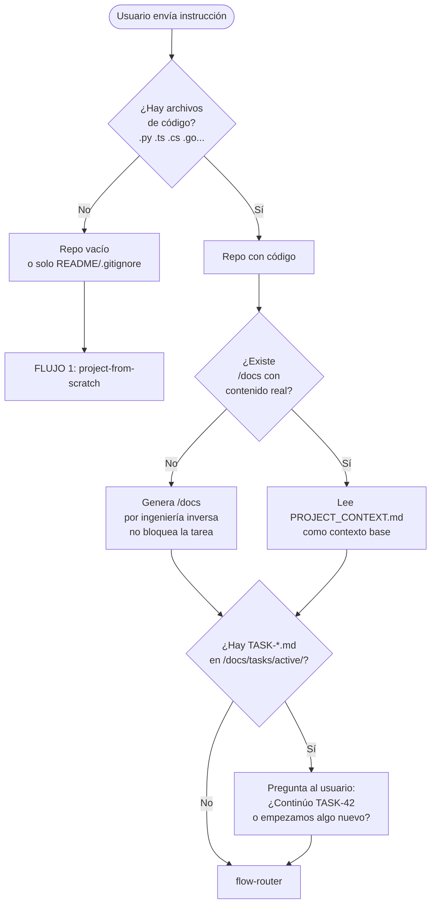
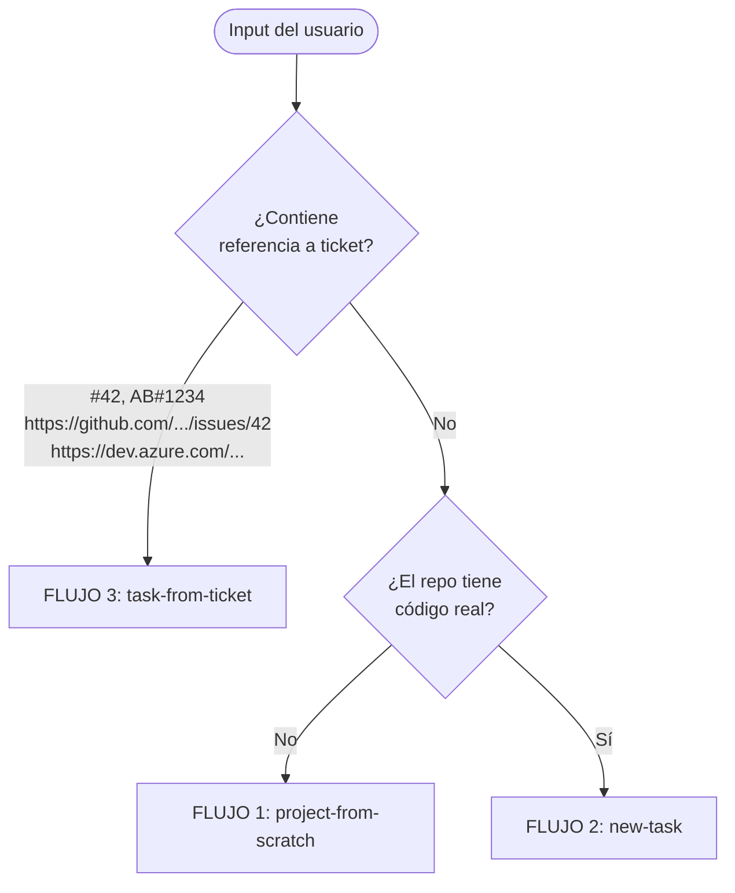
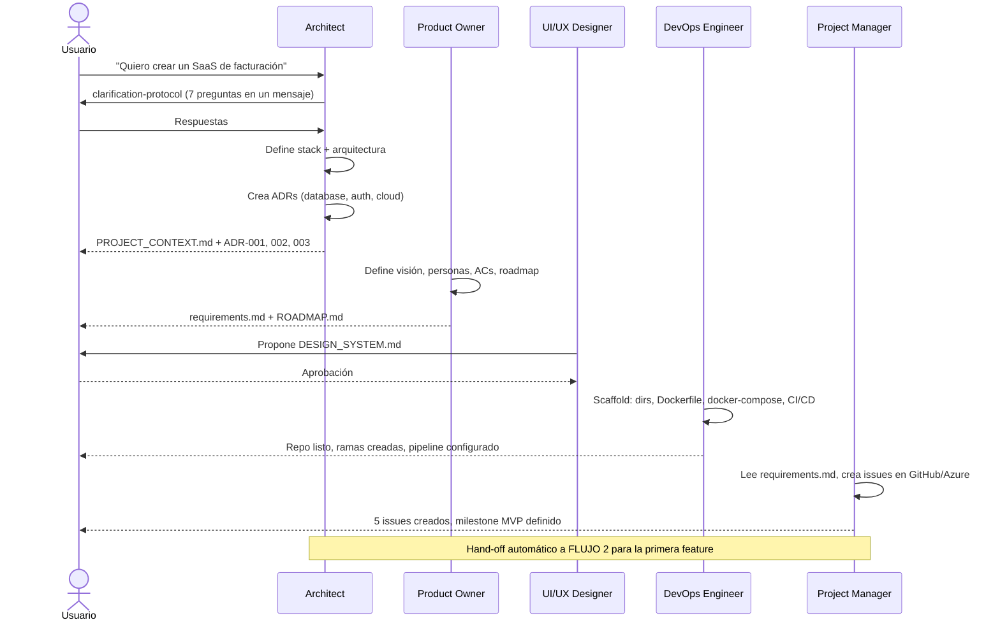
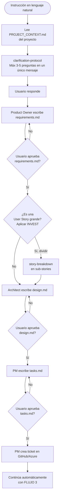
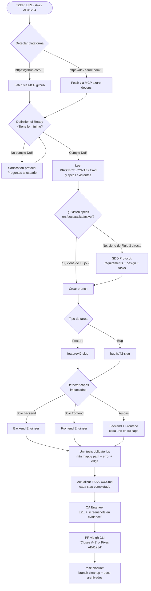

# Flujos de Trabajo

El plugin maneja 3 flujos principales. El flujo correcto se selecciona automáticamente basado en el contexto del repositorio y la instrucción del usuario. No es necesario especificar qué flujo usar.

## Paso 0: repo-context-check (siempre corre primero)

Antes de activar cualquier flujo, el Architect ejecuta `repo-context-check` para entender el estado real del repositorio:



### ¿Qué genera si no existe /docs?

Cuando el proyecto tiene código pero no tiene `/docs`, el Architect genera la documentación mínima por ingeniería inversa. Este paso **no bloquea** la tarea — genera el contexto base y continúa:

```
/docs/
├── 01-architecture/
│   └── PROJECT_CONTEXT.md    ← stack detectado, dependencias, patrones
├── 02-api/
│   └── endpoints.md          ← mapa de endpoints encontrados en el código
├── 03-ui-ux/
│   └── DESIGN_SYSTEM.md      ← tokens extraídos de CSS/Tailwind/theme
├── 04-devops/
│   └── INFRASTRUCTURE.md     ← entornos, CI/CD, variables detectadas
├── 05-security/
├── 06-incidents/
├── 07-decisions/
│   └── decision-log.md
└── tasks/
    ├── active/
    └── completed/
```

---

## Paso 1: flow-router

Después de `repo-context-check`, el `flow-router` determina cuál de los 3 flujos activar:



**Tabla de detección:**

| Input del usuario | Flujo activado |
|-------------------|----------------|
| `"Quiero crear una app de inventarios"` + repo vacío | Flujo 1 |
| `"Agrega notificaciones por email"` + proyecto existente | Flujo 2 |
| `"#42"` o `"issue 42"` | Flujo 3 (GitHub) |
| `https://github.com/user/repo/issues/42` | Flujo 3 (GitHub) |
| `"AB#1234"` | Flujo 3 (Azure DevOps) |

---

## Flujo 1: project-from-scratch

Para repositorios vacíos o proyectos completamente nuevos. Activa **todos los agentes** para crear la base del proyecto.



**Resultado de este flujo:**
- Stack y arquitectura definidos con ADRs
- Design System base documentado
- Estructura de carpetas y repo configurado
- Docker + docker-compose + CI/CD GitHub Actions
- Issues iniciales creados en GitHub o Azure DevOps
- Transición automática a Flujo 2 para la primera feature

---

## Flujo 2: new-task

Para tareas nuevas en proyectos existentes, descritas en lenguaje natural. Es el flujo más común en el día a día.



**Puntos clave del Flujo 2:**
- El `clarification-protocol` hace las preguntas en **un único mensaje** (máximo 3-5), nunca una por una
- Cada artefacto SDD requiere aprobación explícita del usuario antes de continuar
- El Flujo 2 termina creando un ticket y transicionando automáticamente al Flujo 3

---

## Flujo 3: task-from-ticket

Para tickets existentes en GitHub Issues o Azure DevOps. Es el flujo de implementación real.



**Naming de branches por plataforma:**

| Plataforma | Formato | Ejemplo |
|------------|---------|---------|
| GitHub | `feature/42-slug` o `bugfix/42-slug` | `feature/42-jwt-auth` |
| Azure DevOps | `feature/AB1234-slug` | `feature/AB1234-email-notifications` |

**Definition of Ready — requisitos mínimos para un ticket:**

Un ticket cumple DoR cuando tiene:
- Título descriptivo
- Descripción con el problema o valor de negocio
- Al menos un criterio de aceptación
- Stack/capa identificada (backend, frontend, fullstack)

Si no cumple DoR, el agente pregunta al usuario para completar la información antes de continuar.

---

## Comparativa de flujos

| Aspecto | Flujo 1 | Flujo 2 | Flujo 3 |
|---------|---------|---------|---------|
| **Trigger** | Repo vacío | Lenguaje natural + repo con código | URL, #id, AB# |
| **Agentes** | Todos | PO + AR + PM + Engineers | Engineers + QA + DevOps |
| **SDD** | Completo | Completo | Completo (si no viene de F2) |
| **Branch** | No (scaffold) | Crea ticket → pasa a F3 | Sí, siempre |
| **Output** | Proyecto base | Ticket + transición a F3 | PR mergeado + ticket cerrado |
| **Duración típica** | 1-2 horas | 20-30 min (SDD) + F3 | 30 min – varias horas |
