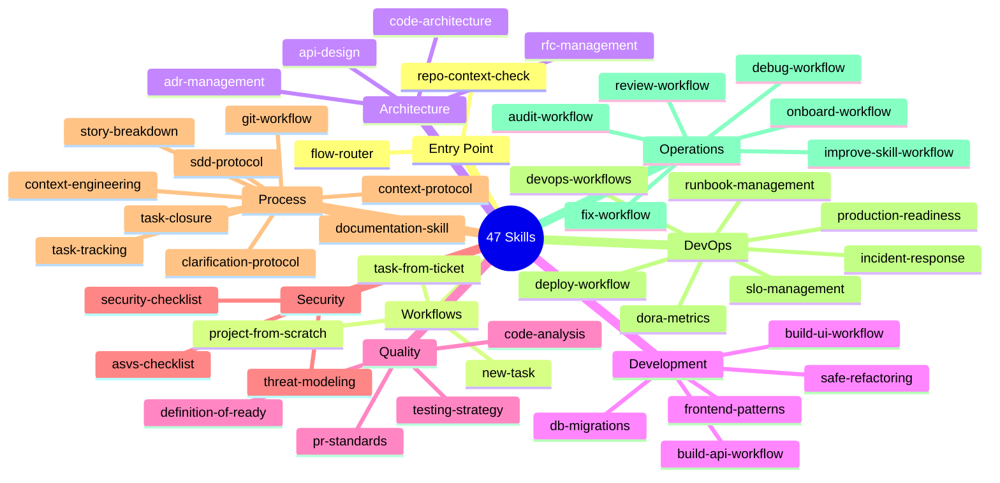

# Catálogo de Skills

El plugin tiene **47 skills** organizadas en categorías. Cada skill es un módulo de conocimiento, protocolos y plantillas que los agentes invocan según su rol y la tarea en curso.

## Mapa completo de skills

## Skills por categoría

### Entry Point (2 skills)

| Skill | Descripción | Usado por |
|-------|-------------|-----------|
| `repo-context-check` | Step 0 obligatorio. Detecta si el repo tiene código, si existe /docs, si hay tareas activas. | Architect, PM |
| `flow-router` | Determina cuál de los 3 flujos activar basándose en el input del usuario y el estado del repo. | Architect, PM |

### Workflows (3 skills)

| Skill | Descripción | Usado por |
|-------|-------------|-----------|
| `workflows/project-from-scratch` | Flujo completo para repositorios vacíos. Orquesta todos los agentes para crear la base del proyecto. | Architect |
| `workflows/new-task` | Flujo para tareas nuevas en lenguaje natural. SDD + creación de ticket + transición a task-from-ticket. | Architect, PO, PM, UI/UX |
| `workflows/task-from-ticket` | Flujo de implementación desde un ticket existente. Branch, implementación, tests, PR, closure. | Architect |

### Architecture (4 skills)

| Skill | Descripción | Usado por |
|-------|-------------|-----------|
| `code-architecture` | Patrones arquitectónicos: Clean Architecture, CQRS, DDD, hexagonal. Guía la estructura del código. | Architect, BE, FE |
| `adr-management` | Crea y gestiona Architecture Decision Records. Documenta el "por qué" de cada decisión técnica. | Architect |
| `rfc-management` | Request for Comments para cambios de arquitectura. Proceso de revisión y aprobación técnica. | Architect, PM |
| `api-design` | Estándares REST, HTTP codes, RFC 9457 (problem details), paginación, versionado. | Architect, BE |

### Development (5 skills)

| Skill | Descripción | Usado por |
|-------|-------------|-----------|
| `build-api-workflow` | Workflow especializado para construir APIs: endpoints, schemas, validaciones, tests. | BE |
| `build-ui-workflow` | Workflow especializado para construir UI: componentes, hooks, estado, integración con API. | FE |
| `db-migrations` | Gestión de migraciones: Alembic (Python), EF Core (C#), Prisma (TypeScript). Estrategias seguras. | BE |
| `frontend-patterns` | Patrones React/Vue/Angular: componentes, composables, hooks, gestión de estado, accesibilidad. | FE, UI/UX |
| `safe-refactoring` | Técnicas de refactoring seguro sin romper funcionalidad: strangler fig, branch by abstraction. | Architect, BE |

### Quality (4 skills)

| Skill | Descripción | Usado por |
|-------|-------------|-----------|
| `testing-strategy` | Pirámide de tests, naming conventions, cobertura mínima, mocking, integration tests. | BE, FE, QA, PM |
| `code-analysis` | Análisis estático, detección de code smells, métricas de complejidad ciclomática. | Security, QA |
| `pr-standards` | Estándares para PRs: template, tamaño máximo, checklist de revisión, criterios de merge. | QA |
| `definition-of-ready` | Criterios mínimos para que un ticket esté listo para implementar. Checklist de DoR. | PO, PM |

### Security (3 skills)

| Skill | Descripción | Usado por |
|-------|-------------|-----------|
| `security-checklist` | OWASP Top 10, headers de seguridad, JWT, secrets management, validación de inputs. | Architect, BE, FE, DevOps, Security |
| `asvs-checklist` | ASVS (Application Security Verification Standard) — niveles 1, 2 y 3. | Security |
| `threat-modeling` | Metodología STRIDE para identificar amenazas en nuevas features. Genera threat model por tarea. | Security |

### Process (9 skills)

| Skill | Descripción | Usado por |
|-------|-------------|-----------|
| `sdd-protocol` | Spec-Driven Development. Los 3 artefactos obligatorios: requirements.md, design.md, tasks.md. | Architect, PO, PM, BE, FE |
| `clarification-protocol` | Protocolo para hacer preguntas de clarificación en un único mensaje, con máximo 3-5 preguntas. | Architect, PO, UI/UX |
| `story-breakdown` | Aplicar criterios INVEST para dividir user stories grandes en sub-stories implementables. | PO, PM |
| `task-tracking` | Crea y mantiene TASK-XXX.md con progress log, unit tests, evidencia QA y Next Action. | BE, FE, QA, PM, Security |
| `task-closure` | Protocol de cierre: merge PR, cerrar ticket, archivar docs, limpiar branch. | PM |
| `context-engineering` | Gestiona estado compartido entre agentes. Handoff protocol, checkpoint protocol, token budget. | Architect, BE, FE, PM |
| `context-protocol` | Protocolo de carga de contexto mínimo necesario. Evita cargar todo el repo al inicio. | Architect |
| `git-workflow` | Conventional Commits, branching strategy, hooks, reglas de merge. | Todos |
| `documentation-skill` | Guías para mantener /docs actualizado. Qué documentar, cómo y cuándo. | PO, PM, UI/UX |

### DevOps (7 skills)

| Skill | Descripción | Usado por |
|-------|-------------|-----------|
| `deploy-workflow` | Proceso completo de deploy: pre-deploy checklist, deploy, smoke tests, rollback. | DevOps |
| `devops-workflows` | Configuración de Docker, docker-compose, GitHub Actions, variables de entorno por entorno. | DevOps |
| `dora-metrics` | Métricas DORA: deployment frequency, lead time, change failure rate, MTTR. | DevOps, PM |
| `production-readiness` | Checklist antes de ir a producción: health checks, logs, alertas, backups, rollback plan. | QA, DevOps |
| `slo-management` | Definición y seguimiento de SLOs y SLAs. Error budgets y alertas. | DevOps |
| `incident-response` | Proceso de respuesta a incidentes: detección, triaje, resolución, post-mortem. | DevOps |
| `runbook-management` | Creación y mantenimiento de runbooks para operaciones repetibles. | DevOps |

### Operations (6 skills)

| Skill | Descripción | Activación |
|-------|-------------|------------|
| `audit-workflow` | Auditoría integral: seguridad, arquitectura, calidad de código y deuda técnica. | `/team-software-engineering:audit` |
| `fix-workflow` | Bug fix rápido sin SDD ni planning — va directo a la implementación. | `/team-software-engineering:fix` |
| `debug-workflow` | Sesión de debugging colaborativa: análisis del error, causa raíz, solución. | `/team-software-engineering:debug` |
| `review-workflow` | Code review de archivos, directorios o PRs completos. | `/team-software-engineering:review` |
| `improve-skill-workflow` | Permite al usuario dar feedback sobre una skill para que un agente la mejore. | `/team-software-engineering:improve-skill` |
| `onboard-workflow` | Setup inicial de un proyecto existente: genera /docs completo por ingeniería inversa. | `/team-software-engineering:onboard` |

## Skills por agente (matriz completa)

| Skill | Architect | PO | PM | Backend | Frontend | QA | Security | DevOps | UI/UX |
|-------|:---------:|:--:|:--:|:-------:|:--------:|:--:|:--------:|:------:|:-----:|
| repo-context-check | ✓ | | ✓ | | | | | | |
| flow-router | ✓ | | ✓ | | | | | | |
| sdd-protocol | ✓ | ✓ | ✓ | ✓ | ✓ | | | | ✓ |
| clarification-protocol | ✓ | ✓ | | | | | | | ✓ |
| context-engineering | ✓ | ✓ | ✓ | ✓ | ✓ | | ✓ | ✓ | ✓ |
| task-tracking | | | ✓ | ✓ | ✓ | ✓ | ✓ | | |
| task-closure | | | ✓ | | | | | | |
| story-breakdown | | ✓ | ✓ | | | | | | |
| testing-strategy | | | ✓ | ✓ | ✓ | ✓ | | | |
| security-checklist | ✓ | | | ✓ | ✓ | ✓ | ✓ | ✓ | |
| git-workflow | ✓ | ✓ | ✓ | ✓ | ✓ | ✓ | ✓ | ✓ | |
| api-design | ✓ | | | ✓ | | | | | |
| code-architecture | ✓ | | | ✓ | ✓ | | | | |
| adr-management | ✓ | | | | | | | | |
| deploy-workflow | | | | | | | | ✓ | |
| production-readiness | | | | | | ✓ | | ✓ | |
| pr-standards | | | | | | ✓ | | | |
| threat-modeling | | | | | | | ✓ | | |
| asvs-checklist | | | | | | | ✓ | | |
| dora-metrics | | | ✓ | | | | | ✓ | |
| frontend-patterns | | | | | ✓ | | | | ✓ |
| documentation-skill | | ✓ | ✓ | | | | | | ✓ |
| definition-of-ready | | ✓ | ✓ | | | | | | |
