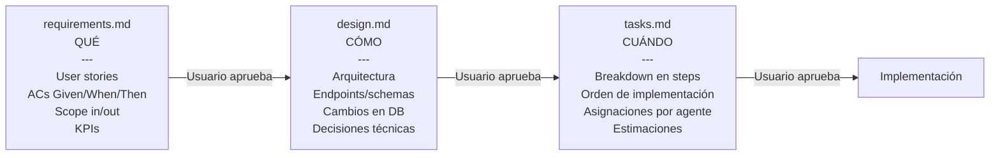

# SDD Protocol — Spec-Driven Development

## ¿Qué es?

SDD (Spec-Driven Development) es la metodología central del plugin. Garantiza que **nunca se escribe una línea de código sin especificación aprobada**. La spec es la fuente de verdad — el código es su expresión.

## Regla crítica

> **No se escribe código hasta que el usuario apruebe `design.md`.**
> Si el usuario pide cambios, se actualiza `design.md` primero y luego se reimplementa.
> La spec manda — el código se adapta a la spec, no al revés.

## Los 3 artefactos



## ¿Por qué importa?

Sin SDD, un agente puede implementar algo diferente a lo que el usuario tenía en mente. Los artefactos funcionan como **contrato** entre el usuario y el equipo de agentes. Si el usuario cambia de opinión, se modifica el artefacto primero — no el código directamente.

Beneficios concretos:
- Evita el "eso no era lo que pedí" después de horas de implementación
- Permite al usuario ver el diseño completo antes de ejecutar
- Da a los agentes un documento de referencia claro durante la implementación
- El QA Engineer valida el PR contra los ACs de `requirements.md`

## Flujo SDD completo

```
clarification-protocol (Architect/PO)
         ↓
requirements.md   ←   @product-owner
         ↓
    [Usuario aprueba ACs]
         ↓
design.md         ←   @architect
         ↓
    [Usuario aprueba diseño técnico]
         ↓
tasks.md          ←   @project-manager
         ↓
    [Usuario aprueba plan]
         ↓
Implementación por @backend-engineer / @frontend-engineer
         ↓
QA valida contra ACs de requirements.md
         ↓
task-closure
```

## Ubicación de artefactos

```
/docs/tasks/active/TASK-42-email-notifications/
├── TASK-42-email-notifications.md   ← tracking file (task-tracking skill)
├── evidence/                         ← screenshots QA
└── specs/
    ├── requirements.md               ← SDD Phase 1
    ├── design.md                     ← SDD Phase 2
    └── tasks.md                      ← SDD Phase 3
```

## Template: requirements.md

```markdown
# Feature: [Nombre descriptivo]

## Objetivo de negocio
[Por qué existe esta feature — el valor real, no la tarea técnica]

## User Stories
- Como [rol], quiero [acción], para [beneficio]
- Como [rol], quiero [acción], para [beneficio]

## Acceptance Criteria (verificables)
- [ ] Given [contexto], When [acción], Then [resultado esperado]
- [ ] Given [contexto], When [acción], Then [resultado esperado]
- [ ] Given [contexto], When [acción], Then [resultado esperado]

## Out of Scope
- [Lo que explícitamente NO incluye esta feature]
- [Lo que se hará en un futuro ticket separado]

## KPIs esperados
- [Métrica]: [valor actual] → [valor objetivo]

## Definition of Done
- [ ] Todos los ACs pasan
- [ ] Tests unitarios escritos (happy path + error + edge)
- [ ] Tests E2E con screenshots como evidencia
- [ ] PR aprobado por QA
- [ ] Documentación de tarea actualizada
- [ ] Ticket cerrado
```

## Template: design.md

```markdown
# Design: [Nombre]

## Resumen técnico
[1-3 líneas de la solución propuesta]

## Arquitectura

### Componentes afectados
- [Servicio/módulo]: [qué cambia y por qué]
- [Base de datos]: [schema changes si aplica]
- [Frontend]: [componentes nuevos o modificados]

### Diagrama (Mermaid)
[diagrama de componentes y flujo]

## Modelo de datos (si hay cambios en DB)

[SQL de la migración o esquema actualizado]

## Decisiones técnicas

| Decisión | Alternativas evaluadas | Razón |
|----------|----------------------|-------|
| [opción elegida] | [alternativas] | [justificación] |

## Seguridad
- [Consideraciones STRIDE relevantes]
- [Headers, validaciones, auth requerida]

## ADRs generados
- ADR-NNN: [si hay decisión arquitectónica nueva que lo justifique]
```

## Template: tasks.md

```markdown
# Tasks: [Nombre]

## Branch: feature/<id>-<description>
## Estimated effort: [S/M/L/XL]
## Assigned engineers: @backend-engineer, @frontend-engineer

## Orden de implementación

### Backend (@backend-engineer)
1. [ ] Crear migration para [tabla]
2. [ ] Implementar [Servicio] con métodos [lista]
3. [ ] Implementar endpoint [MÉTODO /ruta]
4. [ ] Escribir unit tests (mín. 3: happy path, error, edge)
5. [ ] Documentar endpoint en openapi.yml

### Frontend (@frontend-engineer)
6. [ ] Crear componente [Nombre]
7. [ ] Integrar con API
8. [ ] Escribir tests unitarios del componente
9. [ ] Verificar accesibilidad (WCAG 2.2 AA)

### QA (@qa-engineer)
10. [ ] Escribir tests E2E con Playwright
11. [ ] Screenshots de evidencia en cada paso crítico
12. [ ] Auditoría de accesibilidad con axe-core
13. [ ] Aprobar o rechazar PR con evidencia

### Closure (@project-manager)
14. [ ] Verificar que todos los ACs de requirements.md están cubiertos
15. [ ] Merge PR con "Closes #<id>"
16. [ ] Mover TASK a completed/
```

## Template: task.yml

El `task.yml` es la versión estructurada del tracking, útil para herramientas o automatizaciones:

```yaml
id: TASK-42
title: "Add email notifications"
status: IN_PROGRESS     # PENDING | IN_PROGRESS | IN_REVIEW | DONE
branch: feature/42-email-notifications
type: feature           # feature | bug | chore | spike
priority: high          # high | medium | low
assigned_agents:
  - backend-engineer
  - qa-engineer
layers:
  - backend
  - frontend
platform: python        # python | dotnet | typescript | all
created_at: 2026-03-31
ticket_url: "https://github.com/org/repo/issues/42"
sdd:
  requirements: approved
  design: approved
  tasks: approved
tracking_file: "docs/tasks/active/TASK-42-email-notifications/TASK-42-email-notifications.md"
```

## Cuándo se aplica SDD

| Situación | ¿SDD obligatorio? |
|-----------|-------------------|
| Feature nueva (new-task) | Sí, siempre |
| Ticket existente con descripción incompleta | Sí, completa los artefactos |
| Ticket existente con descripción completa | Puede omitir requirements.md |
| Bug fix simple via `/fix` | No — va directo a implementación |
| Hotfix urgente | No — documenta después |
| Refactoring | Sólo design.md si el cambio es significativo |

## Checklist de revisión SDD

Antes de aprobar un artefacto SDD, el usuario debe verificar:

**requirements.md**
- [ ] Cada AC es verificable (puede ser probado automáticamente o manualmente)
- [ ] El scope out of scope es explícito
- [ ] No hay ambigüedad en el "happy path"

**design.md**
- [ ] El diagrama Mermaid refleja el diseño real
- [ ] Los endpoints tienen método, ruta y payload definidos
- [ ] Los cambios en DB están detallados (no solo "agregar tabla")
- [ ] Las decisiones técnicas tienen justificación

**tasks.md**
- [ ] Cada step es lo suficientemente pequeño para un commit atómico
- [ ] El orden respeta las dependencias (DB antes de API, API antes de UI)
- [ ] Está claro qué agente hace qué
