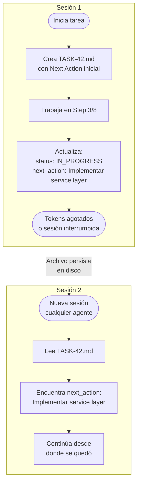

# Context Engineering — Persistencia entre sesiones

## El problema

Claude tiene un límite de tokens por sesión. En tareas largas o complejas, el contexto de conversación se agota. Sin una solución, el agente pierde el hilo de lo que estaba haciendo y el usuario tiene que re-explicar el estado completo del trabajo.

## La solución: estado en archivos

En lugar de depender de la memoria de conversación (que se pierde), el plugin **persiste el estado en archivos** dentro del proyecto. El sistema funciona aunque la sesión se interrumpa, el contexto se agote, o un agente diferente retome el trabajo.



## Principios fundamentales

El plugin sigue las mejores prácticas de Anthropic para sistemas multi-agente:

1. **Right context at the right time** — no se carga todo el repo al inicio; cada agente carga solo lo que necesita cuando lo necesita
2. **Subagentes retornan resúmenes** — máximo 1-2k tokens de vuelta al orquestador, no outputs completos
3. **Shared state via archivos** — el estado compartido vive en `/docs/tasks/active/`, no en la conversación
4. **Stopping conditions explícitas** — cada agente sabe cuándo parar (ver tabla en 03-agents.md)
5. **Token budget awareness** — al llegar al 80% del context window, el agente hace un checkpoint completo

## Estructura del archivo de tracking

### TASK-{id}.md — el tracking file

Cada tarea tiene un archivo de tracking que persiste todo el estado:

```markdown
# TASK-42: Add Email Notifications

| Campo | Valor |
|-------|-------|
| **Status** | IN_PROGRESS (40%) |
| **Branch** | feature/42-email-notifications |
| **Type** | Feature |
| **Platform** | GitHub #42 |
| **Created** | 2026-03-31 |
| **Last checkpoint** | 2026-03-31 14:30 |

## Acceptance Criteria
- [ ] AC 1: Given a user registers, When confirmed, Then receives welcome email
- [x] AC 2: Given invalid email, When sending, Then returns 422 (verified)

## Progress Log

### Step 1: Analysis & Setup [COMPLETED]
- Read PROJECT_CONTEXT.md — stack: FastAPI + React + PostgreSQL
- Branch created: feature/42-email-notifications
- Decision: Use SendGrid SDK — better deliverability vs raw SMTP

### Step 2: Backend implementation [COMPLETED]
- Created: src/notifications/service.py (NotificationService)
- Created: src/notifications/schemas.py (SendEmailRequest)
- Modified: src/core/dependencies.py (added NotificationService DI)

### Step 3: Unit Tests [IN_PROGRESS]
- Created: src/tests/test_notification_service.py
  - test_send_welcome_email_success (PASS)
  - test_send_email_invalid_recipient (PASS)
  - test_send_email_rate_limited (PENDING)

### Step 4: Frontend integration [PENDING]
### Step 5: E2E Tests + Evidence [PENDING]
### Step 6: PR + Closure [PENDING]

## Unit Tests Written
| Test | File | Status | Cubre |
|------|------|--------|-------|
| test_send_welcome_email_success | test_notifications.py | PASS | Happy path |
| test_send_email_invalid_recipient | test_notifications.py | PASS | Error case |
| test_send_email_rate_limited | test_notifications.py | PENDING | Edge case |

## Evidence (QA Screenshots)
| Screenshot | Descripción | Status |
|-----------|-------------|--------|
| evidence/e2e-email-sent.png | Email recibido en inbox | Pending |
| evidence/e2e-error-state.png | Error para email inválido | Pending |

## Files Modified
| Archivo | Acción | Descripción |
|---------|--------|-------------|
| src/notifications/service.py | Created | NotificationService |
| src/notifications/schemas.py | Created | Pydantic schemas |
| src/core/dependencies.py | Modified | DI container |

## Next Action (if context resets)
> **Resume desde**: Step 3 — completar test_send_email_rate_limited
> **Branch**: feature/42-email-notifications (último commit: abc123)
> **Ejecutar**: git checkout feature/42-email-notifications
> **Luego**: Implementar rate limit de 10 emails/min/usuario en NotificationService
> **Test a escribir**: test_send_email_rate_limited en src/tests/test_notification_service.py
```

## El campo "Next Action"

`Next Action` es el campo más importante del archivo de tracking. Es lo primero que lee un agente al retomar una tarea. Debe ser lo suficientemente detallado para que un agente **sin contexto previo** sepa exactamente qué hacer:

**Mal Next Action:**
```
> Continuar con los tests
```

**Buen Next Action:**
```
> Resume desde: Step 3 — unit tests del NotificationService
> Branch: feature/42-email-notifications (último commit: abc123f)
> Ejecutar: git checkout feature/42-email-notifications && git log --oneline -3
> Pendiente: test_send_email_rate_limited en src/tests/test_notification_service.py
> El servicio tiene un rate limit de 10/min/usuario configurado en NotificationService.send()
> Usar pytest-mock para simular el rate limiter sin llamadas reales a SendGrid
```

## Handoff Protocol entre agentes

Cuando un agente termina su parte y necesita pasar el trabajo a otro, escribe un handoff estructurado:

```markdown
## Handoff: @backend-engineer → @qa-engineer

### Completado
- Implementado NotificationService con send_welcome(), send_reset(), send_alert()
- Unit tests: 4 passing, 0 failing (coverage: 92% en código nuevo)
- Branch: feature/42-email-notifications (commit: abc123f)
- Endpoints: POST /api/notifications/send (admin only, JWT required)

### Contexto crítico para QA
- El token expira en 15 min (configurable via JWT_EXPIRE_MINUTES env var)
- Rate limit: 10 emails/min/usuario — el test E2E no debe disparar esto
- Usar SENDGRID_API_KEY=test-key en .env.test para no hacer llamadas reales

### Tu tarea
Ejecutar E2E tests con Playwright cubriendo:
1. Usuario recibe email de bienvenida tras registro
2. Email de reset de contraseña contiene link con token válido
3. Email inválido retorna error 422 (sin enviar)
4. Admin puede enviar email manual via POST /api/notifications/send

### Criterio de éxito
- Todos los ACs de requirements.md verificados
- Screenshots en docs/tasks/active/TASK-42-email-notifications/evidence/
- PR aprobado o rechazado con evidencia documentada
```

## Checkpoint Protocol

Los agentes actualizan el TASK file en estos momentos:

| Momento | Acción |
|---------|--------|
| Al empezar un step | Marca el step como "IN_PROGRESS" |
| Al completar un step | Marca como "COMPLETED", lista archivos creados |
| Al tomar una decisión técnica | Documenta en "Decisions Made" |
| Antes de un paso riesgoso | Commit atómico + actualiza Last checkpoint |
| Al 80% del context window | Checkpoint completo con "Next Action" detallado |

## Reglas para el "Next Action"

1. **Siempre actualizado** — nunca dejar en blanco, aunque sea al final de una sesión completa
2. **Accionable sin contexto** — el agente que lo lea no debe necesitar leer la conversación
3. **Incluir branch y último commit** — permite verificar el estado del repo
4. **Incluir el "por qué"** — si hay una decisión tomada que afecta el siguiente paso, documentarla
5. **Incluir paths exactos** — nada de "el archivo de tests" — poner la ruta completa

## Anti-patterns a evitar

| Anti-pattern | Por qué es un problema | Solución |
|-------------|----------------------|----------|
| Depender de la conversación para el estado | Se pierde cuando los tokens se agotan | Escribir en TASK-XXX.md |
| Pasar outputs completos entre agentes | Consume tokens innecesariamente | Resumir en 1-2k tokens |
| Activar más agentes de los necesarios | Overhead de coordinación | Solo los agentes de las capas impactadas |
| Dejar "Next Action" vacío | El siguiente agente está ciego | Siempre actualizar antes de parar |
| No documentar al final | Pérdida de contexto | Documentar en cada step, no al terminar |
| Loop sin stopping condition | El agente sigue indefinidamente | Máximo 3 iteraciones por paso |
