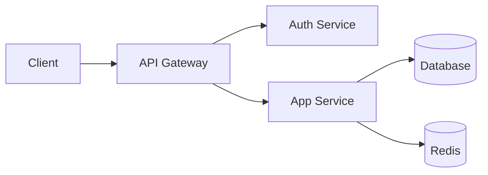

# Skill: Code Architecture

## Principios universales de arquitectura

### Separación de responsabilidades
- Cada módulo tiene una sola razón para cambiar
- Capas claras: presentación → negocio → datos
- No mezcles lógica de negocio con infraestructura

### Patrones de arquitectura — cuándo usar cada uno

**Monolito modular** → app nueva, equipo pequeño, incertidumbre de dominio
**Microservicios** → dominio bien definido, equipos independientes, necesidad de escalar partes
**Event-driven** → acciones desacopladas, alta concurrencia, procesos asíncronos
**Serverless** → funciones simples, costo por uso, sin estado

### Estructura de capas recomendada

```
Backend:
  API Layer      → recibe, valida, responde
  Service Layer  → lógica de negocio pura
  Repository     → acceso a datos
  Domain Models  → entidades y reglas del negocio

Frontend:
  Pages/Routes   → composición de pantallas
  Components     → UI reutilizable
  Hooks/Services → lógica compartida
  API Client     → comunicación con backend
```

### Trade-offs que siempre evalúas
- Consistencia vs disponibilidad (CAP theorem)
- Simplicidad vs flexibilidad
- Optimización prematura vs performance real
- Acoplamiento vs cohesión

### Diagramas — usa Mermaid cuando sea útil


