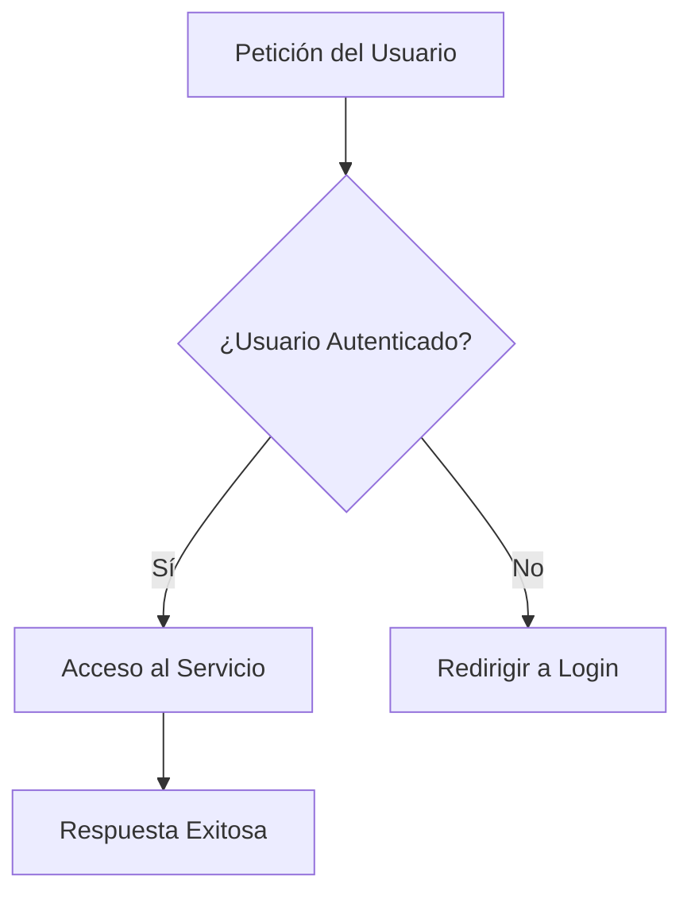
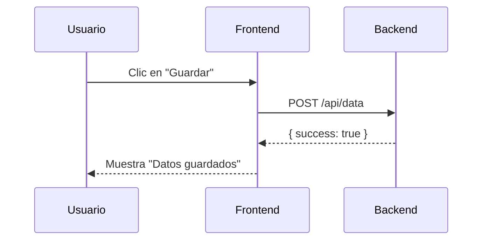

# Skill: Creación de Documentación Técnica

Esta skill te proporciona las herramientas y plantillas para generar documentación clara, útil y fácil de mantener.

## 1. Filosofía de la Documentación

*   **Documenta el "Porqué", no el "Qué":** El código ya dice *qué* hace. La buena documentación explica *por qué* se tomó una decisión. "Se eligió Redis para la caché por su baja latencia" es mucho más útil que "Este código usa una caché".
*   **Piensa en tu Audiencia:** ¿Quién leerá esto? ¿Un nuevo desarrollador? ¿Un DevOps? ¿Un PM? Adapta el nivel de detalle y el lenguaje a la audiencia.
*   **DRY (Don't Repeat Yourself):** No repitas la misma información en varios lugares. Si la documentación de una función está en el código (docstring), no la copies en un `README`. Enlaza a la fuente original si es necesario.
*   **La Documentación es Código:** Trátala como tal. Debe ser revisada, versionada y mantenida.

## 2. Herramientas Clave

### Diagramas como Código con Mermaid.js

Los diagramas son esenciales para explicar la arquitectura. Usa Mermaid.js para crear diagramas directamente en tus archivos Markdown. Son fáciles de versionar y mantener.

**Ejemplo de Diagrama de Flujo:**
````markdown

````

**Ejemplo de Diagrama de Secuencia:**
````markdown

````

### Docstrings y Anotaciones en Código

La documentación más cercana al código es la mejor.

*   **Python (Docstrings):**
    ```python
    def mi_funcion(param1, param2):
        """
        Esta función hace X y Z.

        Args:
            param1 (int): Descripción del primer parámetro.
            param2 (str): Descripción del segundo parámetro.

        Returns:
            bool: True si la operación fue exitosa, False en caso contrario.
        """
        # ...código...
    ```
*   **JavaScript (JSDoc):**
    ```javascript
    /**
     * Esta función hace X y Z.
     * @param {number} param1 - Descripción del primer parámetro.
     * @param {string} param2 - Descripción del segundo parámetro.
     * @returns {boolean} True si la operación fue exitosa, False en caso contrario.
     */
    function miFuncion(param1, param2) {
      // ...código...
    }
    ```

## 3. Plantillas de Documentos

### Documento de Arquitectura (`01-ARQUITECTURA.md`)
*   **Secciones:**
    1.  **Visión General:** Resumen de alto nivel del sistema.
    2.  **Diagrama de Componentes:** Un diagrama Mermaid que muestra los componentes principales (frontend, backend, base de datos, servicios externos) y cómo se conectan.
    3.  **Flujos de Datos Clave:** Explica y/o dibuja los flujos de datos para las 2-3 funcionalidades más importantes del sistema.
    4.  **Decisiones de Arquitectura (ADRs):** Registra las decisiones importantes y su justificación.

### Guía de Configuración (`02-CONFIGURACION.md`)
*   **Secciones:**
    1.  **Requisitos Previos:** (ej. Node.js v18+, Python 3.10, Docker)
    2.  **Instalación:** Un bloque de código con los comandos para clonar el repo e instalar dependencias.
    3.  **Configuración de Entorno:** Explica cómo crear y qué poner en el archivo `.env` o similar.
    4.  **Ejecutar la Aplicación:** El comando para iniciar el servidor de desarrollo.

### Referencia de API (`04-API_REFERENCE.md`)
*   Usa una tabla o una lista para cada endpoint.
*   **Para cada endpoint, especifica:**
    *   **Ruta y Método:** `POST /api/users`
    *   **Descripción:** "Crea un nuevo usuario."
    *   **Parámetros del Body (Request):** Lista de campos, tipo y si son requeridos.
    *   **Respuesta Exitosa (200/201):** Un ejemplo del JSON de respuesta.
    *   **Respuestas de Error (4xx/5xx):** Posibles errores y qué significan.
