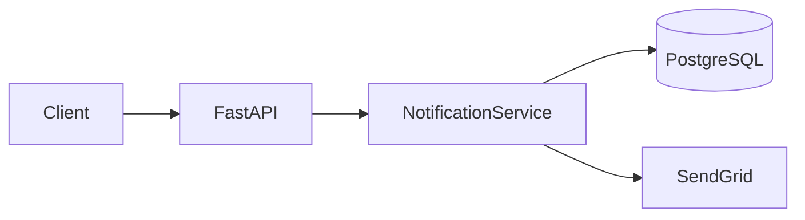

# Skill: SDD Protocol (Spec-Driven Development)

## CONTRACT
- **Input**: Feature request (del usuario o de un ticket)
- **Output**: 3 artefactos en /docs/tasks/active/TASK-<id>/specs/
- **Regla**: No se escribe codigo hasta que design.md este aprobado

## LOS 3 ARTEFACTOS

### 1. requirements.md — QUE (produce @product-owner)

```markdown
# Feature: [Nombre descriptivo]

## Objetivo de negocio
[Por que existe esta feature — el valor real, no la tarea tecnica]

## User Stories
- Como [rol], quiero [accion], para [beneficio]
- Como [rol], quiero [accion], para [beneficio]

## Acceptance Criteria (verificables)
- [ ] Given [contexto], When [accion], Then [resultado esperado]
- [ ] Given [contexto], When [accion], Then [resultado esperado]
- [ ] Given [contexto], When [accion], Then [resultado esperado]

## Out of Scope
- [Lo que explicitamente NO incluye esta feature]
- [Lo que se hara en un futuro ticket separado]

## KPIs esperados
- [Metrica 1]: [valor actual] → [valor objetivo]

## Definition of Done
- [ ] Todos los ACs pasan
- [ ] Tests unitarios escritos (happy path + error + edge)
- [ ] Tests E2E con screenshots como evidencia
- [ ] PR aprobado por QA
- [ ] Documentacion de tarea actualizada
- [ ] Ticket cerrado
```

### 2. design.md — COMO (produce @architect)

```markdown
# Design: [Nombre]

## Resumen tecnico
[1-3 lineas de la solucion propuesta]

## Arquitectura

### Componentes afectados
- [Servicio/modulo]: [que cambia y por que]
- [Base de datos]: [schema changes si aplica]
- [Frontend]: [componentes nuevos o modificados]

### Diagrama (Mermaid)


## Modelo de datos (si hay cambios en DB)

```sql
-- Migration: add notifications table
CREATE TABLE notifications (
    id UUID PRIMARY KEY DEFAULT gen_random_uuid(),
    user_id UUID NOT NULL REFERENCES users(id),
    type VARCHAR(50) NOT NULL,
    payload JSONB NOT NULL DEFAULT '{}',
    sent_at TIMESTAMPTZ,
    created_at TIMESTAMPTZ NOT NULL DEFAULT NOW()
);

CREATE INDEX idx_notifications_user_id ON notifications(user_id);
CREATE INDEX idx_notifications_type ON notifications(type);
```

## Decisiones tecnicas

| Decision | Alternativas evaluadas | Razon |
|----------|----------------------|-------|
| SendGrid | SMTP directo, SES | Mejor deliverability, SDK Python oficial, tier gratis suficiente |
| Async queue | Sincrono en request | Emails no deben bloquear la respuesta al usuario |

## Seguridad
- [Consideraciones STRIDE relevantes]
- [Headers, validaciones, auth requerida]

## ADRs generados
- ADR-NNN: [si hay decision arquitectonica nueva]
```

### 3. tasks.md — CUANDO (produce @project-manager)

```markdown
# Tasks: [Nombre]

## Branch: feature/<id>-<description>
## Estimated effort: [S/M/L/XL]
## Assigned engineers: @backend-engineer, @frontend-engineer

## Orden de implementacion

### Backend (@backend-engineer)
1. [ ] Crear migration para tabla notifications
2. [ ] Implementar NotificationService con metodos send_welcome, send_reset
3. [ ] Implementar endpoint POST /api/notifications/send (admin only)
4. [ ] Escribir tests unitarios (min 3: happy path, error, edge)
5. [ ] Documentar endpoint en openapi.yml

### Frontend (@frontend-engineer)
6. [ ] Crear componente NotificationBadge
7. [ ] Integrar con API de notificaciones
8. [ ] Escribir tests unitarios del componente
9. [ ] Verificar accesibilidad (WCAG 2.2 AA)

### QA (@qa-engineer)
10. [ ] Escribir tests E2E con Playwright
11. [ ] Tomar screenshots de evidencia en cada paso critico
12. [ ] Ejecutar audit de accesibilidad con axe-core
13. [ ] Aprobar o rechazar PR con evidencia

### Closure (@project-manager)
14. [ ] Verificar que todos los ACs de requirements.md estan cubiertos
15. [ ] Merge PR con "Closes #<id>"
16. [ ] Mover TASK a completed/
```

## FLUJO SDD COMPLETO

```
requirements.md  ←  @product-owner
       ↓
    [Usuario aprueba ACs]
       ↓
design.md        ←  @architect
       ↓
    [Usuario aprueba diseño tecnico]
       ↓
tasks.md         ←  @project-manager
       ↓
    [Implementacion por engineers]
       ↓
    [QA valida contra ACs de requirements.md]
       ↓
    [Task closure]
```

## REGLA CRITICA

**No se escribe codigo hasta que el usuario apruebe design.md.**
Si el usuario pide cambios, se actualiza design.md primero y luego se reimplementa.
La spec manda — el codigo se adapta a la spec, no al reves.
