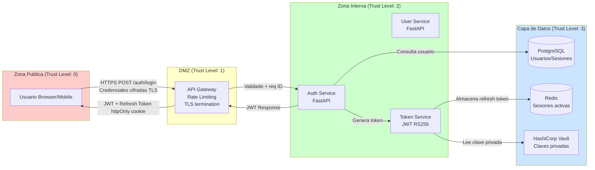
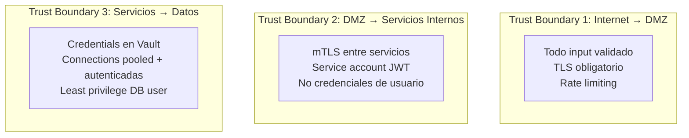

# Skill: Threat Modeling (PASTA + STRIDE + LINDDUN)

## CONTRACT

Todo feature que introduzca un nuevo flujo de datos sensibles, un nuevo actor
externo, un cambio en el modelo de autenticacion/autorizacion o un nuevo
componente de infraestructura DEBE tener un threat model documentado antes de
iniciar la implementacion. El threat model vive en `/docs/security/threat-models/`.

---

## CORE CONCEPTS

### Cuando usar cada framework

| Framework | Cuando aplicarlo | Resultado principal |
|-----------|-----------------|---------------------|
| **PASTA** | Analisis completo de un sistema nuevo o cambio arquitectonico mayor | Documento de amenazas priorizadas por riesgo de negocio |
| **STRIDE** | Revision rapida de un endpoint o componente especifico | Lista de amenazas por categoria tecnica |
| **LINDDUN** | Flujos que procesan datos personales (GDPR/privacidad) | Amenazas de privacidad priorizadas |

### Regla de seleccion

```
Feature nueva compleja o sistema nuevo → PASTA completo
Endpoint nuevo o cambio en autenticacion → STRIDE
Procesamiento de PII o datos de salud → LINDDUN (puede combinarse con STRIDE)
Revision rapida en PR → STRIDE solo para los cambios del PR
```

---

## PASTA — 7 Fases

### Fase 1: Definir objetivos de negocio
Identifica que activos de negocio estamos protegiendo y cuales son las
consecuencias de un compromiso.

```
Pregunta clave: Si este sistema falla de seguridad, que impacto tiene en
el negocio? (reputacional, financiero, legal, operacional)
```

### Fase 2: Definir el scope tecnico
- Tecnologias, lenguajes, frameworks y dependencias del componente
- Limites de confianza (trust boundaries)
- Datos que fluyen por el sistema y su clasificacion

### Fase 3: Descomposicion de la aplicacion
- Data Flow Diagrams (DFD) de nivel 0 y nivel 1
- Identificar todos los puntos de entrada y salida
- Documentar los actores (usuarios, sistemas externos, administradores)

### Fase 4: Analisis de amenazas (usa STRIDE aqui)
Aplicar STRIDE a cada elemento del DFD.

### Fase 5: Analisis de vulnerabilidades
Cruzar amenazas con vulnerabilidades conocidas (CVEs, OWASP Top 10, CWE).

### Fase 6: Modelado de ataques
Construir arboles de ataque (attack trees) para las amenazas de mayor riesgo.

### Fase 7: Analisis de riesgo y mitigaciones
Puntuar cada amenaza con la matriz Impact x Probability y definir mitigaciones.

---

## STRIDE — Referencia rapida

| Categoria | Amenaza | Objetivo | Control principal |
|-----------|---------|----------|------------------|
| **S**poofing | Suplantar identidad de usuario o servicio | Autenticacion | MFA, mTLS, certificados |
| **T**ampering | Modificar datos en transito o reposo | Integridad | MAC/firma digital, TLS, hashing |
| **R**epudiation | Negar haber realizado una accion | No-repudio | Audit logs firmados, timestamps |
| **I**nformation Disclosure | Exponer datos sensibles | Confidencialidad | Cifrado, control de acceso, sanitizacion |
| **D**enial of Service | Agotar recursos del sistema | Disponibilidad | Rate limiting, circuit breakers, autoscaling |
| **E**levation of Privilege | Obtener permisos no autorizados | Autorizacion | RBAC/ABAC, principio minimo privilegio |

---

## LINDDUN — Amenazas de privacidad

| Categoria | Descripcion | Ejemplo |
|-----------|-------------|---------|
| **L**inkability | Vincular datos de diferentes fuentes para identificar a una persona | Correlacion de IPs entre sesiones |
| **I**dentifiability | Identificar a un individuo a partir de datos anonimizados | Re-identificacion por combinacion de campos |
| **N**on-repudiation | El usuario no puede negar haber realizado una accion (puede ser problema de privacidad) | Logs detallados de comportamiento de usuario |
| **D**etectability | Determinar si alguien usa el sistema o tiene ciertos datos | Timing attacks en respuestas |
| **D**isclosure of information | Exposicion de datos personales | Data breach, over-sharing en APIs |
| **U**nawareness | El usuario no sabe como se usan sus datos | Falta de transparencia en procesamiento |
| **N**on-compliance | Violacion de regulaciones de privacidad | Almacenamiento de datos sin base legal |

---

## PLANTILLA DE DOCUMENTO DE AMENAZA

```markdown
# Threat Model: [Nombre del Sistema/Feature]

**Fecha:** YYYY-MM-DD
**Autor:** @nombre
**Revisado por:** @nombre
**Version:** 1.0
**Framework aplicado:** PASTA / STRIDE / LINDDUN

## 1. Alcance

### Descripcion
[Que hace este sistema/feature en una o dos oraciones]

### Activos a proteger
| Activo | Clasificacion | Consecuencia de compromiso |
|--------|--------------|---------------------------|
| Tokens de acceso | Critico | Acceso no autorizado a datos de usuario |
| PII de usuarios | Sensible | Violacion GDPR, dano reputacional |
| Claves de cifrado | Critico | Compromiso total de datos cifrados |

### Actores
| Actor | Tipo | Nivel de confianza |
|-------|------|--------------------|
| Usuario autenticado | Externo | Bajo |
| Servicio interno de pagos | Interno | Medio |
| Administrador | Interno | Alto |

## 2. Data Flow Diagram

[Insertar DFD en Mermaid — ver seccion EXAMPLES]

## 3. Amenazas identificadas

| ID | Categoria | Componente afectado | Descripcion | Probabilidad | Impacto | Riesgo | Estado |
|----|-----------|--------------------|----|---|---|---|---|
| T-001 | Spoofing | Auth endpoint | Brute force de credenciales | Alta | Alto | Critico | Mitigado |
| T-002 | Information Disclosure | User API | IDOR en GET /users/{id} | Media | Alto | Alto | Mitigado |

## 4. Mitigaciones

| ID Amenaza | Mitigacion | Implementado en | Evidencia |
|-----------|-----------|----------------|-----------|
| T-001 | Rate limiting 5 req/min + bloqueo tras 10 fallos | auth/middleware.py | PR #123 |
| T-002 | Ownership check en todos los endpoints de recurso | users/router.py:45 | PR #124 |

## 5. Amenazas aceptadas (riesgo residual)

| ID | Razon de aceptacion | Aprobado por |
|----|--------------------|----|
| T-005 | Riesgo bajo, costo de mitigacion desproporcionado | @architect |
```

---

## EXAMPLES

### Data Flow Diagram — Sistema de Autenticacion



### Trust Boundaries en el DFD



---

### Matriz de Riesgo (Impact x Probability)

```
              IMPACTO
              Bajo    Medio   Alto    Critico
          +-------+-------+-------+--------+
Alta      |  Medio |  Alto | Critico| Critico|
          +-------+-------+-------+--------+
PROB Media |  Bajo  | Medio |  Alto  | Critico|
          +-------+-------+-------+--------+
Baja      |  Bajo  |  Bajo | Medio  |  Alto  |
          +-------+-------+-------+--------+
Minima    | Minimo |  Bajo |  Bajo  | Medio  |
          +-------+-------+-------+--------+
```

**Escala de impacto:**
- **Critico:** Perdida de datos masiva, multa regulatoria, baja del servicio >24h
- **Alto:** Acceso no autorizado a datos de usuarios, perdida financiera significativa
- **Medio:** Degradacion del servicio, exposicion de datos no sensibles
- **Bajo:** Incomodidad de usuario, datos publicos expuestos

**Umbral de accion:**
- Critico → Bloquea release, fix inmediato
- Alto → Fix en el sprint actual
- Medio → Backlog prioritario, fix en los proximos 2 sprints
- Bajo → Backlog normal

---

### Ejemplo completo: Sistema de autenticacion con STRIDE

#### Componente analizado: `POST /auth/login`

| ID | STRIDE | Descripcion de amenaza | Prob | Impacto | Riesgo | Mitigacion |
|----|--------|------------------------|------|---------|--------|-----------|
| T-001 | Spoofing | Brute force de contrasenas | Alta | Alto | Critico | Rate limiting 5/min, lockout tras 10 fallos, CAPTCHA |
| T-002 | Spoofing | Credential stuffing desde breaches externos | Alta | Alto | Critico | HaveIBeenPwned check, deteccion de IPs anomalas |
| T-003 | Tampering | Manipulacion del payload JWT despues de firmado | Baja | Critico | Critico | Firma RS256, validacion de firma en cada request |
| T-004 | Repudiation | Negacion de intento de login fraudulento | Media | Medio | Medio | Log de intentos con IP, user-agent, timestamp |
| T-005 | Information Disclosure | Enumeracion de usuarios via timing attack | Media | Medio | Medio | Tiempo constante en comparacion, mensaje generico |
| T-006 | Information Disclosure | Leak de hash de contrasena via SQL injection | Baja | Critico | Alto | ORM con parametros preparados, WAF |
| T-007 | Denial of Service | Flood de requests agota conexiones DB | Alta | Alto | Critico | Connection pool, rate limiting, circuit breaker |
| T-008 | Elevation of Privilege | Session fixation tras login exitoso | Media | Alto | Alto | Regenerar session ID tras autenticacion exitosa |

#### Attack tree para T-001 (Brute Force)

```
[Comprometer cuenta de usuario]
├── [Brute force directo]
│   ├── [Sin rate limiting] → MITIGADO: 5 req/min por IP
│   └── [Distributed brute force] → MITIGADO: rate limit por usuario + IP
├── [Credential stuffing]
│   ├── [Usar breach databases] → MITIGADO: HaveIBeenPwned check
│   └── [Probar variaciones] → MITIGADO: Lockout tras 10 fallos
└── [Phishing]
    └── [Fuera de scope del threat model — control de usuario]
```

---

## CHECKLIST

- [ ] DFD de nivel 0 y nivel 1 documentados con trust boundaries
- [ ] Todos los actores identificados con su nivel de confianza
- [ ] Todos los activos clasificados (Critico / Sensible / Interno / Publico)
- [ ] STRIDE aplicado a cada elemento del DFD
- [ ] Cada amenaza tiene probabilidad, impacto y riesgo calculado
- [ ] Las amenazas Criticas y Altas tienen mitigacion documentada con PR de referencia
- [ ] Las amenazas aceptadas tienen justificacion y aprobacion documentada
- [ ] El documento esta en `/docs/security/threat-models/` y referenciado en el issue

---

## ANTI-PATTERNS

1. **Threat model como checkbox.** Hacerlo al final solo para cumplir un requisito. Debe realizarse antes de implementar.
2. **STRIDE aplicado al sistema completo de golpe.** Aplicarlo elemento por elemento del DFD para no perder amenazas.
3. **Ignorar las amenazas de supply chain.** Las dependencias de terceros son parte del DFD.
4. **No actualizar el threat model.** Cada cambio arquitectonico significativo requiere re-revision.
5. **Asumir que el cifrado en transito es suficiente.** Cifrado en reposo, en uso y en transito son capas independientes.
6. **Mitigaciones sin evidencia.** Cada mitigacion debe tener un PR o issue que demuestre que esta implementada.
7. **Omitir actores internos en el modelo.** Insiders maliciosos o comprometidos son una amenaza real — zero trust.
